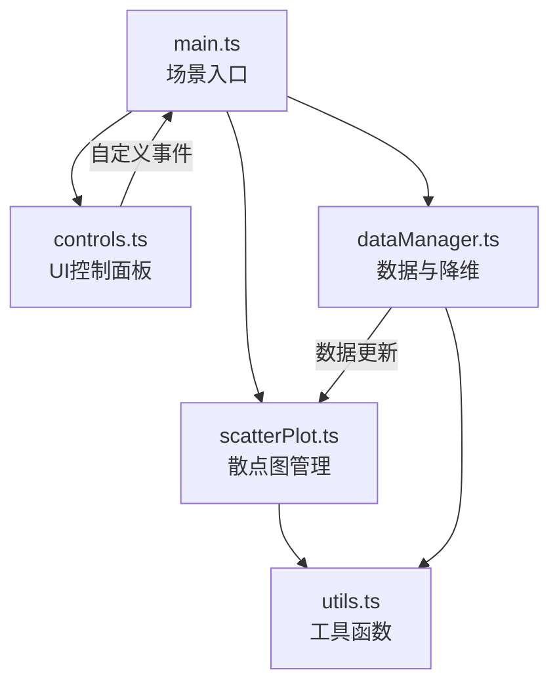

## 1. 架构设计

## 2. 技术说明

- 前端：TypeScript + Vite@5 + Three.js@0.160 + lodash
- 初始化工具：vite-init
- 后端：无（纯前端应用）
- 数据：内置静态JSON数据集（iris、wine）
- 样式：原生CSS（深色科幻主题）

## 3. 模块职责

| 文件名 | 职责 |
|--------|------|
| src/main.ts | 初始化Three.js场景、相机、渲染器、OrbitControls；加载数据集；启动动画循环；协调各模块 |
| src/dataManager.ts | 内置iris和wine静态数据；特征列提取；均值标准差计算；PCA降维（前3主成分）；t-SNE降维（模拟）；结果内存缓存 |
| src/scatterPlot.ts | 3D散点生成/更新；悬停交互与邻域连线动画；数据点渐入渐出动画；LOD性能优化 |
| src/controls.ts | 左侧控制面板UI；所有下拉框和按钮；自定义事件通知系统 |
| src/utils.ts | viridis色阶映射；坐标轴标签精灵创建；缓动函数；FPS监控显示 |

## 4. 自定义事件系统

| 事件名 | 触发时机 | 数据负载 |
|--------|----------|----------|
| dataset:change | 切换数据集 | { dataset: string } |
| axes:change | 切换X/Y/Z轴 | { x: string, y: string, z: string } |
| mode:change | 切换降维模式 | { mode: 'raw' \| 'pca' \| 'tsne' } |
| colorMapping:change | 切换颜色映射特征 | { feature: string } |
| sizeMapping:change | 切换大小映射特征 | { feature: string } |
| view:reset | 重置视角 | 无 |

## 5. 性能策略

- 数据点≤500：使用 THREE.Mesh(SphereGeometry) 渲染
- 数据点>500：自动启用LOD，远处点合并为 THREE.Sprite
- 降维结果缓存在内存中避免重复计算
- 使用 requestAnimationFrame 驱动动画循环，监控FPS
