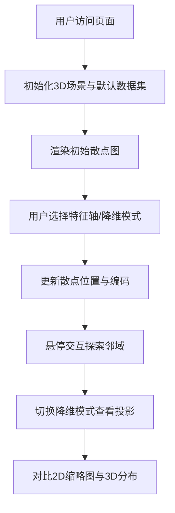

## 1. 产品概述

高维数据3D探索器 - 一个帮助数据科学家和分析师在浏览器中直观探索高维数据集的交互式3D散点图投影与降维对比工具。

- 解决传统2D散点图矩阵无法同时展示超过3个特征维度的问题，内置鸢尾花（iris）和红酒品质（wine）两个经典数据集
- 支持原始三维特征展示与PCA/t-SNE降维投影一键切换，颜色和大小编码多维度特征，辅助理解高维数据结构

## 2. 核心功能

### 2.1 功能模块

1. **主页面**：左侧控制面板 + 右侧3D散点图场景 + 降维信息悬浮面板

### 2.2 页面详情

| 页面名称 | 模块名称 | 功能描述 |
|-----------|-------------|---------------------|
| 主页面 | 数据集选择 | 下拉选择器切换iris和wine数据集，自动加载对应特征列表 |
| 主页面 | 特征轴选择 | X/Y/Z三个下拉选择器，从数据集列名动态加载，实时更新散点图 |
| 主页面 | 降维模式切换 | "原始三维"、"PCA降维"、"t-SNE降维"三档切换按钮 |
| 主页面 | 颜色映射 | 下拉选择特征进行viridis色阶颜色编码 |
| 主页面 | 大小映射 | 下拉选择特征进行点大小编码（2-20px范围） |
| 主页面 | 重置视角 | 一键重置相机到初始位置 |
| 主页面 | 3D散点图 | Three.js渲染球体散点，OrbitControls旋转缩放 |
| 主页面 | 悬停交互 | 悬停点放大变白，显示最近5个邻居连线 |
| 主页面 | 降维信息面板 | 右下角滑入面板，显示解释方差/K-L散度 + 2D投影缩略图 |

## 3. 核心流程

用户打开页面 → 默认加载iris数据集 → 选择X/Y/Z特征 → 查看3D散点图 → 切换降维模式对比 → 悬停探索邻域关系 → 选择颜色/大小映射 → 切换数据集继续探索

## 4. 用户界面设计

### 4.1 设计风格

- 深色科幻风格
- 主背景：#0f0f1a，卡片背景：#1e1e2e
- 主色调：紫色 #7c3aed，强调色：橙色 #f59e0b，错误色：红色 #ef4444
- 悬停动画：0.2秒平滑过渡，scale 1.02，box-shadow发散效果
- 数据点生成：0.5秒ease-out从原点扩散动画，切换时旧点0.3秒渐隐、新点0.3秒渐显

### 4.2 页面设计概述

| 页面名称 | 模块名称 | UI元素 |
|-----------|-------------|-------------|
| 主页面 | 左侧控制面板 | 宽300px，#1e1e2e背景，圆角12px，内边距20px；下拉框#2d2d44选项背景、#7c3aed选中高亮；切换按钮#7c3aed/#3b3b5c；重置按钮#ef4444悬停#dc2626 |
| 主页面 | 右侧3D场景 | #0f0f1a背景，Three.js球体散点，坐标轴标签始终面向相机 |
| 主页面 | 降维悬浮面板 | 右下角滑入，200px宽，#1e1e2e背景，圆角8px，透明度0.9，150x150 canvas 2D缩略图 |

### 4.3 响应式

桌面端优先设计，控制面板固定宽度300px，右侧自适应填充。

### 4.4 3D场景指引

- 背景：纯色 #0f0f1a，无需HDRI
- 光照：环境光 + 方向光，确保散点清晰可见
- 相机：PerspectiveCamera，初始合理视场角60度
- 交互：OrbitControls自由旋转缩放
- 性能：帧率≥45fps，数据点≤500时用球体，超出自动LOD降级为精灵点网格
