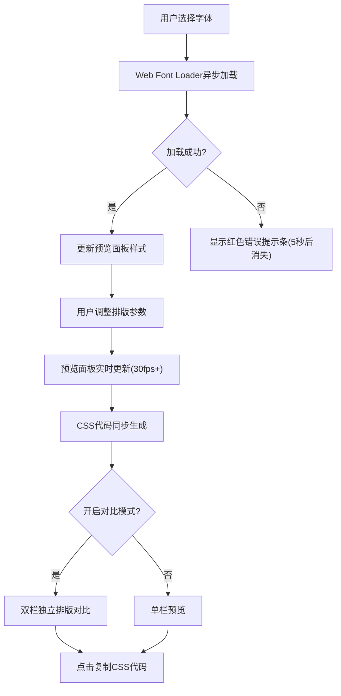

## 1. 产品概述

在线网页字体排版对比与CSS代码生成应用，帮助设计师和开发者快速预览不同字体、字重、字距、行高的排版效果，并一键生成可用的CSS代码。支持双区域对比模式，方便并排比较两种排版方案。

- 主要用途：字体排版预览、CSS代码生成、多方案排版对比
- 目标用户：前端开发者、UI/UX设计师、内容创作者
- 产品价值：简化字体选型流程，快速验证排版效果，提高开发效率

## 2. 核心功能

### 2.1 功能模块

1. **主页面**：字体选择器、参数控制面板、排版预览面板、CSS代码生成区

### 2.2 页面详情

| 页面名称 | 模块名称 | 功能描述 |
|-----------|-------------|---------------------|
| 主页面 | 字体选择器 | 下拉选择6种Google Fonts字体，每种字体显示自身风格预览，选中后异步加载 |
| 主页面 | 参数控制面板 | 字重、字距、行高、字号的滑块与输入框双向绑定控制 |
| 主页面 | 排版预览面板 | 可编辑文本区域，实时应用所有排版参数，支持对比模式双栏展示 |
| 主页面 | CSS代码生成区 | 实时生成包含@import的完整CSS代码，支持一键复制 |
| 主页面 | 对比模式 | 开启后分为左右两区域，独立设置两套排版参数进行并排比较 |
| 主页面 | 加载/错误提示 | 字体加载中显示旋转动画，加载失败显示红色提示条 |

## 3. 核心流程

用户选择字体 → Web Font Loader异步加载字体 → 加载完成后更新预览 → 用户调整排版参数（字重、字距、行高、字号）→ 预览面板实时更新 → CSS代码同步生成 → 用户可开启对比模式进行双栏比较 → 点击复制按钮获取CSS代码

## 4. 用户界面设计

### 4.1 设计风格

- 主色调：深紫灰色侧边栏(#1e1b2e) + 浅色主区域
- 强调色：紫色(#8b5cf6 / #7c3aed)、蓝色(#3b82f6 / #2563eb)、错误红(#ef4444)
- 文字色：侧边栏浅灰(#cbd5e1)、主区域深灰、代码区浅灰(#e2e8f0)
- 卡片：圆角12px、间距16px、卡片背景#2d2438
- 按钮：圆角6px，hover时上移2px并加深背景色(transition 0.2s)
- 滑块：宽度240px、高度6px、圆角3px，旋钮直径16px圆形
- 字体：代码区使用等宽字体

### 4.2 页面设计概述

| 页面名称 | 模块名称 | UI元素 |
|-----------|-------------|-------------|
| 主页面 | 字体选择器 | 下拉列表(平滑展开动画0.3s ease-out)，每项显示字体名和自身风格预览 |
| 主页面 | 参数控制面板 | 四个控制项(字重/字距/行高/字号)，每项含滑块+数字输入框(精确两位小数)，对比模式开关按钮 |
| 主页面 | 排版预览面板 | 宽75%最小600px，背景#fefefe，内边距40px，可编辑文本，编辑时蓝色边框(#3b82f6)，失焦浅灰边框(#e5e7eb)，样式切换时淡入淡出(0.3s) |
| 主页面 | CSS代码区 | 背景#1e293b，文字#e2e8f0，等宽字体，圆角8px，内边距16px，右上角复制按钮 |
| 主页面 | 加载动画 | 界面中央旋转圆形边框，半径20px，1s无限循环 |
| 主页面 | 错误提示 | 控制面板顶部红色条(#ef4444)，白色文字，圆角4px，5秒后消失 |

### 4.3 响应式

- 桌面端(≥768px)：左侧300px固定侧边栏 + 右侧主内容区
- 移动端(<768px)：侧边栏折叠为顶部可展开栏，汉堡图标点击展开，预览面板占满全宽
- 桌面优先设计，触屏优化

### 4.4 动画与动效

- 字体下拉菜单：高度0→auto，0.3s ease-out
- 按钮hover：上移2px + 背景加深，transition 0.2s
- 预览区样式切换：opacity 0→1，0.3s
- 加载动画：圆形边框旋转，1s无限循环
- 复制按钮：点击后文字变为"已复制"，2秒后恢复
