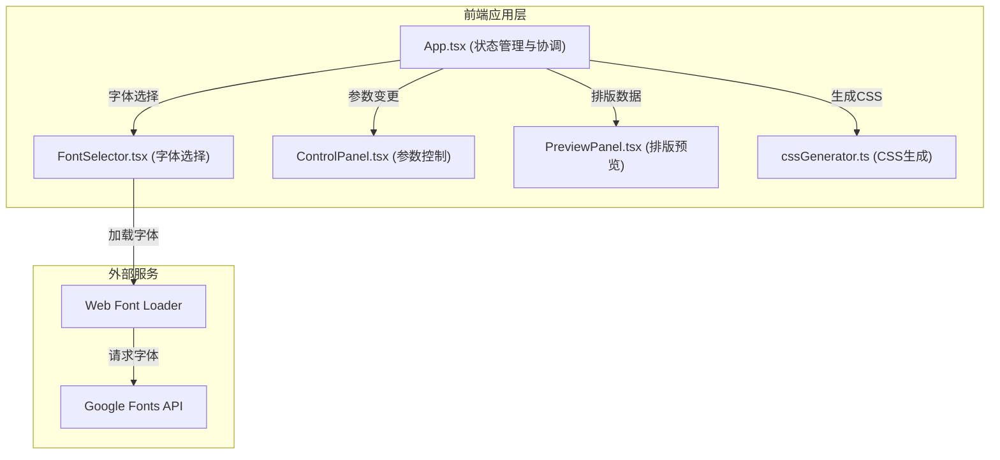
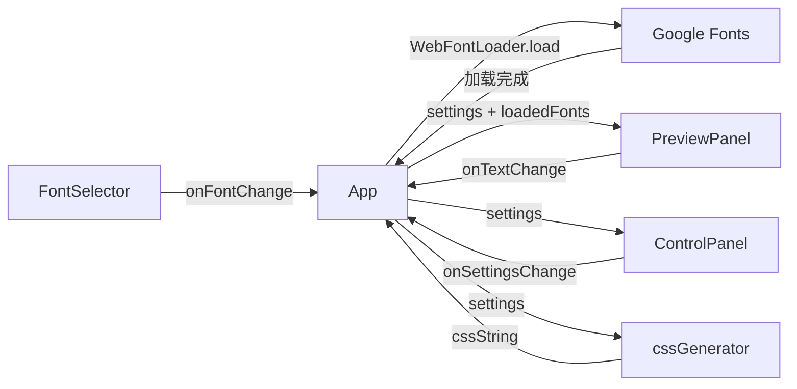

## 1. 架构设计



## 2. 技术描述

- 前端：React@18 + TypeScript + Vite@5
- 构建工具：Vite@5 + @vitejs/plugin-react
- 字体加载：@webfontloader/webfontloader
- 工具库：lodash (debounce性能优化)
- 后端：无，纯前端应用
- 数据库：无

## 3. 路由定义

| 路由 | 用途 |
|-------|---------|
| / | 主应用页面（字体排版对比与CSS生成） |

## 4. 数据模型

### 4.1 类型定义

```typescript
interface TypographySettings {
  fontFamily: string;
  fontWeight: number;       // 100-900, step 100, default 400
  letterSpacing: number;    // -0.1 to 0.3 em, step 0.01, default 0
  lineHeight: number;       // 1.0 to 2.5, step 0.1, default 1.6
  fontSize: number;         // 12-72 px, step 1, default 20
}

interface AppState {
  mainSettings: TypographySettings;
  compareSettings: TypographySettings;
  compareMode: boolean;
  isLoading: boolean;
  errorMessage: string | null;
  previewText: string;
  loadedFonts: string[];
}
```

### 4.2 预设字体列表

```typescript
const PRESET_FONTS = [
  { name: 'Roboto', category: 'sans-serif' },
  { name: 'Open Sans', category: 'sans-serif' },
  { name: 'Lato', category: 'sans-serif' },
  { name: 'Montserrat', category: 'sans-serif' },
  { name: 'Playfair Display', category: 'serif' },
  { name: 'Source Code Pro', category: 'monospace' },
];
```

## 5. 组件数据流



## 6. 性能优化策略

1. **滑块更新防抖**：使用lodash.debounce，预览保持30fps+
2. **字体异步加载**：Web Font Loader不阻塞UI
3. **CSS样式优化**：使用CSS变量减少重排
4. **组件拆分**：PureComponent/React.memo避免不必要重渲染
5. **requestAnimationFrame**：高频更新同步到帧
