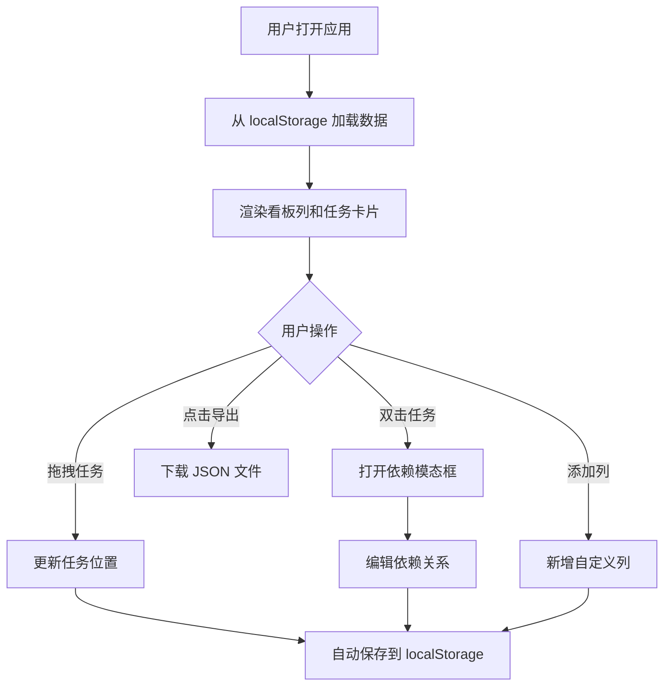

## 1. 产品概述

轻量级看板任务管理应用，面向个人或小团队，在浏览器中提供直观的任务看板、拖拽排序和任务依赖关系可视化追踪。
- 解决传统看板工具过于复杂（如Jira）或缺乏任务依赖关系直观展示的痛点
- 帮助用户清晰地识别任务阻塞关系，提升团队协作效率

## 2. 核心功能

### 2.1 用户角色
无角色区分，所有用户享有完整的看板管理权限。

### 2.2 功能模块
1. **看板主页面**：多列看板展示、水平滚动容器、工具栏
2. **任务卡片**：拖拽排序、双击编辑依赖、信息展示
3. **依赖关系管理**：模态框编辑、前置任务勾选、搜索添加
4. **数据管理**：本地持久化存储、JSON 导出

### 2.3 页面详情

| 页面名称 | 模块名称 | 功能描述 |
|----------|----------|----------|
| 看板主页 | 看板列展示 | 横向滚动展示三列默认看板（待办、进行中、已完成），支持新增自定义列 |
| 看板主页 | 工具栏 | 顶部展示"导出JSON"按钮，移动端底部浮动工具栏 |
| 看板主页 | 任务卡片 | 展示任务标题、描述、优先级标签、截止日期、依赖图标 |
| 看板主页 | 拖拽交互 | 支持任务卡片跨列拖拽移动，带占位符和过渡动画 |
| 依赖模态框 | 前置任务列表 | 以复选框形式展示当前任务的所有前置任务 |
| 依赖模态框 | 搜索添加 | 输入关键字模糊匹配所有任务，添加为前置依赖 |

## 3. 核心流程

用户进入应用后，首先从 localStorage 恢复上次看板状态。用户可以通过拖拽在列间移动任务、通过双击任务打开依赖编辑模态框管理前置任务、点击导出按钮导出数据。所有操作自动持久化到本地存储。

## 4. 用户界面设计

### 4.1 设计风格
- **主色调**：蓝色 #1976d2，强调色：琥珀色 #ffb300
- **列背景色**：待办 #e3f2fd（浅蓝）、进行中 #fff9c4（浅黄）、已完成 #c8e6c9（浅绿）
- **按钮样式**：圆角 6px，悬停时上移 2px 并加深阴影
- **字体**：系统无衬线字体（Roboto via Google Fonts）
- **布局风格**：卡片式布局，水平滚动看板容器
- **动效**：所有交互元素 200ms ease 过渡，拖拽时 300ms ease-out 平滑动画

### 4.2 页面设计概览

| 页面名称 | 模块名称 | UI 元素 |
|----------|----------|----------|
| 看板主页 | 看板列 | 彩色背景、列名、任务数量徽章（圆形 #1565c0）、+ 添加列按钮 |
| 看板主页 | 任务卡片 | 白色背景 220px 宽、圆角 8px、标题加粗 16px、描述灰色 50字截断、优先级彩色标签、截止日期、依赖图标（↖ 蓝色箭头） |
| 依赖模态框 | 弹框 | 半透明遮罩 #00000066、白色圆角 16px、宽度 460px、前置任务复选框、搜索输入框 |
| 工具栏 | 按钮 | 蓝色背景 #1e88e5、白色文字、圆角 6px、悬停动效 |

### 4.3 响应式设计
- **桌面端**：看板列水平滚动，任务卡片固定 220px 宽度
- **移动端（<768px）**：看板列垂直堆叠，任务卡片宽度 100%，工具栏固定在页面底部（白色背景 + 顶部浅阴影）

### 4.4 性能要求
- 拖拽交互帧率稳定 60fps
- 同时拖动超过 50 张任务卡片无可见卡顿
- 使用 CSS transform 和 opacity 实现动画以触发 GPU 加速
