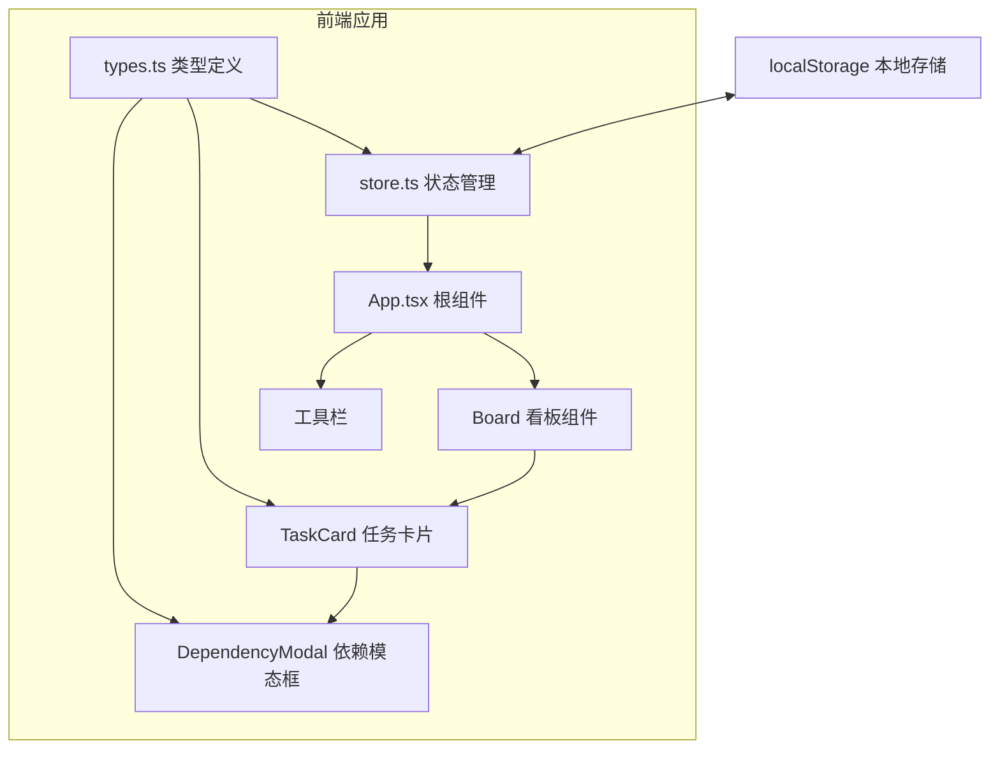
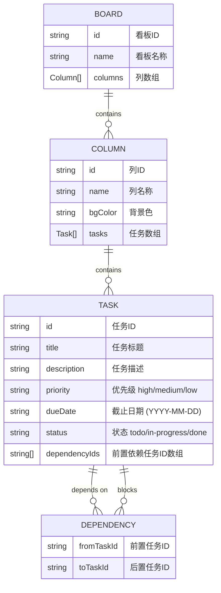

## 1. 架构设计



## 2. 技术描述

- **前端框架**：React 18 + TypeScript
- **构建工具**：Vite 5（开发服务器端口 3000）
- **状态管理**：useReducer + Context API（纯函数状态变更）
- **样式方案**：原生 CSS（CSS Variables + 响应式媒体查询）
- **拖拽实现**：HTML5 原生 Drag and Drop API
- **图标**：SVG 内联图标
- **依赖库**：uuid（ID 生成）、lodash（工具函数）

## 3. 项目结构

| 文件路径 | 用途 |
|----------|------|
| `package.json` | 项目依赖配置（react@18、react-dom、typescript、vite@5、@vitejs/plugin-react、uuid、lodash） |
| `vite.config.js` | Vite 构建配置，支持 React 和 TypeScript，devServer 端口 3000 |
| `tsconfig.json` | TypeScript 严格模式配置，target ES2020，moduleResolution bundler |
| `index.html` | 入口页面，挂载 root div，引入 Google Fonts Roboto |
| `src/types.ts` | 看板数据类型定义（Board、Column、Task、Dependency），readonly 接口 + 联合类型 |
| `src/store.ts` | 全局状态管理（useReducer），提供 addColumn、addTask、moveTask、toggleDependency、saveToLocalStorage、loadFromLocalStorage 等方法 |
| `src/components/Board.tsx` | 看板主组件，渲染三列布局和水平滚动容器，处理拖拽事件 |
| `src/components/TaskCard.tsx` | 任务卡片组件，展示任务信息、依赖图标和 Tooltip，支持双击打开模态框 |
| `src/components/DependencyModal.tsx` | 依赖关系编辑模态框组件，展示前置任务列表和搜索添加 |
| `src/App.tsx` | 根组件，组合 Board 和工具栏，初始化时从 localStorage 加载数据 |
| `src/index.css` | 全局样式（CSS 变量、滚动条样式、响应式布局） |
| `src/main.tsx` | React 应用入口 |

## 4. 数据模型

### 4.1 数据模型定义



### 4.2 初始数据结构

应用首次启动时自动创建默认三列看板：
- **待办**（背景 #e3f2fd）
- **进行中**（背景 #fff9c4）
- **已完成**（背景 #c8e6c9）

### 4.3 localStorage 存储格式

```json
{
  "columns": [
    {
      "id": "uuid",
      "name": "待办",
      "bgColor": "#e3f2fd",
      "taskIds": ["uuid-1", "uuid-2"]
    }
  ],
  "tasks": {
    "uuid-1": {
      "id": "uuid-1",
      "title": "任务标题",
      "description": "任务描述",
      "priority": "high",
      "dueDate": "2025-01-01",
      "columnId": "uuid-column",
      "dependencyIds": ["uuid-2"]
    }
  }
}
```

## 5. 关键技术实现

### 5.1 拖拽性能优化
- 使用原生 HTML5 Drag and Drop API
- 拖拽时通过 CSS `transform: scale(1.05)` 和 `opacity: 0.5` 实现视觉反馈
- 放置区域使用 `onDragOver` + `preventDefault()` 启用放置
- 数据传递使用 `dataTransfer.setData/getData`

### 5.2 状态管理策略
- 使用 `useReducer` 实现纯函数状态变更
- 所有 action 为不可变更新（返回新对象引用）
- 每次状态变更后自动触发 `saveToLocalStorage`

### 5.3 响应式布局
- CSS Grid + Flexbox 组合实现布局
- 媒体查询 `@media (max-width: 768px)` 适配移动端
- 使用 CSS 自定义属性统一管理颜色和尺寸变量

### 5.4 自定义滚动条
- `::-webkit-scrollbar` 系列伪元素定制水平滚动条
- 宽度 8px，滑块圆角 4px，背景 #e0e0e0，滑块 #90caf9
