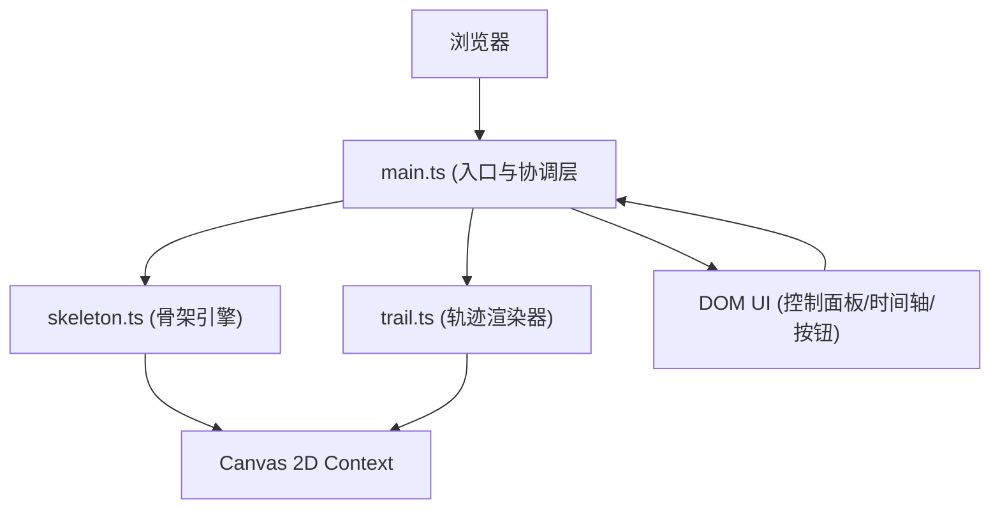

## 1. 架构设计



## 2. 技术描述

- 前端：TypeScript@5.3 + Vite@5.4 + Canvas 2D API
- 工具库：lodash@4.17（用于工具函数和防抖节流
- 构建工具：Vite@5.4
- 开发服务器端口：3000

## 3. 文件结构

| 文件路径 | 用途 |
|----------|------|
| package.json | 项目依赖和脚本配置 |
| vite.config.js | Vite构建配置 |
| tsconfig.json | TypeScript编译配置（严格模式，target ES2020 |
| index.html | 入口HTML页面 |
| src/main.ts | 主入口：Canvas初始化、主循环、事件处理、模块协调 |
| src/skeleton.ts | Bone类定义、正向运动学fkSolve函数 |
| src/trail.ts | TrailRenderer类、攻击轨迹绘制 |

## 4. 数据模型

### 4.1 Bone类定义

```typescript
interface BoneData {
  id: string;
  parentId: string | null;
  length: number;
  angle: number;
  x: number;
  y: number;
}
```

### 4.2 骨骼层级结构

- torso(根节点，无父节点)
  - head (parent: torso)
  - leftShoulder (parent: torso)
    - leftArm (parent: leftShoulder)
  - rightShoulder (parent: torso)
    - rightArm (parent: rightShoulder)
  - leftHip (parent: torso)
    - leftLeg (parent: leftHip)
  - rightHip (parent: torso)
    - rightLeg (parent: rightHip)

### 4.3 骨架数据导出格式

```typescript
interface SkeletonExport {
  head: { x: number; y: number; rotation: number };
  torso: { x: number; y: number; rotation: number };
  leftArm: { x: number; y: number; rotation: number };
  rightArm: { x: number; y: number; rotation: number };
  leftLeg: { x: number; y: number; rotation: number };
  rightLeg: { x: number; y: number; rotation: number };
}
```

## 5. 核心算法

### 5.1 正向运动学 (FK)

- 从根节点torso出发，递归计算每个子骨骼的末端世界坐标：
  子节点.x = 父节点.x + length * cos(父节点.angle + 子节点.angle)
  子节点.y = 父节点.y + length * sin(父节点.angle + 子节点.angle)

### 5.2 攻击轨迹插值

- 使用二次贝塞尔曲线插值右拳在0.3秒内的运动路径
- 拳速：800px/s
- 关键帧间隔：5px
- 帧数计算：总路径长度 / 5px

### 5.3 预设动画循环

- 右臂：-30° → 70° → -30°（0.5秒循环
- 左腿：0° → -20° → 0°（同步）

## 6. 性能优化策略

- 使用requestAnimationFrame实现60fps渲染循环
- 拖拽操作使用lodash.throttle或直接在RAF循环中处理
- Canvas使用脏矩形优化（仅重绘变化区域）
- 轨迹计算缓存，避免重复计算
- 事件委托减少事件监听器数量
