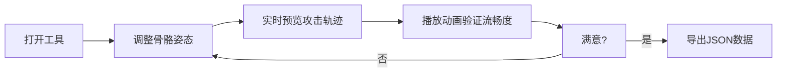

## 1. 产品概述

格斗游戏角色骨架搭建工具 - 帮助游戏设计师在浏览器中快速搭建2D横版格斗游戏角色骨架，预览不同骨骼姿态下角色攻击动作的流畅度。

- 解决像素风格斗游戏中，设计师需要反复调整角色各关节旋转角度和位置偏移才能让攻击动画有力量感和自然弧度的问题
- 相比传统在游戏引擎中逐一测试的方式，提供效率更高的可视化预览工具

## 2. 核心功能

### 2.1 用户角色

| 角色 | 注册方式 | 核心权限 |
|------|----------|----------|
| 游戏设计师 | 无需注册，直接使用 | 调整骨骼、预览轨迹、导出数据 |

### 2.2 功能模块

1. **骨架编辑画布**：火柴人角色展示、关节拖拽、正向运动学计算
2. **攻击轨迹预览**：右拳运动轨迹实时绘制、关键帧落点标记
3. **骨骼控制面板**：6个滑块精确控制各关节旋转角度
4. **时间轴动画播放**：预设攻击动画循环播放、播放头同步
5. **骨架数据导出**：导出当前骨骼状态为JSON文件

### 2.3 页面详情

| 页面名称 | 模块名称 | 功能描述 |
|----------|----------|----------|
| 主页面 | 骨架编辑画布 | 展示6节点火柴人，支持关节拖拽，关节高亮显示 |
| 主页面 | 攻击轨迹预览 | 240x240浅灰圆盘，绘制右拳运动轨迹和关键帧点阵 |
| 主页面 | 骨骼控制面板 | 6个滑块（头/躯干/左臂/右臂/左腿/右腿），-90°到90°范围 |
| 主页面 | 时间轴控制条 | 800x40时间轴，红色播放头，绿色播放按钮 |
| 主页面 | 数据导出按钮 | 导出骨架JSON文件下载 |

## 3. 核心流程

设计师打开工具 → 通过滑块或拖拽调整骨骼姿态 → 实时查看攻击轨迹预览 → 播放预设动画观察流畅度 → 满意后导出骨架数据

## 4. 用户界面设计

### 4.1 设计风格

- 主背景色：#1a1a2e，面板背景：#16213e，边框色：#0f3460
- 关节节点：白色圆点（半径6px），选中时橙色#ff8c00放大到8px，带光晕效果
- 滑块背景：#37474f，手柄色：#7c3aed，值显示白色文字
- 播放按钮：圆形绿色#2ecc71（直径32px）
- 导出按钮：矩形蓝色#3498db（圆角6px），hover时#2980b9
- 攻击轨迹：实心红色曲线（宽度2px），半透明红色关键帧点阵
- 整体圆角：6px-12px，过渡动画0.2s ease

### 4.2 页面设计概览

| 页面名称 | 模块名称 | UI元素 |
|----------|----------|--------|
| 主页面 | 骨架编辑画布 | 中央Canvas、6关节火柴人、拖拽交互、光晕效果 |
| 主页面 | 攻击轨迹预览 | 右侧圆盘、红色轨迹曲线、关键帧点阵、辉光边缘 |
| 主页面 | 骨骼控制面板 | 左侧垂直滑块组、角度数值显示 |
| 主页面 | 时间轴控制条 | 底部播放控制、三角形播放头、动画进度 |
| 主页面 | 数据导出按钮 | 右上角功能按钮区 |

### 4.3 响应式设计

- 桌面端（≥800px）：三栏布局（左控制面板、中央画布、右预览区），水平居中
- 移动端（<800px）：垂直排列（控制面板在上、画布居中、预览区在下）

### 4.4 性能要求

- 拖拽骨骼和滑块滑动时帧率≥55fps
- 攻击轨迹绘制延迟≤16ms
- 使用requestAnimationFrame实现流畅动画循环
