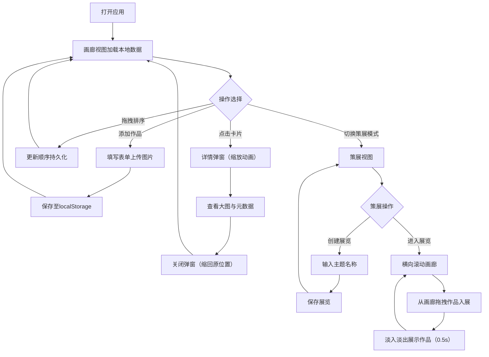

## 1. 产品概述

个人艺术收藏品数字画廊与策展平台，为艺术品爱好者提供管理、展示和虚拟策展的一站式体验。
- 目标用户：艺术品收藏家、数字艺术家、艺术爱好者
- 核心价值：将实体/数字艺术品集中管理，通过虚拟策展实现多样化的艺术叙事

## 2. 核心功能

### 2.1 功能模块

1. **画廊视图**：艺术品卡片网格展示、拖拽排序、添加/编辑/删除作品、localStorage持久化
2. **策展模式**：创建主题展览、从画廊拖拽作品入展、横向滚动画廊、淡入淡出切换动画
3. **作品详情**：点击卡片弹出模态框、大图展示、完整元数据表格、毛玻璃背景、缩放关闭动画

### 2.3 页面详情

| 页面名称 | 模块名称 | 功能描述 |
|---------|---------|---------|
| 画廊主页 | 顶部导航 | 标题显示、模式切换（画廊/策展）、添加作品按钮 |
| 画廊主页 | 卡片网格 | 4列响应式网格布局、艺术品卡片、拖拽排序、悬浮上浮效果 |
| 画廊主页 | 添加/编辑表单 | 作品名称、艺术家、年份、流派、材料、尺寸、描述、缩略图上传 |
| 策展视图 | 展览列表 | 已创建展览卡片、创建新展览入口 |
| 策展视图 | 展览详情 | 横向滚动画廊、淡入淡出切换（0.5s过渡）、作品移除功能 |
| 作品详情弹窗 | 模态框 | 大图展示、元数据表格（名称/艺术家/年份/流派/材料/尺寸）、毛玻璃背景、缩放关闭动画 |

## 3. 核心流程

用户打开应用 → 浏览画廊（可拖拽调整顺序）→ 点击查看作品详情 → 切换至策展模式 → 创建主题展览 → 从画廊拖拽作品进入展览 → 浏览展览作品（横向滚动+淡入淡出切换）

## 4. 用户界面设计

### 4.1 设计风格

- **主色调**：宁静米白色（#F8F6F2）作为背景，深灰色（#2D2D2D）作为文字和边框
- **卡片样式**：极简1px黑色边框包裹，轻微阴影（0 2px 8px rgba(0,0,0,0.06)）
- **悬浮效果**：上浮3px + 阴影加深（0 6px 20px rgba(0,0,0,0.12)）
- **背景纹理**：CSS noise颗粒纹理叠加在米白背景上
- **毛玻璃效果**：弹窗背景 backdrop-filter: blur(8px)
- **字体**：衬线字体用于标题（如Playfair Display或类似艺术感字体），无衬线用于正文

### 4.2 页面设计概述

| 页面名称 | 模块名称 | UI元素 |
|---------|---------|---------|
| 画廊主页 | 顶部导航 | 居左艺术字体标题、居右模式切换Tab、添加作品按钮、米白背景带纹理 |
| 画廊主页 | 卡片网格 | 4列网格（桌面）→ 3列（平板）→ 2列（大手机）→ 1列（小手机）、间距24px、卡片悬停上浮3px |
| 策展视图 | 展览卡片 | 与艺术品卡片一致风格、显示主题名称和作品数量 |
| 策展视图 | 展览画廊 | 横向滚动容器、作品居中展示、淡入淡出过渡0.5s |
| 作品详情弹窗 | 模态框 | 居中展示、毛玻璃半透明黑色遮罩、大图在左/元数据表格在右、关闭按钮 |

### 4.3 响应式设计

- **桌面端（≥1200px）**：4列网格，详情弹窗左右布局
- **平板端（768-1199px）**：3列网格，弹窗保持左右布局
- **大手机（480-767px）**：2列网格，弹窗上下布局
- **小手机（<480px）**：1列网格，弹窗上下布局，按钮尺寸增大

## 4.4 性能要求

- 画廊滚动保持60fps（使用CSS transform和will-change优化）
- 缩略图懒加载（IntersectionObserver）
- 单张缩略图不超过200KB（前端压缩处理）
