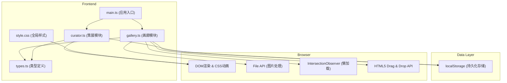
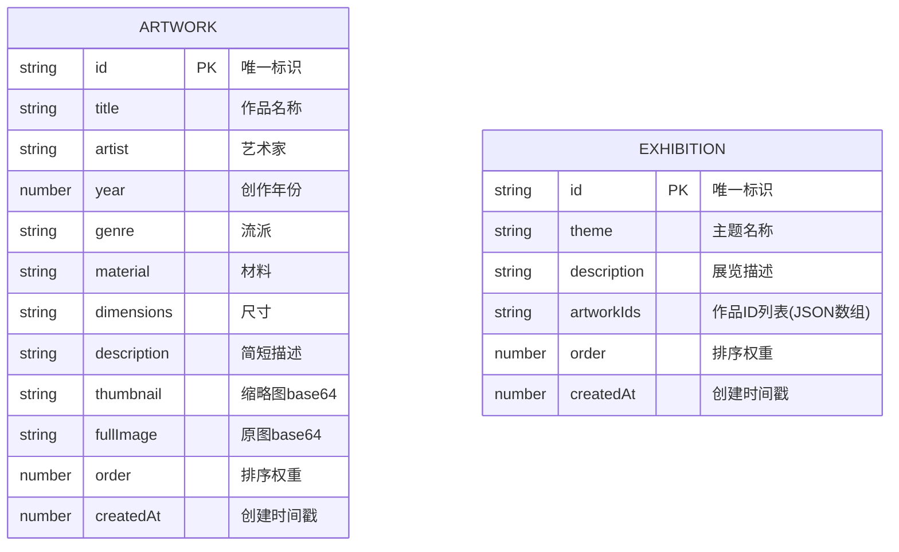

## 1. 架构设计



## 2. 技术说明

- **前端框架**：原生 TypeScript + Vite（无第三方UI框架）
- **构建工具**：Vite 5.x，devServer端口3000
- **类型系统**：TypeScript 5.x 严格模式，target ES2020，DOM类型
- **样式方案**：纯CSS，CSS变量管理主题，CSS动画/过渡
- **数据存储**：浏览器localStorage
- **核心API**：HTML5 Drag & Drop、File API、IntersectionObserver、Canvas API（图片压缩）

## 3. 路由与视图

| 视图模式 | 触发方式 | 功能 |
|---------|---------|------|
| Gallery View | 顶部Tab切换 | 艺术品网格、拖拽排序、CRUD操作 |
| Curator View | 顶部Tab切换 | 展览列表、展览详情、作品管理 |
| Modal Overlay | 点击卡片触发 | 作品详情、大图预览、元数据展示 |

## 4. 数据模型

### 4.1 数据模型定义



### 4.2 类型定义（TypeScript）

```typescript
// src/types.ts
export interface Artwork {
  id: string;
  title: string;
  artist: string;
  year: number;
  genre: string;
  material: string;
  dimensions: string;
  description: string;
  thumbnail: string;
  fullImage: string;
  order: number;
  createdAt: number;
}

export interface Exhibition {
  id: string;
  theme: string;
  description: string;
  artworkIds: string[];
  order: number;
  createdAt: number;
}

export type GalleryState = {
  artworks: Artwork[];
  exhibitions: Exhibition[];
  currentView: 'gallery' | 'curator';
  currentExhibitionId: string | null;
};
```

### 4.3 localStorage存储键

- `art_gallery_artworks`: 艺术品列表JSON
- `art_gallery_exhibitions`: 展览列表JSON

## 5. 文件结构

```
├── package.json          # 项目依赖与脚本
├── vite.config.js        # Vite构建配置
├── tsconfig.json         # TypeScript配置
├── index.html            # 入口HTML
└── src/
    ├── main.ts           # 应用入口
    ├── gallery.ts        # 画廊模块
    ├── curator.ts        # 策展模块
    ├── style.css         # 全局样式
    └── types.ts          # 类型定义
```

## 6. 性能优化方案

1. **60fps滚动**：使用 `transform: translate3d()` 和 `will-change: transform` 启用GPU加速
2. **图片懒加载**：IntersectionObserver监听，进入视口后再加载 `data-src`
3. **图片压缩**：Canvas API将上传图片压缩至200KB以内，保持合适分辨率
4. **拖拽性能**：使用 `requestAnimationFrame` 节流拖拽位置更新
5. **动画优化**：仅对 transform 和 opacity 属性做过渡，避免触发重排重绘
