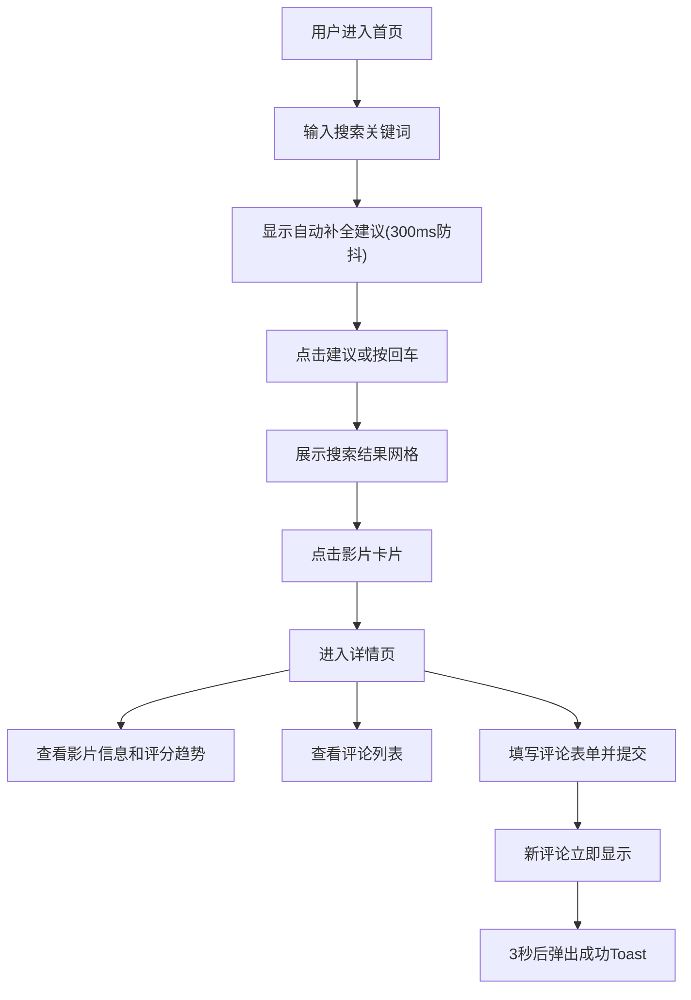

## 1. 产品概述
在线影视作品评论与评分聚合看板应用，为用户提供影片搜索、详情浏览、评论提交和评分趋势分析功能。
- 主要用途：帮助用户快速查找影片信息、阅读他人评论、发表个人观点、追踪评分变化趋势
- 目标用户：电影爱好者、普通观众、影评人

## 2. 核心功能

### 2.1 功能模块
1. **首页搜索页**：影片搜索栏、自动补全建议、搜索结果网格展示
2. **影片详情页**：影片基本信息展示、剧情简介、平均评分显示、评分趋势图表、评论列表、评论提交表单

### 2.2 页面详情
| 页面名称 | 模块名称 | 功能描述 |
|-----------|-------------|---------------------|
| 首页搜索页 | 搜索栏 | 实时输入自动补全（最多5条，300ms防抖），回车或点击建议触发搜索 |
| 首页搜索页 | 搜索结果网格 | 响应式卡片网格展示（每行3-4张，自适应） |
| 影片详情页 | 影片信息区 | 海报、标题、年份、类型标签、剧情简介、动态颜色平均评分 |
| 影片详情页 | 评分趋势图 | Recharts折线图展示近30天每日平均评分变化 |
| 影片详情页 | 评论列表 | 展示所有评论及用户头像昵称 |
| 影片详情页 | 评论表单 | 昵称输入、评论内容、提交按钮（带动画） |

## 3. 核心流程
用户在首页输入关键词进行搜索，从自动补全列表选择或回车触发搜索，浏览搜索结果卡片，点击卡片进入详情页。在详情页查看影片信息、评分趋势和已有评论，填写昵称和评论内容后提交，新评论立即显示并弹出成功提示。

## 4. 用户界面设计

### 4.1 设计风格
- **主色调**：深色主题，主背景#0f0f23，卡片背景#1e1e2e
- **强调色**：紫色#7c3aed（按钮、类型标签），悬停#6d28d9
- **评分渐变色**：0-5分红色#e74c3c，5-8分橙色#f39c12，8-10分绿色#2ecc71
- **文字色**：#e0e0e0
- **圆角**：统一8px或12px，搜索框24px
- **按钮样式**：圆角8px，悬停变亮，点击0.1s缩放动画
- **字体**：Google Fonts Inter
- **布局风格**：卡片式布局，响应式网格
- **过渡动画**：0.2-0.3s，hover缩放1.02或改变阴影

### 4.2 页面设计概览
| 页面名称 | 模块名称 | UI元素 |
|-----------|-------------|-------------|
| 首页搜索页 | 搜索栏 | 宽60%最大600px，圆角24px，深灰背景白字，内边距12px 20px，下方建议列表 |
| 首页搜索页 | 搜索结果卡片 | 海报、标题、年份、平均评分，hover缩放1.02加阴影 |
| 影片详情页 | 信息区 | 左侧海报40%宽圆角8px，右侧标题24px粗体、年份、类型标签(浅紫背景圆角12px)、简介行高1.6、评分48px渐变色 |
| 影片详情页 | 评分图表 | 宽100%高300px，圆点半径4px紫色，折线渐变半透明紫色填充，悬停提示数值 |
| 影片详情页 | 评论表单 | 昵称输入50%宽，内容区宽100%高120px圆角8px边框#ddd，紫色按钮 |

### 4.3 响应式设计
- **大屏(>=1024px)**：详情页左右两栏布局，卡片网格每行3-4张
- **中屏(768-1023px)**：海报缩小至30%宽度，评论列表移到底部，卡片网格每行2-3张
- **小屏(<768px)**：单列布局，搜索框宽度90%，卡片网格每行1-2张
