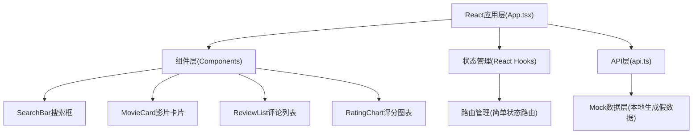
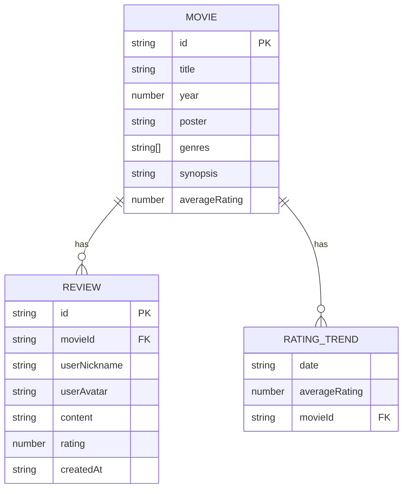

## 1. 架构设计



## 2. 技术说明
- **前端框架**：React@18 + TypeScript
- **构建工具**：Vite@5 + @vitejs/plugin-react
- **图表库**：Recharts@2
- **工具库**：uuid、lodash
- **样式方案**：原生CSS（内联样式+CSS变量）
- **数据来源**：本地Mock数据（无后端）

## 3. 路由定义
| 路由 | 用途 |
|-------|---------|
| / | 首页：搜索框 + 影片卡片列表 |
| /movie/:id | 详情页：影片信息 + 评分图表 + 评论列表 + 评论表单 |

## 4. 数据模型

### 4.1 数据模型定义


### 4.2 类型接口定义
- **Movie**：id, title, year, poster, genres, synopsis, averageRating
- **Review**：id, movieId, userNickname, userAvatar, content, rating, createdAt
- **RatingTrend**：date, averageRating

## 5. 性能优化策略
- **Code Splitting**：组件级代码分割，降低首屏加载时间
- **防抖搜索**：300ms防抖处理输入事件
- **React.memo**：RatingChart等组件使用memo避免不必要重渲染
- **useMemo/useCallback**：优化数据计算和回调函数
- **目标指标**：首屏<3秒，搜索响应<200ms，评论刷新<500ms，图表FPS>=30

## 6. 项目文件结构
```
├── package.json
├── vite.config.js
├── tsconfig.json
├── index.html
└── src/
    ├── types.ts          # TypeScript接口类型
    ├── main.tsx          # React入口
    ├── App.tsx           # 主应用组件
    ├── api.ts            # Mock API层
    └── components/
        ├── SearchBar.tsx      # 搜索框组件
        ├── MovieCard.tsx      # 影片卡片组件
        ├── ReviewList.tsx     # 评论列表组件
        └── RatingChart.tsx    # 评分趋势图表
```
