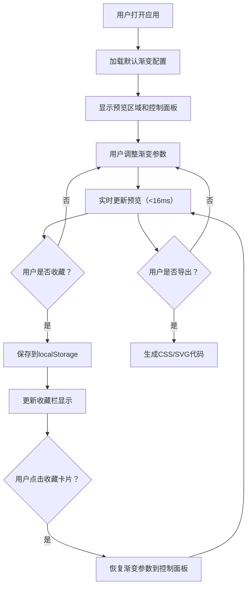

## 1. 产品概述

渐变色彩主题工具是一款面向前端开发者和UI设计师的在线渐变创作平台，帮助用户在浏览器中快速创建、预览和导出自定义渐变色彩方案，支持线性渐变、径向渐变和圆锥渐变三种模式。

- 解决设计师在选配色方案时反复切换工具调整色标、角度和位置的痛点
- 实现实时预览渐变在不同形状上的呈现效果，支持一键收藏和导出CSS/SVG代码

## 2. 核心功能

### 2.1 功能模块

1. **渐变预览区域**：300x300像素的预览画布，支持方形、圆形、正六边形三种形状切换，附带平滑过渡动画
2. **控制面板**：渐变模式切换（线性/径向/圆锥）、角度滑块、色标编辑器（颜色拾取+位置滑块）、圆心偏移控制
3. **收藏栏**：本地存储收藏的渐变方案，支持最多20个收藏卡片，点击即可恢复参数
4. **导出功能**：一键生成CSS渐变代码和SVG示例

### 2.2 页面详情

| 页面名称 | 模块名称 | 功能描述 |
|---------|---------|---------|
| 主页 | 渐变预览区 | 300x300预览画布，背景色#1a1a2e，圆角16px，内嵌阴影，支持三种形状切换及0.4s过渡动画 |
| 主页 | 控制面板 | 宽度320px，背景色#16213e，渐变模式按钮、角度滑块、色标编辑器、圆心偏移滑块 |
| 主页 | 收藏栏 | 页面底部横向排列的渐变卡片，宽120px高60px，圆角8px，悬停放大效果 |
| 主页 | 收藏按钮 | 心形图标按钮，悬停填充色从透明渐变为#e94560 |

## 3. 核心流程

## 4. 用户界面设计

### 4.1 设计风格

- **主色调**：#1a1a2e（深紫蓝）
- **辅助色**：#16213e（深蓝）、#0f3460（藏青）
- **强调色**：#e94560（玫红）
- **文字色**：#eaeaea（浅灰白）
- **控件风格**：12px圆角、2px边框（#0f3460），焦点时边框色变为#e94560并带0.2s过渡
- **动画**：形状切换0.4s scale+opacity过渡，按钮选中0.3s背景色渐变，收藏卡片悬停scale 1.08
- **整体风格**：深色科幻风格，简洁现代，注重交互细节

### 4.2 页面设计概览

| 页面名称 | 模块名称 | UI元素 |
|---------|---------|--------|
| 主页 | 渐变预览区 | 300x300画布，形状下拉选择器（方形/圆形/正六边形），内嵌阴影，圆角16px，过渡动画 |
| 主页 | 控制面板 | 渐变模式切换按钮组（线性/径向/圆锥，90x40px），角度滑块（0-360度），色标编辑器（颜色拾取+位置滑块+拖拽排序），圆心X/Y偏移滑块 |
| 主页 | 收藏栏 | 横向滚动卡片列表，最多20个卡片，每个120x60px，圆角8px，悬停放大+阴影 |
| 主页 | 收藏按钮 | 心形图标，默认轮廓，悬停填充#e94560渐变 |

### 4.3 响应式设计

- **桌面端**（>768px）：预览区300x300px居中，左侧控制面板320px固定宽度
- **移动端**（≤768px）：预览区缩放为240x240px居中，控制面板折叠到顶部
- 触摸操作优化：增大滑块可点击区域

## 5. 性能要求

- 渐变参数调整后预览区域在16ms内完成重绘（60FPS）
- 收藏列表渲染延迟不超过50ms
- 使用CSS硬件加速实现过渡动画
- localStorage读写操作异步处理，不阻塞UI
