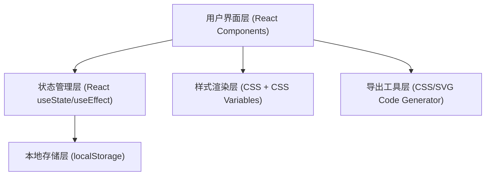

## 1. 架构设计



## 2. 技术描述

- **前端框架**：React@18 + TypeScript
- **构建工具**：Vite@5 + @vitejs/plugin-react
- **辅助库**：lodash（工具函数）、uuid（生成唯一ID）
- **样式方案**：原生CSS + CSS Modules（内联样式处理动态渐变）
- **状态管理**：React Hooks（useState、useEffect、useCallback、useMemo）
- **数据持久化**：localStorage

## 3. 文件结构

```
├── index.html                      # 入口HTML
├── package.json                    # 项目依赖配置
├── vite.config.js                  # Vite构建配置
├── tsconfig.json                   # TypeScript配置
└── src/
    ├── types.ts                    # 类型定义
    ├── App.tsx                     # 根组件
    ├── utils/
    │   └── gradientUtils.ts        # 渐变CSS生成工具
    └── components/
        ├── Preview.tsx             # 预览区域组件
        ├── ControlPanel.tsx        # 控制面板组件
        └── FavoritesBar.tsx        # 收藏栏组件
```

## 4. 数据模型

### 4.1 核心类型定义

```typescript
type GradientMode = 'linear' | 'radial' | 'conic';

type ShapeType = 'square' | 'circle' | 'hexagon';

interface GradientStop {
  id: string;
  color: string;
  position: number;
}

interface GradientConfig {
  mode: GradientMode;
  angle: number;
  stops: GradientStop[];
  cx: number;
  cy: number;
}

interface FavoriteItem {
  id: string;
  name: string;
  config: GradientConfig;
  createdAt: number;
}
```

### 4.2 本地存储键名

- `gradient-favorites`: 收藏的渐变列表 JSON 字符串

## 5. 组件职责

### 5.1 Preview.tsx
- **Props**: `config: GradientConfig`, `shape: ShapeType`
- **职责**: 根据配置渲染渐变背景，处理形状切换动画，导出SVG渲染
- **性能**: 使用CSS `will-change` 优化，动画使用transform和opacity

### 5.2 ControlPanel.tsx
- **Props**: `config: GradientConfig`, `onChange: (config: GradientConfig) => void`
- **职责**: 渲染所有参数输入控件，处理用户交互，实时回调更新配置
- **子功能**: 渐变模式切换、角度控制、色标编辑（增删改+拖拽排序）、圆心偏移

### 5.3 FavoritesBar.tsx
- **Props**: `onSelect: (config: GradientConfig) => void`, `currentConfig: GradientConfig`
- **职责**: 从localStorage加载收藏列表，渲染收藏卡片，处理收藏/取消收藏操作
- **性能**: 最多20个卡片，使用CSS contain优化渲染

### 5.4 App.tsx
- **职责**: 维护全局状态（当前渐变配置、形状类型、收藏列表），组合所有子组件，同步渐变到favicon，处理导出功能

## 6. 性能优化策略

1. **CSS渐变硬件加速**: 使用 `transform: translateZ(0)` 或 `will-change: background`
2. **防抖节流**: 色标滑块使用 lodash throttle (16ms) 确保60FPS
3. **本地存储优化**: 收藏操作使用 microtask 异步写入，避免阻塞UI
4. **Memo优化**: 使用 React.memo 包裹纯展示组件，useMemo 缓存CSS生成结果
5. **避免强制回流**: 动画仅使用 transform 和 opacity 属性

## 7. 导出功能

### CSS导出格式
```css
/* 线性渐变 */
background: linear-gradient({angle}deg, {color1} {pos1}%, {color2} {pos2}%, ...);

/* 径向渐变 */
background: radial-gradient(circle at {cx}% {cy}%, {color1} {pos1}%, {color2} {pos2}%, ...);

/* 圆锥渐变 */
background: conic-gradient(from {angle}deg at {cx}% {cy}%, {color1} {pos1}%, {color2} {pos2}%, ...);
```

### SVG导出格式
```xml
<svg width="300" height="300" xmlns="http://www.w3.org/2000/svg">
  <defs>
    <linearGradient id="grad" x1="0%" y1="0%" x2="100%" y2="100%">
      <stop offset="{pos1}%" stop-color="{color1}" />
      <stop offset="{pos2}%" stop-color="{color2}" />
    </linearGradient>
  </defs>
  <rect width="100%" height="100%" fill="url(#grad)" />
</svg>
```
