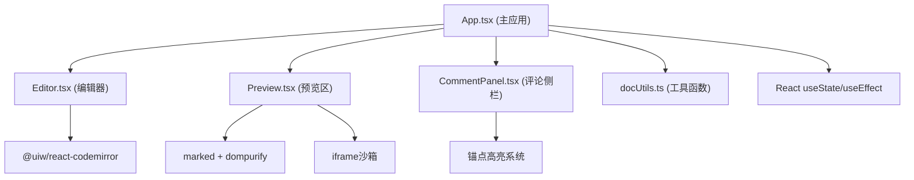

## 1. 架构设计



## 2. 技术描述
- **前端框架**：React@18 + TypeScript + Vite@5
- **编辑器**：@uiw/react-codemirror + @codemirror/lang-javascript + @codemirror/lang-html
- **Markdown 渲染**：marked + dompurify
- **工具库**：uuid（生成ID）、lodash（debounce/throttle）
- **样式方案**：CSS Modules / 内联样式（无需 Tailwind，按需求精确控制）
- **状态管理**：React useState + useCallback（轻量场景，无需 Zustand）

## 3. 项目文件结构
| 路径 | 用途 |
|-------|---------|
| package.json | 项目依赖与脚本 |
| vite.config.js | Vite 构建配置（含路径别名 @/） |
| tsconfig.json | TypeScript 严格模式配置 |
| index.html | 入口页面（Inter字体、深色背景、#root挂载） |
| src/App.tsx | 主应用：文档/版本/评论状态、拖拽分割线、组件装配 |
| src/components/Editor.tsx | Markdown编辑器：CodeMirror、版本控制条、代码块按钮 |
| src/components/Preview.tsx | 预览渲染：Markdown→HTML、代码运行iframe、刷新/全屏 |
| src/components/CommentPanel.tsx | 评论侧栏：列表、回复、折叠、滑入动画 |
| src/utils/docUtils.ts | 工具：版本快照、时间戳、导出md、分享短链接 |

## 4. 数据模型

### 4.1 类型定义
```typescript
interface CodeBlock {
  id: string;
  language: 'javascript' | 'typescript' | 'html';
  code: string;
  output?: string;
}

interface DocVersion {
  version: string;
  content: string;
  timestamp: string;
}

interface Comment {
  id: string;
  anchorText: string;
  author: string;
  content: string;
  timestamp: string;
  replies: CommentReply[];
}

interface CommentReply {
  id: string;
  author: string;
  content: string;
  timestamp: string;
}

interface AppState {
  content: string;
  versions: DocVersion[];
  currentVersion: string;
  comments: Comment[];
  splitRatio: number;
  commentPanelOpen: boolean;
}
```

## 5. 核心模块设计

### 5.1 编辑器模块
- 使用 @uiw/react-codemirror，配置 markdown 语法高亮
- 代码块通过正则解析识别 ```js/ts/html 块
- 版本控制条：显示当前版本、保存按钮、版本下拉选择器

### 5.2 预览模块
- marked 解析 Markdown → dompurify 安全过滤 → innerHTML 渲染
- 代码块渲染为带 Run 按钮的卡片，点击后在下方展开 iframe
- JS/TS：在 iframe 中通过 Function 构造器执行，捕获 console.log
- HTML：直接写入 iframe srcdoc
- 刷新：重置所有 iframe；全屏：进入 Fullscreen API

### 5.3 评论模块
- 监听 selectionchange 事件，选中文本后弹出评论按钮
- 锚点文本通过 Range API 获取，匹配预览区 DOM 添加高亮下划线
- 评论列表使用 CSS keyframes 实现 translateX(20px)→0 滑入动画

### 5.4 拖拽分割线
- mouse down 记录起始 X 坐标与当前宽度
- mouse move 实时计算 splitRatio（0-1）
- mouse up 释放监听，应用最终比例

## 6. 性能优化点
- lodash.debounce 包装 Markdown 渲染（100ms，确保 ≤150ms 指标）
- 代码执行使用 iframe 沙箱，避免阻塞主线程
- 评论提交使用 React 状态局部更新，不触发全量重渲染
- 拖拽使用 requestAnimationFrame 节流
