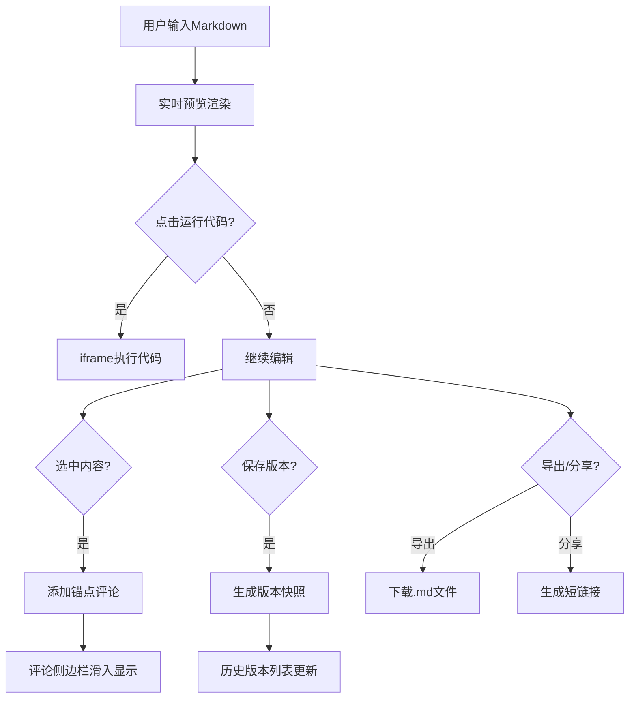

## 1. 产品概述

交互式技术文档协作平台，面向中小型团队，解决传统静态文档无法即时运行示例代码、无法记录代码片段讨论反馈的痛点。提供 Markdown 编辑、代码实时运行、锚点评论、版本管理和一键分享能力，提升技术文档的协作性与可验证性。

## 2. 核心功能

### 2.1 用户角色
| 角色 | 注册方式 | 核心权限 |
|------|----------|----------|
| 文档作者 | 无需注册（本地使用） | 编辑文档、保存版本、导出分享、查看评论 |
| 文档读者 | 无需注册（访问分享链接） | 阅读文档、运行代码、添加评论与回复 |

### 2.2 功能模块
1. **文档编辑器**：Markdown 语法高亮编辑，嵌入式可运行代码块（JS/TS/HTML），版本控制条
2. **实时预览区**：Markdown 渲染、代码运行 iframe、刷新/全屏控制
3. **评论讨论系统**：文本/代码选中锚点、侧边栏评论列表、回复功能
4. **版本管理**：版本快照保存、历史版本切换、时间戳记录
5. **导出与分享**：导出 Markdown 文件、生成模拟分享链接

### 2.3 页面详情
| 页面名称 | 模块名称 | 功能描述 |
|-----------|-------------|---------------------|
| 主编辑页面 | 版本控制条 | 显示当前版本号、保存新版本按钮、历史版本下拉列表 |
| 主编辑页面 | Markdown 编辑器 | 60%宽度、深色背景、代码块嵌入、语言标签、运行/重置按钮 |
| 主编辑页面 | 可拖拽分割线 | 4px宽、悬停变色、支持拖拽调整编辑/预览比例 |
| 主编辑页面 | 实时预览区 | 40%宽度、Markdown 转 HTML、代码运行 iframe、刷新/全屏按钮 |
| 主编辑页面 | 评论侧边栏 | 250px宽、可折叠、评论列表带滑入动画、回复支持 |
| 主编辑页面 | 顶部操作栏 | 导出 Markdown、生成分享链接弹窗 |

## 3. 核心流程

用户在编辑区输入 Markdown 文本和嵌入式代码块 → 实时预览区同步渲染（≤150ms）→ 用户点击代码块"运行"按钮 → 预览区底部展开 iframe 执行代码（≤500ms）→ 用户选中文本/代码行 → 点击评论按钮添加评论 → 评论以动画形式滑入侧边栏 → 用户保存版本快照 → 可从历史版本列表切换恢复 → 导出为 .md 或生成分享链接。

## 4. 用户界面设计

### 4.1 设计风格
- **主色调**：深色主题 #1a1a2e，文字 #eaeaea
- **强调色**：紫色 #7c3aed（评论、分割线悬停）、黄色 #f0db4f（JS标签）
- **编辑器**：背景 #1e1e2e，代码块背景 #2d2d44，圆角12px/8px
- **预览区**：背景 #252a34
- **按钮**：平滑 hover 过渡（0.2s ease-out），点击缩放 0.95
- **字体**：Google Fonts Inter（正文）、等宽字体（代码）
- **布局**：桌面端左右分栏（60%/40%），移动端上下堆叠
- **动画**：评论项淡入+右侧滑入（translateX 20px→0）

### 4.2 页面设计概览
| 页面名称 | 模块名称 | UI 元素 |
|-----------|-------------|-------------|
| 主编辑页面 | 版本控制条 | 版本号标签、保存按钮（紫色渐变）、下拉选择器、时间戳 |
| 主编辑页面 | Markdown 编辑器 | CodeMirror 语法高亮、代码块语言角标、行内运行/重置按钮 |
| 主编辑页面 | 分割线 | 4px竖线、hover高亮紫色、拖拽光标 |
| 主编辑页面 | 预览区 | Markdown渲染HTML、代码运行iframe（200px高）、刷新/全屏图标按钮 |
| 主编辑页面 | 评论侧边栏 | 可折叠面板、评论卡片（头像+昵称+时间+内容）、回复输入框、紫色高亮锚点下划线 |
| 主编辑页面 | 分享弹窗 | 模态框、短链接展示、一键复制按钮 |

### 4.3 响应式适配
- 桌面端（≥768px）：左右分栏布局，编辑区60%/预览区40%，评论侧边栏常驻250px
- 移动端（<768px）：上下堆叠布局，各占100%宽度，评论列表隐藏为浮动按钮触发

### 4.4 性能指标
- Markdown 渲染延迟：≤150ms（使用 debounce）
- 代码运行结果展示：≤500ms（iframe沙箱执行）
- 评论提交：仅局部更新评论列表，不触发页面重绘
