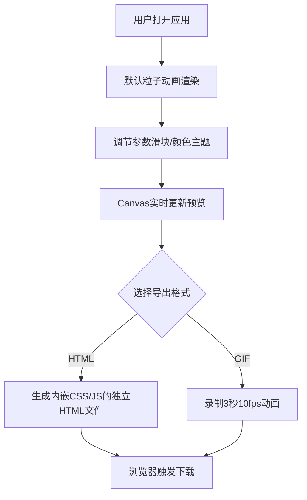

## 1. 产品概述
交互式网页背景生成与导出应用，用户可通过可视化参数调节实时预览粒子动画背景，并导出为独立HTML或GIF文件。
- 面向设计师、前端开发者、内容创作者，提供快速生成精美动态背景的工具
- 降低网页背景开发成本，提供可定制、可导出的专业级粒子动画效果

## 2. 核心功能

### 2.1 用户角色
| 角色 | 注册方式 | 核心权限 |
|------|----------|----------|
| 访客用户 | 无需注册 | 使用所有调节与导出功能 |

### 2.2 功能模块
1. **粒子画布**：全屏实时渲染粒子动画，支持鼠标交互吸引效果
2. **参数控制**：粒子数量、大小、速度、连接距离的滑块调节
3. **颜色主题**：4种预设渐变色彩方案一键切换
4. **导出模块**：独立HTML文件导出、3秒GIF动画录制导出

### 2.3 页面详情
| 页面名称 | 模块名称 | 功能描述 |
|---------|---------|----------|
| 主页面 | 粒子画布 | 全屏Canvas渲染，自适应窗口尺寸，深蓝背景#0a0a23，粒子随机运动，间距小于阈值时绘制连接线，鼠标悬停吸引粒子 |
| 主页面 | 参数控制面板 | 右侧固定面板，包含4个参数滑块（粒子数量、粒子大小、运动速度、连接距离），实时数值显示 |
| 主页面 | 颜色主题切换 | 4个圆形色板按钮，点击切换颜色主题，带0.3秒渐变动画 |
| 主页面 | 导出功能区 | 导出HTML和导出GIF两个按钮，GIF录制显示进度百分比 |

## 3. 核心流程
用户打开应用 → 查看默认粒子动画效果 → 通过滑块或色板调节参数 → 实时预览变化 → 点击导出按钮 → 下载HTML或GIF文件

## 4. 用户界面设计

### 4.1 设计风格
- **主色调**：紫色#7c3aed（按钮、滑块手柄），深蓝#0a0a23（画布背景），深灰#1e1e2e（控制面板）
- **辅助色**：绿色#2ecc71（GIF导出按钮），4种渐变主题色彩
- **文字色**：浅灰#e0e0e0
- **圆角风格**：控制面板16px，按钮8px，色板50%
- **字体**：系统字体栈 -apple-system, BlinkMacSystemFont, 'Segoe UI', Roboto
- **间距**：控件间距统一16px，面板内边距20px

### 4.2 页面设计概览
| 页面名称 | 模块名称 | UI元素 |
|---------|---------|--------|
| 主页面 | 粒子画布 | 全屏Canvas，深蓝背景，圆形粒子，半透明连接线，鼠标交互吸引 |
| 主页面 | 控制面板 | 右侧280px宽固定面板，深色背景，圆角16px，内边距20px，垂直排列滑块 |
| 主页面 | 滑块控件 | 标签显示当前值（14px，#e0e0e0），轨道#3a3a5a，手柄#7c3aed，操作时0.15s缩放动画 |
| 主页面 | 颜色主题 | 4个32px圆形色板按钮，点击选中状态，0.3s颜色渐变过渡 |
| 主页面 | 导出按钮 | 320x44px，圆角8px，HTML紫色，GIF绿色，hover加深，点击0.1s下沉+涟漪效果 |

### 4.3 响应式
- **桌面端（≥768px）**：控制面板右侧固定，宽度280px，画布占满剩余空间
- **移动端（<768px）**：控制面板底部固定，高度200px，宽度100%，水平滚动布局，画布自动缩小适应

### 4.4 视觉交互反馈
- 滑块手柄：hover/active时 transform: scale(1.2)，0.15s过渡
- 按钮点击：transform: translateY(2px) 下沉效果，0.1s过渡，涟漪波纹动画
- 颜色切换：粒子和连接线颜色0.3s平滑渐变
