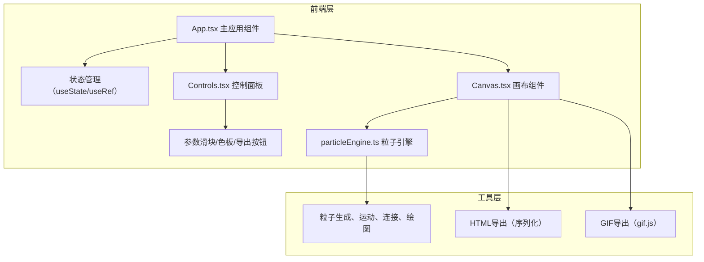

## 1. 架构设计



## 2. 技术描述
- **前端框架**：React@18 + TypeScript
- **构建工具**：Vite@5 配合 @vitejs/plugin-react
- **工具库**：lodash（工具函数）、html2canvas（画布截图）、gif.js（GIF生成）
- **渲染方式**：原生Canvas 2D API，requestAnimationFrame驱动动画循环
- **初始化方式**：使用 react-ts 模板的 Vite 项目脚手架

## 3. 项目文件结构
```
e:\solo\VersionFast\tasks\auto154\
├── package.json
├── vite.config.js
├── tsconfig.json
├── index.html
├── src/
│   ├── App.tsx
│   ├── main.tsx (入口)
│   ├── index.css (全局样式)
│   ├── components/
│   │   ├── Canvas.tsx
│   │   └── Controls.tsx
│   └── utils/
│       └── particleEngine.ts
└── .trae/
    └── documents/
        ├── PRD.md
        └── Technical_Architecture.md
```

## 4. 核心模块说明

### 4.1 particleEngine.ts 粒子引擎
| 类型/接口 | 说明 |
|-----------|------|
| `Particle` | 粒子数据结构：x, y, vx, vy, size, colorIndex |
| `ParticleConfig` | 配置参数：count, size, speed, connectDistance, colorTheme |
| `createParticles(width, height, config)` | 生成指定数量的随机粒子 |
| `updateParticles(particles, config, width, height, mouse)` | 计算粒子下一帧位置，处理边界和鼠标吸引 |
| `drawParticles(ctx, particles, config)` | 绘制粒子圆点和连接线 |

### 4.2 Canvas.tsx 画布组件
- `useRef<HTMLCanvasElement>` 引用画布
- `useEffect` 监听窗口 resize 自适应尺寸
- `requestAnimationFrame` 动画循环，60fps
- `exportHTML()` 生成包含完整动画逻辑的独立HTML文件（Blob + URL.createObjectURL）
- `exportGIF()` 使用 gif.js 录制3秒动画，10fps，显示进度回调

### 4.3 Controls.tsx 控制面板
- 4个 range input 滑块，onChange 回调更新父组件 state
- 4个颜色主题按钮，点击切换 active 状态
- 导出按钮，点击调用父组件传入的导出函数

### 4.4 App.tsx 主应用
- 集中管理所有参数状态（粒子数、大小、速度、连接距离、颜色主题）
- 响应式布局：useMediaQuery 检测 <768px 断点切换布局
- 向子组件传递参数和回调函数

## 5. 性能优化策略
- **Canvas渲染**：仅在动画帧内执行绘图，避免不必要的重绘
- **粒子数量控制**：参数变更时平滑重建粒子数组，避免频繁GC
- **连接距离优化**：使用空间划分或提前终止减少 O(n²) 距离计算
- **GIF导出**：使用 Web Worker（gif.js内置）避免阻塞主线程
- **lodash使用**：debounce/throttle 处理 resize 和滑块高频事件

## 6. 颜色主题预设
| 主题名称 | 起始色 | 结束色 |
|---------|--------|--------|
| 蓝紫（默认） | #4a9eff | #9b59b6 |
| 红橙 | #ff6b6b | #feca57 |
| 绿青 | #00b894 | #00cec9 |
| 灰白 | #b2bec3 | #dfe6e9 |
