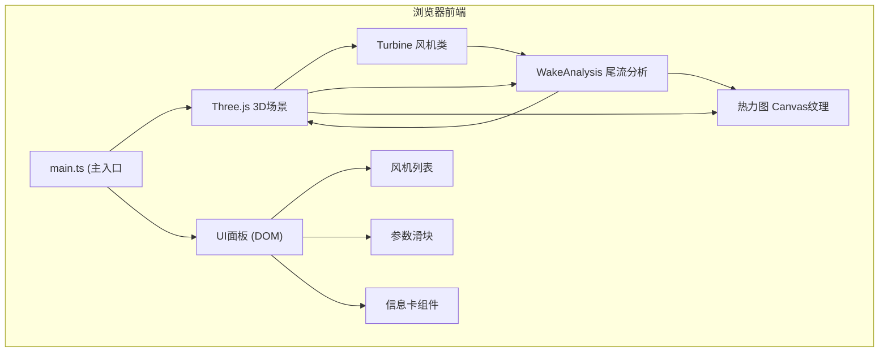

## 1. 架构设计



## 2. 技术描述

- 前端框架: 原生 TypeScript + Three.js 0.160
- 构建工具: Vite 5
- 状态管理: 模块内局部状态 + 回调通信
- 辅助库: lodash (工具函数)
- 无后端，纯前端应用

## 3. 文件结构

| 文件路径 | 职责说明 |
|---------|---------|
| package.json | 依赖声明与脚本配置 |
| vite.config.js | Vite 构建配置 (端口3000) |
| tsconfig.json | TypeScript 严格模式配置 |
| index.html | 入口HTML，全屏容器 |
| src/main.ts | 场景初始化、相机/渲染器/控制器、模块组装、动画循环 |
| src/turbine.ts | Turbine 类: 风机模型构建、参数更新、发电量计算、旋转动画 |
| src/wakeAnalysis.ts | 尾流衰减矩阵计算、热力图数据生成、连线颜色映射 |
| src/uiPanel.ts | 右侧控制面板 DOM 构建、事件绑定、状态维护、回调通信 |

## 4. 核心数据模型

### Turbine 参数
```typescript
interface TurbineParams {
  position: { x: number; y: number; z: number };
  towerHeight: number;      // 塔筒高度 60-120m
  bladeRadius: number;       // 叶片半径 2-5m
  pitchAngle: number;        // 螺距角 -20~+20度
}
```

### 全局参数
```typescript
interface GlobalParams {
  uniformTowerHeight: number;   // 统一塔筒高度
  uniformBladeRadius: number;  // 统一叶片半径
  windSpeed: number;           // 基准风速 5-15m/s
}
```

### 尾流分析输出
```typescript
interface WakeResult {
  attenuationMatrix: number[][];  // NxN 风速衰减百分比矩阵
  heatmapData: number[][];      // 128x128 热力图数值
  connectionColors: string[];   // 每条连线颜色
  connectionLabels: string[];    // 每条连线衰减标签
}
```

## 5. 关键算法

### 尾流衰减模型 (简化版 Jensen 模型)
- 基于风机间距、上游风机转子直径计算下游风速衰减
- 衰减 = 随风向假设沿X轴正方向
- 下游风机接收风速 = 基准风速 × (1 - 衰减率)

### 发电量计算
- 功率 = 0.5 × ρ × A × v³ × Cp
- ρ = 空气密度 (1.225 kg/m³)
- A = π × r² (扫风面积
- v = 有效风速
- Cp = 功率系数 (约0.4)

### 热力图生成
- 128x128 网格采样整个地形区域
- 每格点值 = 基准风速 - Σ(各上游风机对该点衰减)
- Canvas 2D 动态生成纹理
- 颜色映射: #000033(低) → #ff3300(高)
