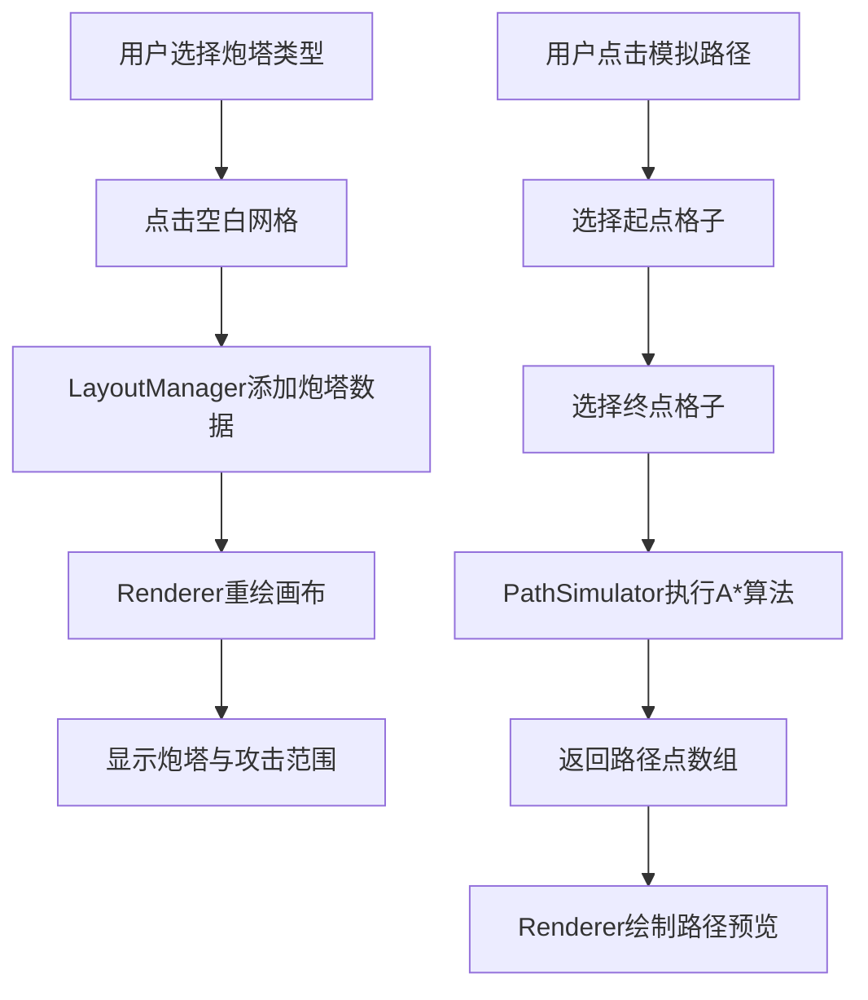

## 1. 产品概述

塔防布局与攻击范围可视化模拟器，帮助游戏策划快速预览炮塔放置位置和攻击范围叠加效果，评估敌方行进路径和防御布局合理性。

- 核心用途：塔防游戏关卡设计阶段的可视化辅助工具
- 目标用户：游戏策划、关卡设计师

## 2. 核心功能

### 2.1 功能模块

1. **炮塔管理模块**：炮塔放置、类型选择、删除、移动拖拽
2. **攻击范围可视化模块**：半透明圆形范围显示、重叠区域颜色加深混合
3. **路径模拟模块**：基于A*算法的敌方路径计算与预览
4. **属性面板模块**：展示选中炮塔的详细属性信息

### 2.2 页面详情

| 页面名称 | 模块名称 | 功能描述 |
|---------|---------|---------|
| 主画布页面 | 炮塔选择面板 | 左上角显示3种炮塔类型按钮（机枪/加农炮/激光），点击选中放置类型 |
| 主画布页面 | 网格画布 | 800x600 Canvas区域，网格大小40x40，支持点击放置/选中炮塔 |
| 主画布页面 | 攻击范围渲染 | 每个炮塔显示半透明圆形攻击范围，重叠区域通过lighter混合加深 |
| 主画布页面 | 属性信息面板 | 左下角显示选中炮塔的攻击力、射程、射速等属性 |
| 主画布页面 | 路径控制按钮 | 顶部"模拟路径"和"清除路径"按钮 |
| 主画布页面 | 路径预览 | 蓝色虚线显示敌方模拟路径，路径格子浅蓝底色表示受攻击风险 |

## 3. 核心流程

### 3.1 炮塔放置流程
用户选择炮塔类型 → 点击空白网格 → 炮塔放置成功并显示攻击范围 → 可选拖拽移动或按D删除

### 3.2 路径模拟流程
用户点击"模拟路径"按钮 → 点击起点格子 → 点击终点格子 → 系统执行A*算法计算路径 → 渲染蓝色虚线路径和受攻击格子

## 4. 用户界面设计

### 4.1 设计风格
- **主色调**：深色科技感背景 #2d3436，面板背景 #1e1e2e
- **炮塔颜色**：机枪#e74c3c（红）、加农炮#3498db（蓝）、激光#2ecc71（绿）
- **按钮样式**：圆角6-8px，背景#2980b9，悬停变暗#1f618d
- **字体**：monospace，大小12px，白色文本
- **动画**：炮塔放置200ms缩放动画（0.8→1.0），选中状态脉动发光效果

### 4.2 页面设计概览

| 模块名称 | UI元素 | 位置 | 样式 |
|---------|--------|------|------|
| 炮塔选择面板 | 3个圆形按钮 | 画布左上角 | 背景#1e1e2e，圆角8px，内边距10px |
| 属性信息面板 | 文字信息 | 画布左下角 | 白色12px monospace字体 |
| 路径控制按钮 | "模拟路径""清除路径" | 画布顶部居中 | 圆角6px，背景#2980b9，按钮间距10px |
| 网格画布 | 800x600 Canvas | 页面中央 | 背景#2d3436，网格线#636e72，线宽1px |
| 炮塔图标 | 圆形/方形 + 颜色区分 | 网格格子中心 | 放置动画200ms，选中发光脉动 |
| 攻击范围 | 半透明圆形 | 炮塔中心为圆心 | 透明度0.3，globalCompositeOperation='lighter' |
| 路径预览 | 蓝色虚线 + 浅蓝格子 | 画布上 | 虚线间距5px，线宽2px，格子#add8e6 |

### 4.3 响应式设计
- 桌面端优先设计，Canvas固定800x600居中显示
- 控制面板绝对定位覆盖在Canvas上方
