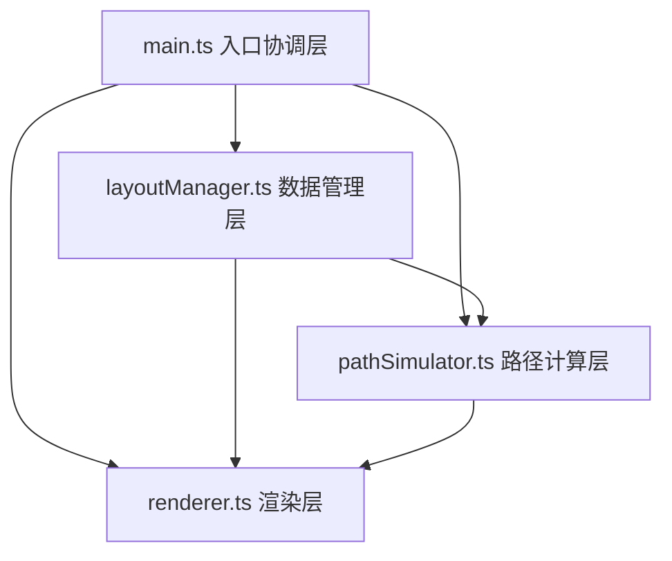

## 1. 架构设计



- **入口层 (main.ts)**：初始化Canvas、绑定事件监听、协调各模块数据交互
- **数据层 (layoutManager.ts)**：管理炮塔位置、类型、范围数据，提供增删改查接口
- **渲染层 (renderer.ts)**：Canvas 2D绘制，网格、炮塔、范围、路径等可视化
- **计算层 (pathSimulator.ts)**：A*路径算法，基于炮塔布局模拟敌方行进路线

## 2. 技术描述

- **前端框架**：无框架，纯TypeScript + Canvas 2D
- **构建工具**：Vite@5
- **语言**：TypeScript（严格模式，target ES2020）
- **工具库**：lodash
- **开发服务器**：Vite devServer，端口3000

## 3. 文件结构与调用关系

```
项目根目录/
├── index.html                      # 入口HTML，加载主脚本
├── package.json                    # 依赖与启动脚本
├── vite.config.js                  # Vite构建配置
├── tsconfig.json                   # TypeScript配置
└── src/
    ├── main.ts                     # [入口] 初始化Canvas，事件监听，协调各模块
    ├── layoutManager.ts            # [数据层] 炮塔数据管理，供main.ts调用
    ├── renderer.ts                 # [渲染层] Canvas绘制，接收main.ts数据
    └── pathSimulator.ts            # [计算层] A*路径算法，供main.ts调用
```

**数据流向：**
1. 用户点击Canvas → main.ts事件处理 → 调用layoutManager.addTower()/selectTower()
2. layoutManager数据更新 → main.ts调用renderer.render()传入最新数据
3. 用户点击"模拟路径" → main.ts获取起点终点 → 调用pathSimulator.findPath()传入炮塔布局
4. pathSimulator返回路径点数组 → main.ts传给renderer.drawPath()绘制

## 4. 数据模型定义

### 4.1 炮塔类型定义

```typescript
type TowerType = 'machinegun' | 'cannon' | 'laser';

interface TowerConfig {
  type: TowerType;
  name: string;
  range: number;          // 攻击范围（像素）
  damage: number;         // 伤害
  fireRate: number;       // 射速
  slowEffect: number;     // 减速效果（0-1）
  color: string;          // 颜色HEX
}

interface Tower {
  id: string;
  type: TowerType;
  gridX: number;          // 网格X坐标
  gridY: number;          // 网格Y坐标
  placedAt: number;       // 放置时间戳（用于动画）
}
```

### 4.2 炮塔配置常量

| 类型 | 射程 | 伤害 | 颜色 |
|------|------|------|------|
| 机枪 (machinegun) | 120px | 低 (10) | #e74c3c |
| 加农炮 (cannon) | 180px | 中 (25) | #3498db |
| 激光 (laser) | 250px | 高 (50) | #2ecc71 |

## 5. 核心算法

### 5.1 A*路径算法
- 网格大小：20列 x 15行（800/40 x 600/40）
- 可走格子：未被炮塔占据的格子
- 代价计算：基础移动代价1，重叠攻击范围区域代价增加（减速区域）
- 启发函数：曼哈顿距离 |x1-x2| + |y1-y2|
- 性能约束：响应时间 ≤ 50ms

### 5.2 攻击范围重叠检测
- 对每个格子计算被多少个炮塔攻击范围覆盖
- Canvas使用globalCompositeOperation='lighter'自动叠加颜色

## 6. 性能优化策略

1. **渲染帧率控制**：requestAnimationFrame驱动，仅在状态变化时重绘
2. **离屏渲染缓存**：网格背景缓存到离屏Canvas，无需每帧重绘
3. **拖拽优化**：拖拽过程中只更新当前拖拽炮塔位置，不重绘全部范围
4. **A*算法优化**：使用二叉堆优化OpenList操作，预处理炮塔阻塞格子
