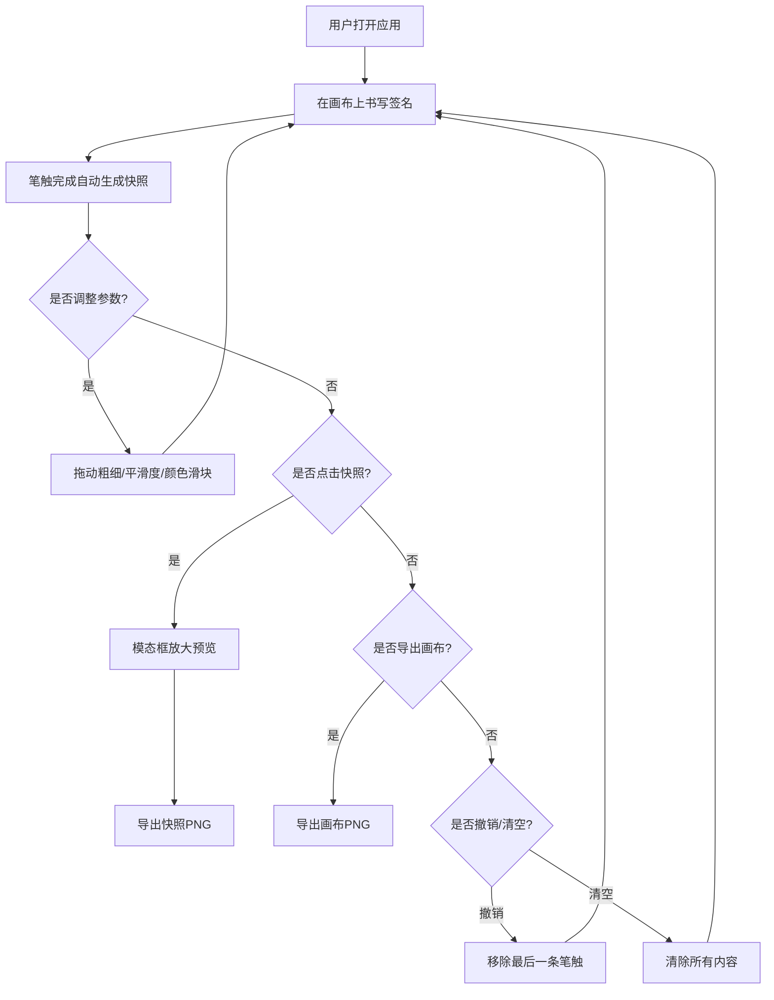

## 1. 产品概述

在线手写签名画板与笔迹风格对比应用，允许用户在浏览器中使用鼠标或触控笔自由书写签名，实时调整笔画参数，并通过快照功能对比最近三次笔迹效果，支持导出为PNG图片。

- **目标用户**：需要电子签名、手写笔迹验证、签名设计对比的个人和企业用户
- **核心价值**：提供流畅的手写绘制体验，支持多版本笔迹对比，一键导出标准图片格式

## 2. 核心功能

### 2.1 功能模块

1. **签名画布**：实时绘制签名，支持鼠标和触控输入，贝塞尔曲线平滑处理
2. **控制面板**：笔画粗细调节、平滑度调节、颜色选择器、撤销和清空按钮
3. **快照对比**：自动保存最近三次笔迹缩略图，支持放大预览和单独导出
4. **导出功能**：画布整体导出为PNG，快照单独导出为PNG

### 2.2 页面详情

| 页面名称 | 模块名称 | 功能描述 |
|-----------|-------------|---------------------|
| 主页面 | 签名画布 | 600x300白色画布，支持鼠标/触控绘制，实时渲染贝塞尔曲线 |
| 主页面 | 控制面板 | 粗细滑块(1-20px)、平滑度滑块(1-10)、颜色选择器(6色预设)、撤销按钮、清空按钮 |
| 主页面 | 快照条 | 三张120x80缩略图，悬停放大，点击弹出模态框预览和导出 |
| 主页面 | 导出按钮 | 画布右下角绿色按钮，导出当前画布为PNG |

## 3. 核心流程

用户打开应用 → 在画布上书写签名 → 完成一条笔触自动生成快照 → 调整滑块参数 → 继续书写对比 → 点击快照放大预览 → 导出画布或快照

## 4. 用户界面设计

### 4.1 设计风格

- **主色调**：深蓝黑 #0f0f23（页面背景）、深紫蓝 #1a1a2e（面板背景）、紫色 #7c3aed（滑块手柄）、绿色 #2ecc71（导出按钮）
- **画布背景**：纯白 #ffffff（模拟纸张）
- **边框色**：#2d2d44
- **预设颜色**：红 #e74c3c、蓝 #3498db、绿 #2ecc71、黄 #f1c40f、紫 #9b59b6、深灰 #34495e
- **按钮样式**：圆角6px，白色文字，字重500，字号14px
- **滑块样式**：轨道4px高 #2d2d44，手柄16px直径 #7c3aed，悬停缩放1.1
- **字体**：使用现代无衬线字体，保持简洁专业

### 4.2 页面设计概述

| 页面名称 | 模块名称 | UI元素 |
|-----------|-------------|-------------|
| 主页面 | 签名画布 | 600x300px白色区域，圆角8px，2px边框 #2d2d44，居中显示 |
| 主页面 | 控制面板 | 背景 #1a1a2e，圆角12px，内边距20px，两行三列网格布局 |
| 主页面 | 快照条 | 三张缩略图水平排列，间距12px，圆角8px，悬停放大和阴影效果 |
| 主页面 | 导出按钮 | 固定在画布右下角，绿色背景，悬停变亮 |

### 4.3 响应式设计

- **桌面端（>700px）**：画布600x300px居中，控制面板两行三列网格
- **移动端（≤700px）**：画布宽度100%，控制面板单列布局，滑块和按钮上下排列
- 触控设备优化：支持触控笔和手指输入
