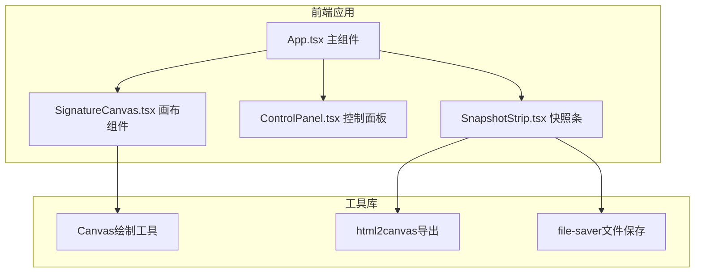

## 1. 架构设计



## 2. 技术描述

- **前端框架**：React@18 + TypeScript
- **构建工具**：Vite@5 + @vitejs/plugin-react
- **状态管理**：React useState/useRef（组件内局部状态）
- **工具库**：
  - lodash：工具函数
  - file-saver：文件下载
  - html2canvas：DOM转Canvas导出PNG
- **初始化工具**：vite-init

## 3. 路由定义

| 路由 | 用途 |
|-------|---------|
| / | 签名画板主页面（单页应用，无路由） |

## 4. 数据结构

### 4.1 笔触数据结构

```typescript
interface Point {
  x: number;
  y: number;
}

interface Stroke {
  points: Point[];
  thickness: number;
  smoothness: number;
  color: string;
}

interface Snapshot {
  id: string;
  dataUrl: string;
  timestamp: number;
}
```

### 4.2 画布状态

```typescript
interface CanvasState {
  strokes: Stroke[];
  currentStroke: Stroke | null;
  isDrawing: boolean;
}
```

## 5. 核心模块设计

### 5.1 SignatureCanvas 画布组件
- Props：
  - `thickness: number` - 当前笔画粗细
  - `smoothness: number` - 当前平滑度
  - `color: string` - 当前颜色
  - `onStrokeComplete: () => void` - 笔触完成回调
- Methods（通过ref暴露）：
  - `undo()` - 撤销最后一条笔触
  - `clear()` - 清空画布
  - `exportCanvas()` - 导出画布为dataUrl
- 事件处理：mousedown/touchstart、mousemove/touchmove、mouseup/touchend/mouseleave
- 使用 requestAnimationFrame 优化绘制性能

### 5.2 ControlPanel 控制面板组件
- Props：
  - `thickness: number`
  - `smoothness: number`
  - `color: string`
  - `onThicknessChange: (v: number) => void`
  - `onSmoothnessChange: (v: number) => void`
  - `onColorChange: (v: string) => void`
  - `onUndo: () => void`
  - `onClear: () => void`
  - `canUndo: boolean`
  - `canClear: boolean`
- 颜色选择器：6色预设横向色带，点击选取

### 5.3 SnapshotStrip 快照条组件
- Props：
  - `snapshots: Snapshot[]`
  - `onExport: (snapshot: Snapshot) => void`
- 模态框：点击缩略图放大预览，提供导出按钮

## 6. 性能优化策略

- 使用 requestAnimationFrame 进行绘制，保持60FPS
- 每条笔触独立存储，超过200条时自动合并最早笔触（保留可视内容）
- 快照缩略图使用离屏Canvas生成，延迟不超过50ms
- 使用 useRef 管理Canvas上下文和绘制状态，避免不必要的重渲染
