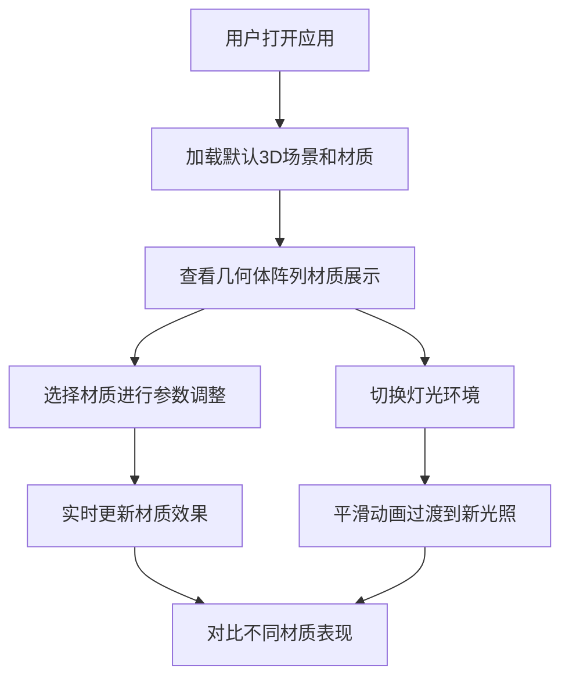

## 1. 产品概述
3D材质对比应用，帮助建筑师和室内设计师在浏览器中交互式查看不同材质在真实光照下的表现效果。
- 解决传统选材需要实物样片、难以模拟不同环境光效的痛点
- 目标用户：建筑师、室内设计师、材料选型专业人士

## 2. 核心功能

### 2.1 功能模块
1. **3D场景渲染区**：几何体阵列展示、PBR材质应用、轨道控制交互
2. **材质参数控制面板**：滑块调节、实时预览、材质选择
3. **灯光环境切换器**：预设灯光场景、平滑动画过渡

### 2.3 页面详情
| 页面名称 | 模块名称 | 功能描述 |
|-----------|-------------|---------------------|
| 主页 | 3D场景渲染区 | Three.js渲染球体、立方体、圆环阵列，支持拖拽旋转/缩放，FPS≥30 |
| 主页 | 材质参数控制面板 | 动态调整粗糙度、金属度、清漆强度、环境光遮蔽，即时更新<100ms |
| 主页 | 灯光环境切换器 | 3种预设场景（日光、暖光射灯、冷光暗室），1.5秒平滑过渡 |

## 3. 核心流程
用户打开应用 → 查看默认材质展示 → 选择材质进行参数调整 → 切换灯光环境观察效果 → 对比不同材质表现

## 4. 用户界面设计
### 4.1 设计风格
- 主色调：#1a1a2e（深色背景）
- 强调色：#e94560（交互高亮）
- 极简深色UI，专业科技感
- 滑块悬停缩放1.05倍高亮动画
- 材质缩略图淡入切换效果（0.3秒）

### 4.2 页面布局
| 页面名称 | 模块名称 | UI元素 |
|-----------|-------------|-------------|
| 主页 | 3D场景区 | 左侧70%宽度，Three.js Canvas，轨道控制 |
| 主页 | 控制面板 | 右侧30%宽度，可折叠，滑块、颜色选择器、材质缩略图 |
| 主页 | 移动端适配 | 控制面板折叠为底部抽屉式 |

### 4.3 响应式
- 桌面端（1920x1080）：左右分栏布局
- 移动端（≤768px）：上下布局，控制面板为底部抽屉

### 4.4 3D场景指引
- 环境：深色背景，专业材质展示氛围
- 灯光：3套预设方案，支持平滑过渡动画
- 相机：PerspectiveCamera，OrbitControls轨道控制
- 几何体：球体、立方体、圆环三种标准几何体阵列排列
- 材质：至少5种PBR材质（粗糙木纹、磨砂金属、抛光大理石等）
- 性能：FPS≥30，参数调整重绘≤200ms
