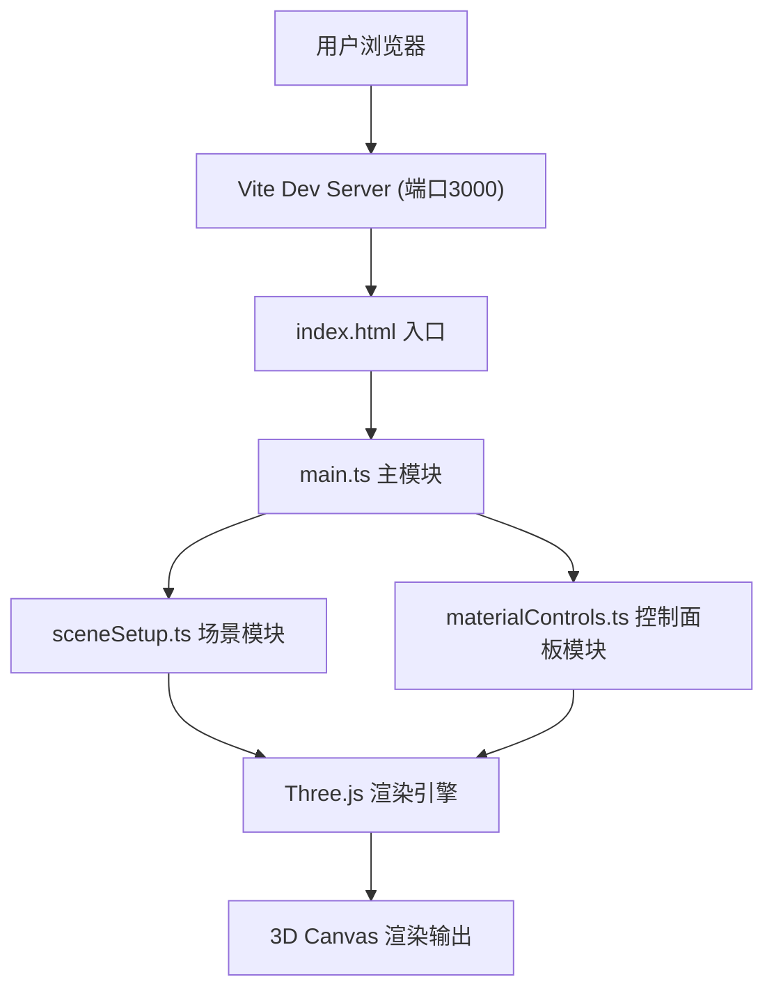

## 1. 架构设计

## 2. 技术描述
- 前端框架：纯 TypeScript (无React/Vue框架)
- 3D引擎：Three.js @^0.160.0
- 类型定义：@types/three
- 构建工具：Vite
- 编程语言：TypeScript (严格模式，target ES2020)

## 3. 项目文件结构
| 文件路径 | 作用 |
|-------|---------|
| package.json | 项目依赖配置（three、@types/three、typescript、vite） |
| vite.config.js | Vite构建配置，devServer端口3000 |
| tsconfig.json | TypeScript严格模式配置 |
| index.html | 入口页面，包含3D容器 |
| src/main.ts | 初始化场景、相机、渲染器，启动动画循环 |
| src/sceneSetup.ts | 创建几何体阵列、设置灯光、轨道控制器 |
| src/materialControls.ts | 控制面板UI，材质属性调整事件绑定 |

## 4. 核心模块设计

### 4.1 场景模块 (sceneSetup.ts)
- 导出：SceneAPI 对象
- 功能：创建几何体阵列、PBR材质实例、灯光系统、OrbitControls
- 方法：getMeshByName(name)、updateMaterialParams()、setLightingPreset()

### 4.2 控制面板模块 (materialControls.ts)
- 导出：ControlsAPI 对象
- 功能：生成滑块/颜色选择器UI、绑定事件、与场景模块通信
- 方法：init()、onMaterialChange(callback)、onLightingChange(callback)

## 5. 性能优化
- 材质参数更新直接修改MeshStandardMaterial属性，触发GPU材质更新
- 灯光过渡使用requestAnimationFrame线性插值
- 使用OrbitControls.enableDamping提升交互流畅度
- 几何体复用共享BufferGeometry
