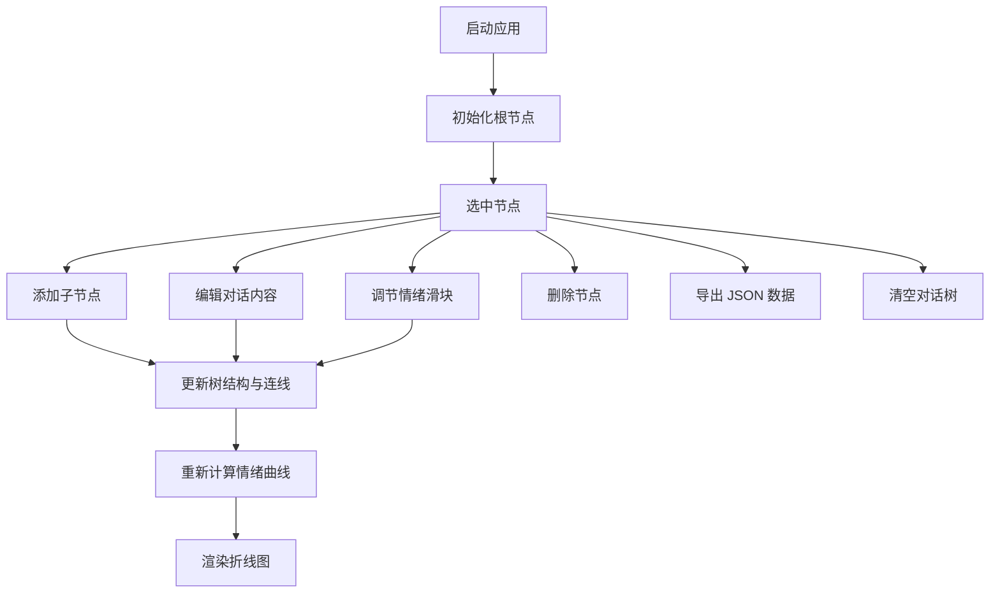

## 1. 产品概述

对话树可视化编辑器是一款面向游戏剧情策划和角色设计师的浏览器端交互式工具，用于快速创建、可视化和管理游戏对话分支结构，并直观展示不同剧情路线下角色情绪的累积变化趋势。

- 核心目标：解决传统叙事设计中流程图与游戏引擎脱节、分支管理混乱、情绪变化难以追踪的痛点，提升剧情迭代效率
- 目标用户：游戏剧情策划、角色设计师、互动叙事创作者

## 2. 核心功能

### 2.1 功能模块

1. **对话树编辑区**：节点卡片式树状布局，贝塞尔曲线连接父子节点，支持节点选择与高亮
2. **节点属性编辑面板**：对话内容文本编辑、愤怒/悲伤/喜悦情绪值滑块调节、节点增删操作
3. **全局情绪趋势图**：基于对话树层级累积计算的三条情绪折线图，支持节点联动高亮
4. **数据导入导出**：JSON 格式导出完整对话树数据，一键清空重置

### 2.2 页面详情

| 页面名称 | 模块名称 | 功能描述 |
|----------|----------|----------|
| 主编辑器 | 顶部情绪折线图 | 实时计算并展示愤怒、悲伤、喜悦三条情绪曲线，按节点深度为 x 轴，累积值为 y 轴 |
| 主编辑器 | 左侧编辑面板 | 对话内容输入、情绪值滑块调节、添加子节点/删除节点/设置初始节点按钮 |
| 主编辑器 | 右侧树状可视化区 | 纵向滚动布局，根节点顶部居中，子节点水平均匀排列，贝塞尔曲线连接，情绪色块指示 |
| 主编辑器 | 右上角工具栏 | 导出 JSON 数据按钮、清空对话树按钮 |

## 3. 核心流程

用户创建和编辑对话树的主要流程：

1. 系统自动初始化一个根节点（初始对话）
2. 用户点击选中任意节点，左侧面板显示该节点属性
3. 用户编辑对话内容和情绪值，实时同步到节点卡片
4. 用户点击"添加子节点"，在当前节点下生成新分支
5. 顶部情绪折线图实时更新，展示各路径累积情绪变化
6. 用户完成设计后点击"导出对话数据"获取 JSON 文件

## 4. 用户界面设计

### 4.1 设计风格

- **深色主题**：整体背景 `#0f0f1a`，面板背景 `#1a1b26`，卡片背景 `#2d2d44`
- **主色调**：紫色 `#7c3aed` 作为强调色，配合红色 `#ef4444`（愤怒）、蓝色 `#3b82f6`（悲伤）、绿色 `#10b981`（喜悦）情绪标识色
- **按钮样式**：圆角 8px，紫色渐变按钮，悬停上移 2px 并增加阴影
- **字体与字号**：正文 14px，辅助文字 12px，文字颜色 `#c9d1d9`
- **布局风格**：左侧固定 280px 编辑面板 + 右侧可滚动树状图区 + 顶部 120px 情绪折线图
- **交互动效**：卡片/面板悬停边框变紫色（0.2s ease-in-out），按钮点击波纹扩散效果，连线更新 0.4s ease-out 缓动

### 4.2 页面设计概览

| 页面名称 | 模块名称 | UI 元素 |
|----------|----------|---------|
| 主编辑器 | 顶部情绪图 | 120px 高度、背景 `#1e1e2e`、圆角 12px、浅灰网格线、三色折线、数据点高亮 |
| 主编辑器 | 左侧编辑面板 | 280px 宽度、文本输入框（高 120px）、两个滑块（范围 -10 到 +10）、三个操作按钮 |
| 主编辑器 | 节点卡片 | 240px 宽、最小高 80px、圆角 12px、节点序号、对话摘要（三行省略）、三色情绪圆点 |
| 主编辑器 | 贝塞尔连线 | `#565f89` 颜色、2px 线宽、控制点 y 偏移 +50px |

### 4.3 响应式设计

- 桌面优先设计，适配 1024px 及以上屏幕宽度
- 左右面板固定宽度（左侧 280px），右侧树状图区域自适应
- 树状图区域支持纵向滚动，节点过多时可浏览完整结构

### 4.4 性能要求

- 拖拽和动画帧率不低于 50fps
- 导出 JSON 数据响应时间不超过 500ms
