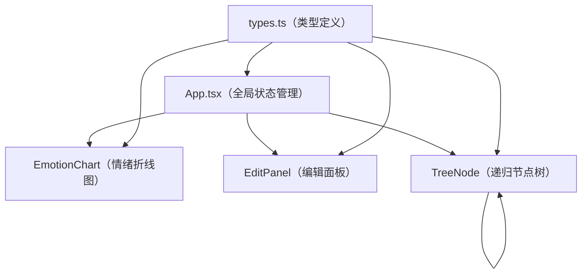

## 1. 架构设计



纯前端单页应用，无后端服务，所有状态在 React 组件内管理。

## 2. 技术描述

- **前端框架**：React@18 + TypeScript
- **构建工具**：Vite@5（devServer 端口 3000）
- **额外依赖**：uuid（节点唯一 ID 生成）、lodash（数据深拷贝等工具函数）
- **样式方案**：原生 CSS（内联样式 + 全局样式），不引入 CSS 框架
- **图标库**：Font Awesome（CDN 引入）

## 3. 项目文件结构

| 文件路径 | 职责说明 |
|----------|----------|
| `package.json` | 项目依赖与脚本配置 |
| `vite.config.js` | Vite 构建配置，端口 3000 |
| `tsconfig.json` | TypeScript 严格模式，target ES2020 |
| `index.html` | 入口 HTML，引入 Font Awesome CDN |
| `src/types.ts` | 对话节点接口与情绪统计接口定义 |
| `src/components/TreeNode.tsx` | 单个节点卡片组件，递归渲染子节点，SVG 贝塞尔曲线 |
| `src/components/EditPanel.tsx` | 左侧编辑面板，输入框/滑块/按钮 |
| `src/components/EmotionChart.tsx` | 顶部情绪折线图，三色折线渲染 |
| `src/App.tsx` | 主应用组件，状态管理、布局、业务逻辑 |

## 4. 数据模型

### 4.1 对话节点接口

```typescript
interface DialogueNode {
  id: string;
  parentId: string | null;
  content: string;
  angerDelta: number;
  sadnessDelta: number;
  joyDelta: number;
  childIds: string[];
}
```

### 4.2 情绪累积统计

```typescript
interface EmotionAccumulator {
  depth: number;
  nodeId: string;
  anger: number;
  sadness: number;
  joy: number;
}
```

### 4.3 全局状态

- `nodes: Record<string, DialogueNode>` — 节点字典（id 为 key）
- `rootId: string` — 根节点 ID
- `selectedId: string | null` — 当前选中节点 ID

## 5. 核心算法逻辑

### 5.1 节点布局计算

- 采用递归后序遍历：先计算子树宽度，再确定父节点水平居中位置
- 每层节点间距 60px，垂直层间距根据节点高度动态调整
- 每个节点最多支持 4 个子节点，超出时禁用"添加子节点"按钮

### 5.2 贝塞尔曲线绘制

- 起点：父节点底部中点 `(x1, y1)`
- 终点：子节点顶部中点 `(x2, y2)`
- 控制点 1：`(x1, y1 + 50)`
- 控制点 2：`(x2, y2 - 50)`
- SVG path：`M x1 y1 C x1 (y1+50), x2 (y2-50), x2 y2`

### 5.3 情绪累积计算

- 从根节点开始按深度层级遍历（BFS）
- 每个节点的累积情绪值 = 父节点累积值 + 当前节点 delta 值
- 同一深度层级取所有节点的情绪值用于折线图绘制（每条路径独立展示或取平均）

### 5.4 JSON 导出格式

```json
{
  "rootId": "uuid",
  "nodes": {
    "node-id": {
      "id": "node-id",
      "parentId": "parent-id-or-null",
      "content": "对话内容",
      "angerDelta": 0,
      "sadnessDelta": 0,
      "joyDelta": 0,
      "childIds": ["child-1", "child-2"]
    }
  }
}
```
