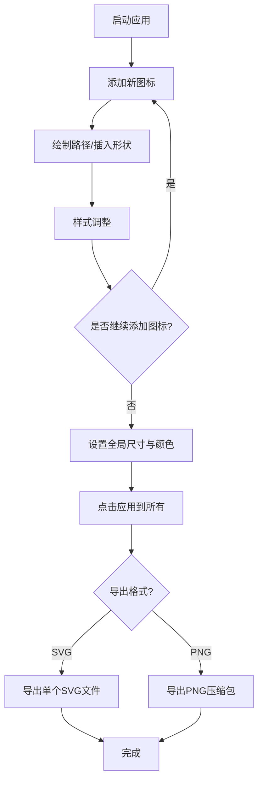

## 1. 产品概述

在线SVG图标编辑器与批量导出工具，支持用户创建、编辑和组合多个SVG图标，统一调整尺寸和颜色后批量导出为SVG或PNG文件。面向设计师和前端开发者，解决图标批量制作和导出的效率问题。

## 2. 核心功能

### 2.1 功能模块

1. **图标列表管理**：缩略图列表展示、添加新图标、点击选中、拖拽排序、右键删除
2. **SVG编辑器**：自由路径绘制、形状插入（矩形/圆形/三角形）、选中高亮、控制手柄调整
3. **样式调整面板**：颜色选择器（12色预设）、描边宽度滑块、透明度滑块
4. **批量统一工具**：全局尺寸设置、全局颜色设置、一键应用到所有图标
5. **导出功能**：SVG单文件导出、PNG批量ZIP导出、导出进度提示

### 2.2 页面详情

| 页面名称 | 模块名称 | 功能描述 |
|-----------|-------------|---------------------|
| 主页面 | 左侧图标列表 | 缩略图60x60展示、拖拽排序、右键删除、添加按钮 |
| 主页面 | 顶部工具栏 | 全局尺寸输入、全局颜色选择、应用到所有按钮 |
| 主页面 | 中间编辑区 | 400x400画布、网格背景、路径绘制、形状插入 |
| 主页面 | 样式面板 | 颜色预设、描边滑块、透明度滑块 |
| 主页面 | 导出区 | SVG导出按钮、PNG导出按钮、加载遮罩 |

## 3. 核心流程

用户启动应用 → 点击"添加新图标"创建图标 → 在画布上绘制路径或插入形状 → 通过样式面板调整外观 → 重复添加多个图标 → 统一设置全局尺寸和颜色 → 选择导出格式（SVG/PNG）→ 查看导出进度 → 完成导出

## 4. 用户界面设计

### 4.1 设计风格

- **主色调**：紫色系 `#7c3aed` 作为强调色，深灰背景 `#0f0f23`
- **辅助色**：绿色 `#10b981`（成功按钮）、白色 `#ffffff`（画布）
- **按钮风格**：圆角8px，悬停缩放1.02，点击缩放0.95，0.2s过渡动画
- **字体**：系统默认无衬线字体，颜色 `#e0e0e0`
- **布局风格**：左右分栏（240px列表 + 自适应编辑区），深色主题
- **选中状态**：`#7c3aed` 外发光效果

### 4.2 页面设计概述

| 页面名称 | 模块名称 | UI元素 |
|-----------|-------------|-------------|
| 主页面 | 图标列表 | 60x60圆角缩略图、悬停动画、拖拽高亮、紫色添加按钮 |
| 主页面 | 编辑画布 | 白色背景、20px网格、蓝色控制手柄、鼠标轨迹绘制 |
| 主页面 | 样式面板 | 12色圆形色块（选中外发光）、范围滑块、数值显示 |
| 主页面 | 工具栏 | 数字输入框、颜色选择器、绿色应用按钮 |
| 主页面 | 导出遮罩 | 半透明黑色背景、圆角12px、旋转加载动画 |

### 4.3 响应式设计

桌面端优先设计，当窗口宽度小于768px时：
- 左侧列表折叠为顶部抽屉
- 点击汉堡菜单展开，下滑动画0.3s ease-out
- 编辑区占满全宽
