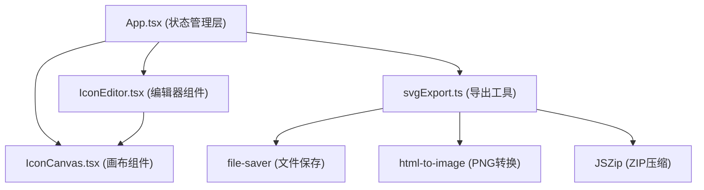

## 1. 架构设计



## 2. 技术描述

- **前端框架**：React@18 + TypeScript
- **构建工具**：Vite@5 + @vitejs/plugin-react
- **状态管理**：React useState/useReducer（轻量级应用，无需额外状态库）
- **工具库**：
  - `uuid`：生成唯一图标ID
  - `lodash`：工具函数（深拷贝等）
  - `file-saver`：文件下载
  - `html-to-image`：SVG转PNG
  - `jszip`：PNG批量压缩导出
- **样式方案**：内联CSS + CSS变量（无需Tailwind，保持项目轻量）

## 3. 数据模型

### 3.1 类型定义

```typescript
interface SVGElement {
  id: string;
  type: 'path' | 'rect' | 'circle' | 'triangle';
  fill: string;
  stroke: string;
  strokeWidth: number;
  opacity: number;
  // 路径特有
  points?: { x: number; y: number }[];
  d?: string;
  // 形状特有
  x?: number;
  y?: number;
  width?: number;
  height?: number;
  r?: number;
}

interface IconItem {
  id: string;
  name: string;
  width: number;
  height: number;
  elements: SVGElement[];
}
```

## 4. 文件结构

```
.
├── package.json
├── vite.config.js
├── tsconfig.json
├── index.html
└── src/
    ├── App.tsx                 # 主应用，状态管理、布局
    ├── components/
    │   ├── IconEditor.tsx      # SVG编辑器：工具栏、路径绘制、形状插入
    │   └── IconCanvas.tsx      # 画布渲染：元素渲染、选中高亮、控制手柄
    └── utils/
        └── svgExport.ts        # 导出工具：SVG序列化、PNG转换、ZIP打包
```

## 5. 性能优化策略

1. **画布渲染优化**：使用React.memo包裹IconCanvas，避免不必要的重渲染
2. **路径绘制**：使用useRef存储绘制中的点数据，不触发每帧re-render
3. **批量操作**：使用useCallback缓存事件处理函数
4. **列表虚拟化**：图标列表使用固定高度，20+图标仍保持流畅
5. **导出性能**：PNG转换使用html-to-image的异步批量处理，避免阻塞主线程
