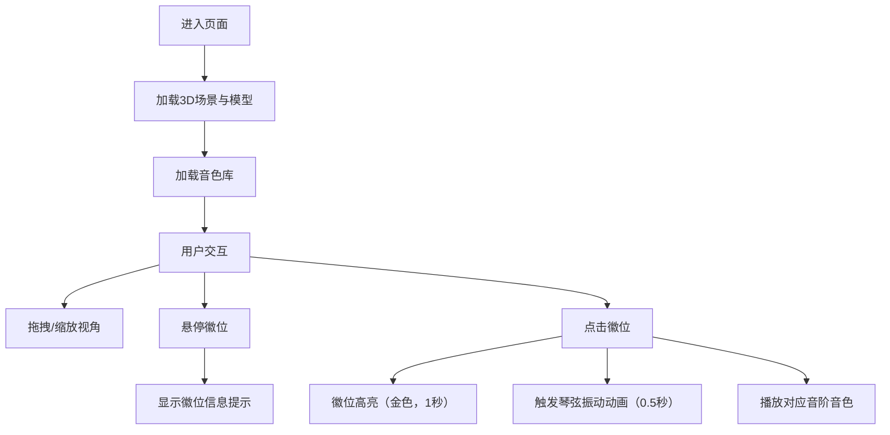

## 1. 产品概述

古琴音阶交互展示系统是一款面向乐器博物馆线上访客的沉浸式3D交互应用。用户可通过自由旋转缩放观察古琴细节，并点击徽位播放对应音阶，体验中国传统乐器的魅力。

- 核心目标：以高保真3D可视化与真实音色采样，让线上访客深度体验古琴文化
- 目标用户：乐器博物馆线上访客、音乐爱好者、传统文化研究者
- 市场价值：创新文化传播方式，提升博物馆线上教育体验

## 2. 核心功能

### 2.1 用户角色
| 角色 | 注册方式 | 核心权限 |
|------|---------|----------|
| 访客用户 | 无需注册 | 浏览3D模型、点击音阶、查看徽位信息 |

### 2.2 功能模块
1. **3D模型展示模块**：古琴琴身、7根琴弦、13个徽位的高精度构建
2. **音色播放模块**：13个徽位对应音阶的合成播放，带滑音效果
3. **交互控制模块**：OrbitControls自由视角、射线检测点击、悬停提示
4. **UI界面模块**：标题、旋转动画按钮、响应式布局

### 2.3 页面详情
| 页面名称 | 模块名称 | 功能描述 |
|---------|---------|----------|
| 主页面 | 3D场景 | 展示古琴模型，支持旋转缩放，显示环境光和聚光效果 |
| 主页面 | 交互层 | 鼠标点击徽位触发高亮与音色，悬停显示徽位信息 |
| 主页面 | 控制面板 | 左上角标题、下方旋转动画按钮 |

## 3. 核心流程

用户进入页面 → 加载3D古琴模型与音色库 → 鼠标拖拽旋转/滚轮缩放观察细节 → 悬停徽位显示信息提示 → 点击徽位触发高亮动画与琴弦振动 → 播放对应音阶音色

## 4. 用户界面设计

### 4.1 设计风格
- **主色调**：深色木质主题 #2b1b0e，木纹棕 #8B4513 ~ #D2691E 渐变
- **强调色**：金色 #d4af37（标题、高亮），象牙白 #FFFFF0（徽位）
- **按钮样式**：圆角8px，背景 #8B4513，hover 变 #A0522D，内边距 10px 20px
- **字体**：宋体 SimSun，标题 24px，金色带文字阴影
- **布局**：居中展示3D模型，绝对定位UI元素
- **过渡动画**：所有交互反馈 0.2秒 transition

### 4.2 页面设计概述
| 页面名称 | 模块名称 | UI元素 |
|---------|---------|--------|
| 主页面 | 标题区域 | 左上角"古琴音阶交互展示"，宋体金色24px，文字阴影 |
| 主页面 | 3D场景 | 居中古琴模型，BoxGeometry木纹琴身，7根白色琴弦，13个象牙白徽位 |
| 主页面 | 提示框 | #2d2d44 背景，白色文字，圆角6px，跟随鼠标偏移 |
| 主页面 | 旋转按钮 | 琴体下方，棕色背景，hover 变深棕 |
| 主页面 | 光照 | 左上角环境光（强度0.5）+ 聚光（强度0.8白色） |

### 4.3 响应式设计
- **桌面端**（≥768px）：标准布局，模型高度自适应
- **移动端**（<768px）：模型高度缩减为视窗高度50%，提示框字体缩小至14px

### 4.4 3D场景指导
- **环境**：深色木质背景 #2b1b0e，营造博物馆氛围
- **光照**：AmbientLight（0.5强度）+ SpotLight（0.8强度白色，从左上照射琴面）
- **相机**：PerspectiveCamera，初始距离适中，OrbitControls灵敏度0.5，缩放范围0.5~5倍
- **交互**：射线检测徽位点击，高亮色#d4af37，1秒后恢复；琴弦顶点Y轴正弦振动0.01幅度，0.5秒
- **性能**：FPS≥30，内存≤200MB，requestAnimationFrame驱动动画
