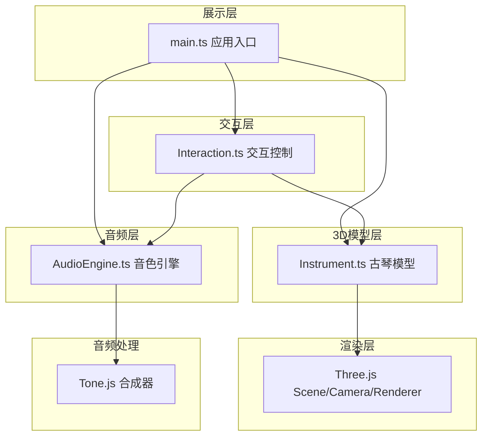

## 1. 架构设计



**模块调用关系与数据流向：**
- `main.ts` → 初始化 Three.js 场景，创建 Instrument、AudioEngine、Interaction 实例
- `Interaction.ts` → 监听鼠标事件 → 射线检测 → 调用 `Instrument.getMarkerIndex()` 获取徽位索引 → 调用 `AudioEngine.playNote()` 播放音色
- `Instrument.ts` → 构建琴身/琴弦/徽位 → 接收点击坐标 → 计算交点 → 返回徽位索引
- `AudioEngine.ts` → 接收徽位索引 → 合成播放对应音高 → 支持滑音效果

## 2. 技术描述
- **前端框架**：无框架，原生 TypeScript + Vite@5
- **3D引擎**：Three.js@0.160.0 + @types/three
- **音频引擎**：Tone.js@14.7.77（内置合成器生成音阶，无需外部音频文件）
- **工具库**：lodash
- **构建工具**：Vite@5，devServer端口3000
- **TypeScript配置**：严格模式，target ES2020，moduleResolution bundler

## 3. 文件结构

```
project-root/
├── package.json              # 依赖与脚本
├── vite.config.js            # Vite构建配置
├── tsconfig.json             # TypeScript配置
├── index.html                # 入口HTML
└── src/
    ├── main.ts               # 应用入口：场景初始化、模块协调
    ├── Instrument.ts         # 古琴3D模型类
    ├── AudioEngine.ts        # 音色引擎（Tone.js）
    └── Interaction.ts        # 交互控制（射线检测、OrbitControls）
```

## 4. 核心数据模型

### 4.1 徽位数据结构
```typescript
interface MarkerData {
  index: number;       // 0-12
  name: string;        // "一徽" ~ "十三徽"
  note: string;        // "C4" ~ "C5"
  position: THREE.Vector3; // 3D空间位置
}
```

### 4.2 古琴尺寸参数
```typescript
interface InstrumentDimensions {
  bodyLength: number;   // 160cm → 16 单位
  bodyWidth: number;    // 20cm  → 2 单位
  bodyHeight: number;   // 5cm   → 0.5 单位
  stringCount: number;  // 7根
  markerCount: number;  // 13个
  stringRadius: number; // 0.02
  stringHeight: number; // 面板上方0.5单位
  markerRadius: number; // 0.3
}
```

## 5. 性能约束
- **帧率**：FPS ≥ 30，使用 requestAnimationFrame 驱动所有动画
- **内存**：加载后 ≤ 200MB，避免冗余纹理和音频缓冲
- **琴弦动画**：顶点级正弦振动，幅度 0.01，持续 0.5 秒
- **徽位高亮**：材质颜色 lerp 过渡 0.2 秒，1秒后恢复
