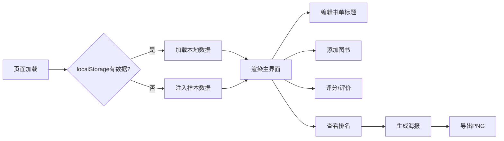

## 1. 产品概述
社区书单管理应用是一款面向小型社区图书管理员或读书会组织者的Web应用，帮助用户创建和管理主题书单收藏、支持多人协作评分与评价、并自动生成加权排名海报。
- 解决传统Excel/文档无法直观展示书单封面风格和评分分布、无法多人协作打分和自动计算加权排名的痛点
- 目标用户：社区图书管理员、读书会组织者、读书爱好者群体

## 2. 核心功能

### 2.1 用户角色
| 角色 | 注册方式 | 核心权限 |
|------|----------|----------|
| 普通用户 | 无需注册，浏览器本地使用 | 创建管理书单、添加图书、评分评价、生成海报 |

### 2.2 功能模块
1. **主界面**：书单标题编辑区、添加图书按钮、图书卡片网格展示区、排名面板
2. **图书管理**：添加图书模态框、图书卡片展示（封面颜色、书名作者、评分、评价）
3. **评分与评价**：五星评分组件、评价列表展开/收起、评价输入与发送
4. **排名与海报**：加权排名面板、前三名高亮、海报生成与导出

### 2.3 页面详情
| 页面名称 | 模块名称 | 功能描述 |
|----------|----------|----------|
| 主页面 | 书单标题区 | 可编辑书单主题标题输入框，重置按钮 |
| 主页面 | 添加图书按钮 | 点击弹出添加图书模态框 |
| 主页面 | 图书卡片网格 | 响应式网格展示所有图书卡片 |
| 主页面 | 排名面板 | 加权排名列表、前三名高亮、生成海报按钮 |
| 添加图书模态框 | 表单 | 书名、作者、封面颜色、出版年份、推荐理由输入 |
| 图书卡片 | 评分组件 | 五星评分，每星2分共10分 |
| 图书卡片 | 评价列表 | 展开/收起评价，显示头像、内容、评分、时间 |
| 海报页面 | 海报展示 | A4竖版海报，深蓝紫渐变背景，前三名书籍展示，二维码占位 |

## 3. 核心流程
用户打开页面→自动加载本地数据或注入样本数据→编辑书单主题→点击添加图书填写表单→图书卡片展示在网格中→对图书进行星级评分→展开评价列表查看评价→输入并提交新评价→右侧面板实时显示加权排名→点击生成海报→展示海报页面→另存为PNG图片下载

## 4. 用户界面设计

### 4.1 设计风格
- 主色调：深色主题 #121212 背景，卡片区域 #1e1e2e / #2d2d44
- 强调色：蓝色 #1976d2，金色 #fbc02d，蓝紫色 #7c4dff
- 文字：主色 #e0e0e0，次要 #9e9e9e
- 按钮风格：圆角8px-16px，悬停过渡动画
- 字体：Noto Sans SC（Google Fonts）
- 布局：卡片式布局，桌面左右分栏，移动端底部抽屉

### 4.2 页面设计概述
| 页面名称 | 模块名称 | UI元素 |
|----------|----------|--------|
| 主页面 | 书单标题区 | 深色背景圆角容器，输入框，添加按钮，重置按钮 |
| 主页面 | 图书卡片 | 3:4比例卡片，颜色封面，圆角12px，阴影过渡，悬停上移 |
| 主页面 | 排名面板 | 固定宽度280px，前三名金银铜边框高亮，金色冠军徽章 |
| 海报页面 | 海报展示 | A4竖版，深蓝紫渐变，白色粗体标题，三本书横排，二维码占位 |

### 4.3 响应式
- 桌面端（>=1024px）：左右分栏，左侧图书网格4列，右侧排名面板固定280px
- 平板端（768-1023px）：图书网格3列，排名面板折叠为底部抽屉（高度40%）
- 手机端（<768px）：图书网格2列，排名面板为底部模态框

### 4.4 动画与交互
- 新卡片添加：从下向上淡入（opacity 0→1, translateY 20px→0, 0.4s）
- 卡片悬停：阴影加深+上移3px（0.25s ease-out）
- 星星评分/评价展开：弹性过渡（scale 0.95→1, 0.2s ease-out）
- 颜色选择器：点击高亮边框
