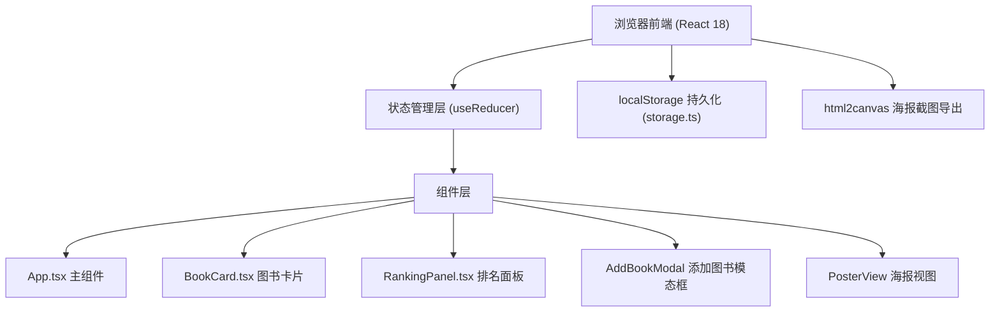
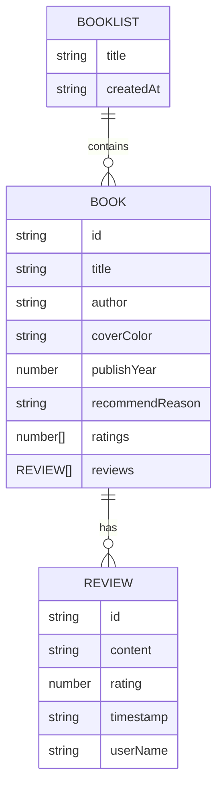

## 1. 架构设计



## 2. 技术描述
- 前端：React 18 + TypeScript + Vite 5
- 初始化工具：vite-init (react-ts 模板)
- 后端：无，纯前端应用
- 数据库：浏览器 localStorage
- UI样式：CSS Modules / 内联样式（不使用Tailwind，按用户精确色值要求）
- 第三方库：uuid（唯一ID）、lodash（工具函数）、html2canvas（海报截图）

## 3. 路由定义
| 路由 | 用途 |
|------|------|
| / (默认) | 主界面：书单管理 + 排名面板 |
| /poster | 海报展示视图 |

注：实际使用 React 内部状态切换视图模式，无需 react-router-dom

## 4. 数据模型

### 4.1 数据模型定义



### 4.2 TypeScript 类型定义

```typescript
interface Review {
  id: string;
  content: string;
  rating: number;
  timestamp: string;
  userName: string;
}

interface Book {
  id: string;
  title: string;
  author: string;
  coverColor: string;
  publishYear: number;
  recommendReason: string;
  ratings: number[];
  reviews: Review[];
}

interface BooklistState {
  title: string;
  books: Book[];
}
```

## 5. 加权排名算法
```
加权总分 = (平均评分 × 0.7) + (评价数量 × 0.5 × 0.3)
- 平均评分：所有评分的算术平均值（满分10分）
- 评价数量：每条评价加0.5分，乘以权重0.3
- 按加权总分降序排列
```

## 6. 文件结构
```
├── package.json
├── vite.config.js
├── tsconfig.json
├── index.html
└── src/
    ├── components/
    │   ├── App.tsx
    │   ├── BookCard.tsx
    │   └── RankingPanel.tsx
    └── utils/
        └── storage.ts
```
