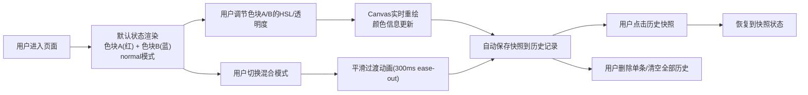

## 1. 产品概述

交互式色彩混合演示面板，帮助前端小白和设计初学者在浏览器中直观理解CSS颜色混合原理（加色混合与减色混合）。通过可交互的色块调节、混合模式切换和实时颜色对比，将抽象的色彩混合概念转化为可触摸、可观察的视觉体验。

- 目标用户：前端开发初学者、UI设计入门者、色彩理论学习者
- 产品价值：降低颜色混合概念的理解门槛，提供即时可视化反馈，提升学习效率

## 2. 核心功能

### 2.1 功能模块

1. **主画布区**：400x400像素画布，展示两个叠加的圆形色块及其混合效果
2. **颜色控制面板**：HSL拾色器滑块 + 透明度调节，分别控制两个色块
3. **混合模式切换栏**：5种混合模式（normal、multiply、screen、overlay、soft-light）切换
4. **颜色信息面板**：实时展示色块A、色块B及叠加区域的HSL与十六进制色值
5. **历史记录面板**：自动记录最近5次状态快照，支持回放与删除

### 2.2 页面详情

| 页面名称 | 模块名称 | 功能描述 |
|---------|---------|---------|
| 主页面 | 主画布区 | 400x400深紫背景画布，左右两个圆形色块（半径80px）居中叠加，根据混合模式实时渲染叠加效果 |
| 主页面 | 控制面板 | 宽度280px，色块A/B独立的HSL滑块（H:0-360, S:0-100%, L:20-80%）和透明度滑块（0.1-1.0步长0.05） |
| 主页面 | 混合模式栏 | 顶部5个模式切换按钮，选中按钮填充模式名称对应颜色，未选中为半透明白边 |
| 主页面 | 颜色信息面板 | 画布下方展示A、B、叠加区的HSL与HEX值，数值颜色匹配对应色块 |
| 主页面 | 历史记录面板 | 右侧宽度200px，展示最近5次快照缩略图+HSL值，可点击回放或单条删除，底部清空按钮 |

## 3. 核心流程

## 4. 用户界面设计

### 4.1 设计风格

- **主题**：深色科技风
- **主背景**：#0a0e1a
- **卡片背景**：#16213e
- **画布背景**：#1a1a2e
- **关键文字**：#e0e0e0
- **辅助文字**：#888
- **强调色**：#00bcd4（海蓝）
- **删除警示色**：#e53935 / #b71c1c
- **字体**：'Segoe UI', sans-serif
- **圆角规范**：画布20px，面板16px/12px，按钮8px/6px
- **阴影过渡**：`0 2px 8px rgba(0,0,0,0.3)` hover时变为 `0 4px 16px rgba(0,188,212,0.4)`
- **按钮点击动效**：`transform: scale(0.96)` 持续100ms

### 4.2 页面设计概览

| 页面名称 | 模块名称 | UI元素 |
|---------|---------|--------|
| 主页面 | 主画布区 | 深紫#1a1a2e背景，圆角20px，内阴影，左右两个圆形色块水平垂直居中叠加 |
| 主页面 | 控制面板 | #16213e背景，圆角16px，内边距20px，滑块轨道#0f3460，滑块高亮海蓝#00bcd4 |
| 主页面 | 混合模式栏 | 水平排列5个按钮，圆角8px，内边距12px，选中态填充对应颜色，未选中半透明白边 |
| 主页面 | 颜色信息面板 | #0f3460背景，圆角12px，三列布局展示A/B/混合色的HSL和HEX |
| 主页面 | 历史记录面板 | #0b1a2e背景，圆角12px，每条记录含缩略图+色值+删除按钮，悬停微放大 |

### 4.3 响应式适配

- **设计优先**：桌面端优先（desktop-first）
- **断点**：768px
- **移动端布局**：控制面板和历史记录面板自动折叠至画布下方，由左右布局转为上下布局

### 4.4 性能要求

- Canvas重绘帧率 ≥ 50fps
- 模式切换动画 300ms ease-out，无闪烁跳变
- 滑块拖拽无明显卡顿
