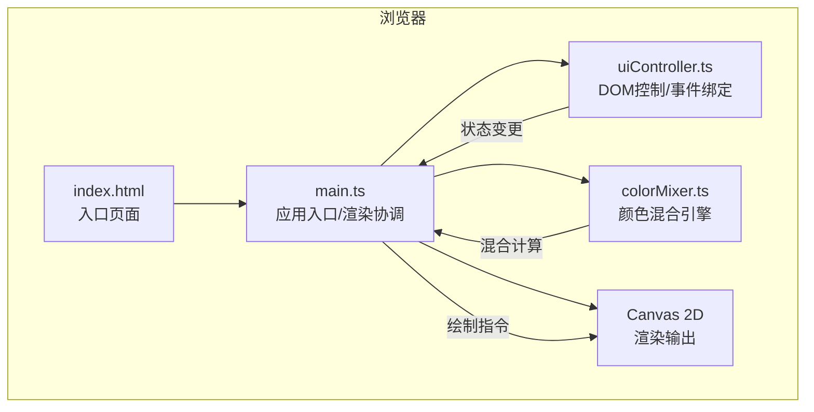

## 1. 架构设计



## 2. 技术描述

- **前端框架**：原生TypeScript（无UI框架）+ Canvas 2D API
- **构建工具**：Vite 5.x
- **语言**：TypeScript 5.x（严格模式）
- **工具库**：lodash（用于防抖、深拷贝等工具函数）
- **初始化方式**：手动配置Vite + TypeScript项目

## 3. 文件结构

| 文件路径 | 职责说明 |
|---------|---------|
| `package.json` | 项目依赖与脚本定义（typescript、vite@5、lodash） |
| `vite.config.js` | Vite构建配置（devServer端口3000，支持TypeScript） |
| `tsconfig.json` | TypeScript编译配置（strict: true, target: ES2020） |
| `index.html` | 入口HTML，全屏深色背景，页面容器结构 |
| `src/main.ts` | 应用入口：初始化Canvas、状态管理、渲染循环、模块协调 |
| `src/colorMixer.ts` | 颜色混合引擎：5种混合模式的像素级算法实现 |
| `src/uiController.ts` | UI控制器：DOM创建、滑块绑定、模式切换、历史记录管理 |

## 4. 核心数据模型

### 4.1 颜色类型定义

```typescript
interface HSL {
  h: number;      // 0-360
  s: number;      // 0-100
  l: number;      // 0-100
}

interface RGB {
  r: number;      // 0-255
  g: number;      // 0-255
  b: number;      // 0-255
}

interface Color extends RGB {
  alpha: number;  // 0-1
  hex: string;    // #rrggbb
  hsl: HSL;
}

interface ColorState {
  colorA: { hsl: HSL; alpha: number };
  colorB: { hsl: HSL; alpha: number };
  mode: BlendMode;
}

type BlendMode = 'normal' | 'multiply' | 'screen' | 'overlay' | 'soft-light';

interface HistoryItem {
  id: string;
  state: ColorState;
  thumbnail: string;   // dataURL
  mixedColorHSL: HSL;
  timestamp: number;
}
```

## 5. 核心模块职责

### 5.1 colorMixer.ts 颜色混合引擎

| 函数 | 说明 |
|-----|------|
| `hslToRgb(h, s, l)` | HSL → RGB 转换 |
| `rgbToHsl(r, g, b)` | RGB → HSL 转换 |
| `rgbToHex(r, g, b)` | RGB → 十六进制转换 |
| `hexToRgb(hex)` | 十六进制 → RGB 转换 |
| `normalizeColor(hsl, alpha)` | 将HSL+alpha规范化为完整Color对象 |
| `blendNormal(cb, cs)` | normal模式：结果 = 源色（覆盖） |
| `blendMultiply(cb, cs)` | multiply模式：结果 = cb × cs / 255 |
| `blendScreen(cb, cs)` | screen模式：结果 = 1 - (1-cb)(1-cs) |
| `blendOverlay(cb, cs)` | overlay模式：hardlight的交换形式 |
| `blendSoftLight(cb, cs)` | soft-light模式：柔和光叠加 |
| `mixColors(c1, c2, mode, alpha1, alpha2)` | 统一入口：执行混合并返回结果Color |

### 5.2 uiController.ts UI控制器

| 方法 | 说明 |
|-----|------|
| `initUI(container, callbacks)` | 创建所有DOM元素并绑定事件 |
| `getState()` | 返回当前完整状态（ColorState） |
| `setState(newState)` | 从状态恢复UI（滑块值、按钮选中态） |
| `addHistoryItem(item)` | 添加历史记录到面板 |
| `removeHistoryItem(id)` | 删除单条历史 |
| `clearHistory()` | 清空全部历史 |
| `updateColorInfo(a, b, mixed)` | 更新颜色信息面板数值 |
| `setActiveMode(mode)` | 更新混合模式按钮选中态 |

### 5.3 main.ts 主入口

- 创建Canvas 2D上下文，尺寸400x400
- 初始化状态（红色#ff4d4d + 蓝色#4d4dff + normal模式）
- 注册状态变更回调：滑块变化、模式切换 → 触发重绘 + 保存历史（防抖）
- 渲染循环：绘制背景 → 绘制色块A → 设置混合模式 → 绘制色块B
- 采样叠加区域中心点颜色 → 更新颜色信息面板
- 生成缩略图（60x60小Canvas）→ 存入历史记录

## 6. 性能优化策略

| 策略 | 说明 |
|-----|------|
| `requestAnimationFrame` | Canvas重绘使用RAF，确保帧率稳定在60fps |
| `lodash.debounce` | 滑块拖拽和历史保存使用防抖（~100ms），避免过度计算 |
| 离屏Canvas | 缩略图生成分离到离屏Canvas，不阻塞主渲染 |
| 局部计算 | 混合颜色仅采样叠加区域中心点像素，而非全区域扫描 |
| CSS过渡 | 模式切换的平滑效果用CSS transition实现，无需JS逐帧插值 |

## 7. 混合模式按钮颜色映射

| 模式 | 选中背景色 |
|-----|-----------|
| normal | #607d8b |
| multiply | #ff5722 |
| screen | #00bcd4 |
| overlay | #9c27b0 |
| soft-light | #ffc107 |
