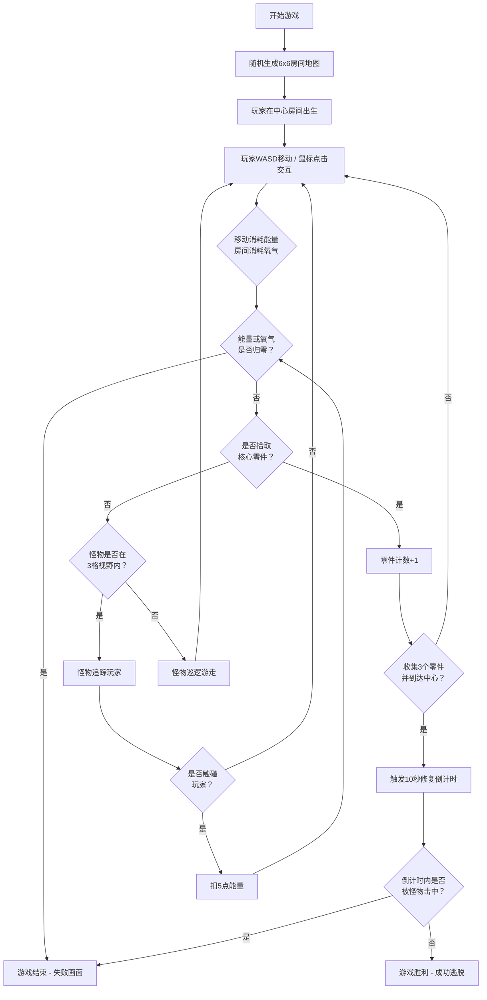

## 1. 产品概述

《太空站逃亡》是一款俯视角2D资源管理生存游戏，玩家在废弃太空站中利用有限资源和工具修复核心系统并逃离。游戏结合了随机地图生成、资源消耗管理、怪物追踪AI等机制，提供紧张刺激的生存体验。

- 核心玩法：探索、收集资源、修复系统、躲避怪物
- 目标用户：喜欢roguelike生存类游戏的玩家
- 产品价值：通过程序化生成和资源限制带来高重玩价值和策略深度

## 2. 核心功能

### 2.1 功能模块
1. **游戏主界面**：Canvas游戏画布、资源UI显示、状态信息
2. **地图生成系统**：6x6随机房间网格、走廊连接、物品/障碍物分布
3. **资源管理系统**：能量消耗、氧气消耗、资源条UI、死亡判定
4. **玩家控制系统**：WASD移动、鼠标点击交互、粒子特效
5. **核心修复系统**：零件收集、修复倒计时、胜利判定
6. **怪物AI系统**：巡逻游走、视野追踪、碰撞伤害

### 2.2 模块详情
| 模块名称 | 功能描述 |
|---------|---------|
| 随机地图生成 | 每次开局生成6x6房间网格，走廊连通，随机分布氧气瓶、能量电池、核心零件、破损设备，保证所有房间可达 |
| 资源消耗系统 | 玩家移动消耗能量，非氧气房间消耗氧气，任一资源归零触发游戏结束 |
| 核心修复 | 收集3个核心零件并到达中心房间，触发10秒修复倒计时，期间未被击中则胜利 |
| 怪物AI | 在走廊巡逻，3格视野内追踪玩家，触碰扣5点能量 |
| 玩家交互 | WASD移动，鼠标点击拾取物品/使用焊枪，移动和交互触发电弧粒子 |
| UI渲染 | 赛博朋克风格，弧形资源条，脉冲动画，低资源闪烁警告，响应式布局 |

## 3. 核心流程

## 4. 用户界面设计

### 4.1 设计风格
- **主色调**：深紫(#1a0a2e)、暗灰(#0d1117)、荧光青(#00ffd5)、危险红(#ff2d55)
- **视觉风格**：赛博朋克暗色调，半透明光效边框，霓虹辉光效果
- **字体**：等宽科幻字体(Consolas/Monaco)，数字使用荧光青发光效果
- **动效**：资源条脉冲动画、低资源闪烁、电弧粒子、怪物视野红色波纹

### 4.2 界面元素
| 区域 | 元素 | 设计描述 |
|------|------|---------|
| 画布中央 | 游戏地图 | 6x6房间网格，走廊连接，俯视角，赛博朋克色块风格 |
| 左下角 | 能量条 | 弧形设计，荧光青色，脉冲动画，<20%时红色闪烁警告 |
| 右下角 | 氧气条 | 弧形设计，蓝色渐变，脉冲动画，<20%时红色闪烁警告 |
| 顶部中央 | 状态信息 | 零件收集数量、修复倒计时提示 |
| 画布四周 | 光效边框 | 半透明荧光青边框，呼吸灯效果 |
| 怪物视野 | 红色波纹 | 玩家进入怪物视野时画布边缘红色波纹过渡动画 |
| 交互特效 | 电弧粒子 | 移动和鼠标点击时触发电弧粒子特效 |

### 4.3 响应式
- 桌面端优先，Canvas保持正方形比例居中显示
- 资源条位置随画布大小自适应调整
- 响应窗口resize事件，动态更新Canvas尺寸和UI布局
- 最小尺寸：800x600，最大尺寸：全屏

## 5. 性能要求
- 游戏主循环稳定30fps以上
- Canvas渲染关闭抗锯齿(imageSmoothingEnabled=false)
- 怪物AI单帧计算≤2ms
- 粒子特效对象池复用，避免频繁GC
