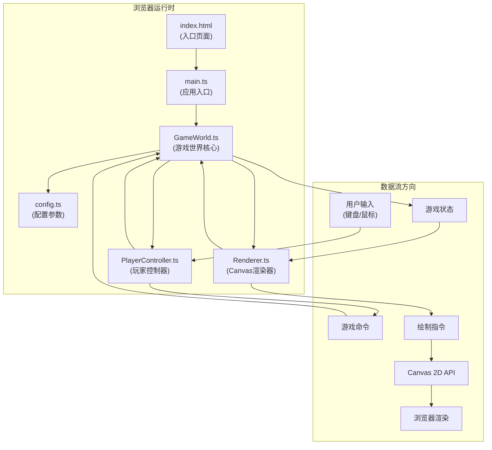

## 1. 架构设计



## 2. 技术描述

- **前端框架**：纯TypeScript + Vite构建，无UI框架依赖，直接操作Canvas 2D API
- **构建工具**：Vite 5.x，devServer端口3000，HMR热更新
- **语言规范**：TypeScript 5.x，strict严格模式，target ES2020
- **渲染引擎**：HTML5 Canvas 2D，关闭抗锯齿优化性能
- **状态管理**：GameWorld单例持有全局状态，各模块通过方法调用交互

## 3. 文件结构与职责

| 文件路径 | 职责描述 | 依赖关系 |
|---------|---------|---------|
| package.json | 项目依赖与启动脚本配置 | 无 |
| vite.config.js | Vite构建配置，devServer端口3000 | 无 |
| tsconfig.json | TypeScript编译配置，strict模式，ES2020 | 无 |
| index.html | 入口页面，包含Canvas画布和UI容器 | 引用main.ts |
| src/config.ts | 全局配置参数：地图尺寸、资源初始值、颜色常量、帧率 | 无外部依赖 |
| src/PlayerController.ts | 监听WASD和鼠标事件，转换为游戏命令，触发粒子效果 | 依赖GameWorld，输出游戏命令 |
| src/Renderer.ts | 将游戏状态绘制到Canvas，包括地图、玩家、怪物、粒子、UI资源条 | 依赖GameWorld状态，输出Canvas绘制 |
| src/GameWorld.ts | 游戏世界核心：地图生成、玩家/怪物状态、资源计算、碰撞检测、胜负判定 | 依赖config.ts，接收PlayerController命令，输出状态给Renderer |
| src/main.ts | 应用入口：初始化GameWorld、PlayerController、Renderer，创建主循环(requestAnimationFrame) | 依赖所有模块 |

## 4. 数据模型

### 4.1 核心类型定义

```typescript
// 位置坐标
interface Position {
  x: number;
  y: number;
}

// 房间类型
enum RoomType {
  NORMAL = 'normal',      // 普通房间
  CORRIDOR = 'corridor',  // 走廊
  CENTER = 'center',      // 中心房间（修复点）
  OXYGEN = 'oxygen'       // 氧气房（有氧气罐）
}

// 房间数据
interface Room {
  id: string;
  gridX: number;      // 网格坐标X (0-5)
  gridY: number;      // 网格坐标Y (0-5)
  type: RoomType;
  connections: string[]; // 连接的房间ID
  items: Item[];
  obstacles: Obstacle[];
}

// 物品类型
enum ItemType {
  OXYGEN_TANK = 'oxygen_tank',   // 氧气瓶
  ENERGY_BATTERY = 'energy_battery', // 能量电池
  CORE_PART = 'core_part'        // 核心零件
}

// 物品实体
interface Item {
  id: string;
  type: ItemType;
  position: Position;  // 像素坐标
  collected: boolean;
}

// 障碍物
interface Obstacle {
  id: string;
  position: Position;
  size: { width: number; height: number };
  repaired: boolean;   // 是否已被焊枪修复（可通行）
}

// 玩家状态
interface Player {
  position: Position;
  energy: number;
  maxEnergy: number;
  oxygen: number;
  maxOxygen: number;
  coreParts: number;   // 已收集的核心零件数
  isMoving: boolean;
  direction: 'up' | 'down' | 'left' | 'right';
}

// 怪物状态
interface Monster {
  position: Position;
  targetPosition: Position | null;
  visionRadius: number;  // 视野半径（格数）
  isChasing: boolean;
  path: Position[];      // 巡逻路径
}

// 粒子特效
interface Particle {
  position: Position;
  velocity: Position;
  life: number;
  maxLife: number;
  color: string;
  size: number;
}

// 游戏状态
interface GameState {
  rooms: Room[];
  player: Player;
  monster: Monster;
  particles: Particle[];
  gameStatus: 'playing' | 'won' | 'lost';
  repairTimer: number | null;  // 修复倒计时(秒)
  elapsedTime: number;
}
```

### 4.2 数据流向
1. **输入层**：PlayerController监听DOM事件(keydown/keyup/mousedown)，生成游戏命令(move/interact)
2. **逻辑层**：GameWorld每帧接收命令，更新player位置、消耗资源、检测碰撞、更新怪物AI、计算胜负
3. **渲染层**：Renderer每帧读取GameWorld.state，绘制地图→实体→粒子→UI叠加层

## 5. 关键算法

### 5.1 随机地图生成
- 6x6网格，中心(2,2)和(3,3)合并为中心房间
- 使用随机DFS生成迷宫，确保连通性
- 随机分配房间类型：1个中心房、2个氧气房、其余为普通房
- 走廊在房间边界之间生成
- BFS验证所有房间可达

### 5.2 怪物AI
- 每帧计算：玩家与怪物的欧几里得距离
- 距离 ≤ visionRadius：A*寻路追踪玩家
- 距离 > visionRadius：沿预设巡逻路径循环移动
- 单帧计算限制在2ms内，使用距离平方避免开方

### 5.3 碰撞检测
- AABB碰撞检测（玩家与障碍物、玩家与怪物）
- 网格空间划分加速碰撞查询

## 6. 性能优化策略

| 优化点 | 方案 |
|-------|------|
| Canvas渲染 | imageSmoothingEnabled=false，离屏缓存静态地图 |
| 粒子系统 | 对象池复用Particle实例，超过100个自动淘汰旧粒子 |
| 怪物AI | 每2帧更新一次寻路，距离判断使用平方比较 |
| 主循环 | requestAnimationFrame，固定逻辑步长(dt=1/30)，渲染插值 |
| UI动画 | CSS transition处理数值过渡(0.3s)，Canvas仅绘制最终状态 |
