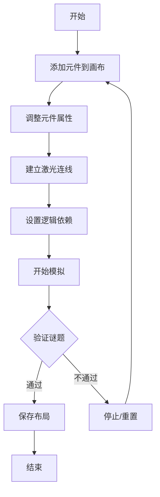

## 1. 产品概述

冒险解谜游戏策划交互式沙盒工具，帮助游戏策划快速生成和预览各种谜题机关（推箱子、激光反射、压力板开门等），直观验证机关联动效果和触发逻辑。

- 解决传统策划文档中难以直观展示物理联动和时序逻辑的问题
- 通过拖拽放置元件、连线设置触发条件，实时运行模拟验证谜题可解性

## 2. 核心功能

### 2.1 功能模块

1. **网格画布**: 400x400像素网格，每格32x32像素，支持元件放置、拖拽、网格吸附
2. **元件面板**: 左侧元件库，包含箱子、压力板、激光发射器/接收器、门、墙壁等可拖拽元件
3. **属性面板**: 右侧属性编辑区，支持位置、朝向、触发类型等参数调整，以及激光连线功能
4. **模拟控制栏**: 画布下方控制区，包含开始/停止/重置模拟按钮
5. **逻辑预览区**: 流程图形式展示条件-结果关系，支持节点拖拽和连线删除
6. **本地存储**: 支持保存/加载谜题布局到localStorage，显示最近5条历史记录

### 2.2 页面详情

| 页面名称 | 模块名称 | 功能描述 |
|-----------|-------------|---------------------|
| 主页面 | 网格画布 | 400x400网格背景，格线#444466，背景#1a1b2e，支持元件放置与拖拽吸附 |
| 主页面 | 元件面板 | 180px宽，背景#252540，圆角12px，包含6种元件图标及添加按钮 |
| 主页面 | 属性面板 | 240px宽，背景#2a2b45，圆角8px，显示选中元件参数，支持激光连线 |
| 主页面 | 模拟控制栏 | 60px高，背景#1e1f30，圆角12px，绿色开始/红色停止按钮 |
| 主页面 | 逻辑预览区 | 150px高，背景#1e1f30，圆角8px，流程图展示条件-结果关系 |

## 3. 核心流程

策划从元件面板拖拽或点击添加元件到画布 → 在属性面板调整参数（位置、朝向、触发条件）→ 为激光发射器和接收器建立连线 → 在逻辑预览区设置条件与结果的依赖关系 → 点击开始模拟 → 运行时可拖拽箱子、观察压力板变色、激光束发射与遮挡、门的开关 → 发现问题后停止/重置 → 保存布局到本地。

## 4. 用户界面设计

### 4.1 设计风格

- **主色调**: 深色科幻风格，主色#1a1b2e，辅色#2a2b45，强调色#00d2ff和#e74c3c
- **按钮样式**: 微渐变+投影，模拟复古游戏机质感，点击时scale(0.95)缩放反馈
- **元件选中状态**: box-shadow: 0 0 12px #00d2ff 外发光效果
- **动画效果**: 激光束透明度0.5→1闪烁（周期0.8秒），门开关旋转过渡（0.5秒）

### 4.2 页面设计概览

| 页面名称 | 模块名称 | UI元素 |
|-----------|-------------|-------------|
| 主页面 | 网格画布 | 格线、元件、激光束、碰撞高亮、拖拽吸附 |
| 主页面 | 元件面板 | 元件图标网格、名称标签、添加按钮、渐变背景 |
| 主页面 | 属性面板 | 坐标输入框、朝向下拉、触发类型下拉、连线按钮 |
| 主页面 | 模拟控制栏 | 开始/停止/重置/保存/加载按钮、状态指示器 |
| 主页面 | 逻辑预览区 | 圆形条件节点（橙色）、方形结果节点（蓝色）、箭头连线 |

### 4.3 响应式设计

桌面优先布局：左侧元件面板（180px）+ 中央画布 + 右侧属性面板（240px）+ 底部控制栏。

窗口宽度 < 900px时自动切换纵向堆叠：画布在上，依次排列元件面板、控制栏、属性面板，保证平板可用。

### 4.4 性能要求

画布同时放置≤20个元件全部运行时，帧率稳定≥30fps。
