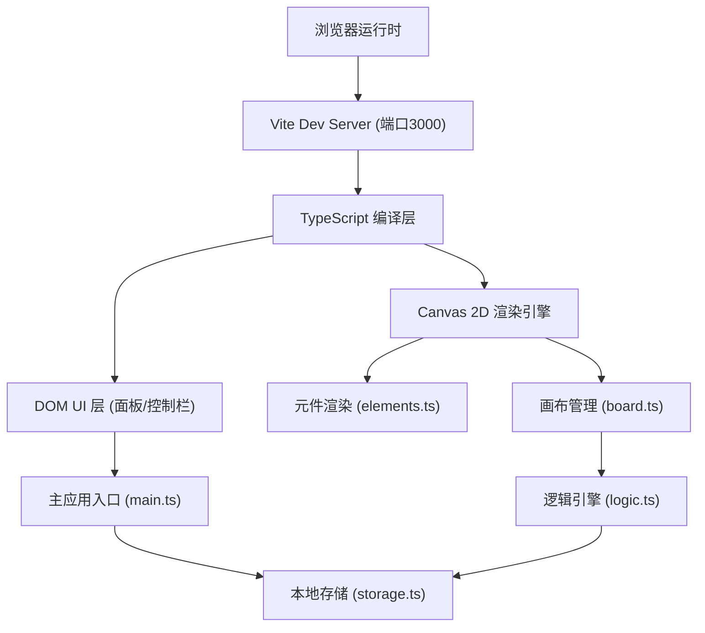

## 1. 架构设计



## 2. 技术描述

- **前端**: TypeScript (strict模式, target ES2020) + Vite 5 + Canvas 2D API
- **UI层**: 原生HTML/CSS（面板、控制栏、属性编辑）
- **渲染层**: Canvas 2D（网格、元件、激光束、流程图）
- **状态管理**: 单例全局状态（main.ts中维护），无额外框架依赖
- **依赖库**: lodash（工具函数）、uuid（元件唯一标识生成）
- **存储**: localStorage（持久化谜题布局）
- **后端**: 无，纯前端应用

## 3. 文件结构

| 文件路径 | 用途 |
|---------|------|
| /package.json | 项目依赖与脚本定义（typescript、vite@5、lodash、uuid） |
| /tsconfig.json | TypeScript严格模式配置，target ES2020 |
| /vite.config.js | Vite构建配置，devServer端口3000 |
| /index.html | 入口页面，全屏深色背景 |
| /src/main.ts | 应用入口：初始化画布、面板、控制栏，管理全局状态 |
| /src/board.ts | 网格画布：绘制、元件放置/拖拽/吸附、碰撞检测、状态渲染 |
| /src/elements.ts | 元件定义：类型、属性、渲染逻辑、激光动画、连线管理 |
| /src/logic.ts | 逻辑引擎：元件间连接、条件判断、门开关逻辑、流程图节点关系 |
| /src/storage.ts | 存储模块：localStorage保存/加载/历史记录管理 |

## 4. 核心数据模型

### 4.1 元件类型定义

```typescript
type ElementType = 'box' | 'pressurePlate' | 'laserEmitter' | 'laserReceiver' | 'door' | 'wall';
type Direction = 'up' | 'down' | 'left' | 'right';
type TriggerType = 'manual' | 'touched' | 'laserHit';

interface BaseElement {
  id: string;           // uuid
  type: ElementType;
  x: number;            // 网格坐标 (像素, 32的倍数)
  y: number;
  gridX: number;        // 网格列索引
  gridY: number;        // 网格行索引
  direction?: Direction;
  triggerType?: TriggerType;
  isActive: boolean;    // 当前激活状态
  initialState: { x: number; y: number; isActive: boolean; direction?: Direction };
}

interface LaserConnection {
  id: string;
  emitterId: string;
  receiverId: string;
}

interface LogicNode {
  id: string;
  type: 'condition' | 'result';
  label: string;
  elementId?: string;
  x: number;
  y: number;
}

interface LogicEdge {
  id: string;
  fromNodeId: string;
  toNodeId: string;
}
```

### 4.2 全局状态

```typescript
interface AppState {
  elements: BaseElement[];
  laserConnections: LaserConnection[];
  logicNodes: LogicNode[];
  logicEdges: LogicEdge[];
  selectedElementId: string | null;
  isSimulating: boolean;
  isConnectingLaser: boolean;
  pendingLaserEmitterId: string | null;
}
```

## 5. 渲染与交互流程

1. **初始化**: main.ts 创建DOM结构 → 初始化Canvas → 绑定事件监听 → 启动requestAnimationFrame循环
2. **放置元件**: 点击元件面板按钮 → 生成uuid → 在画布中心创建元件实例 → 吸附到网格
3. **拖拽元件**: mousedown选中 → mousemove更新位置（网格吸附，步长32）→ 碰撞检测防止重叠 → mouseup确认
4. **模拟运行**: 
   - 每帧更新：压力板检测上方是否有箱子/角色 → 变色；激光发射器按朝向发射射线 → 遇墙壁/箱子中断 → 到达接收器时激活
   - 逻辑判断：logic.ts检查所有条件 → 满足时触发对应结果（门打开等）
5. **激光连线**: 点击连线按钮进入模式 → 点击发射器 → 点击接收器 → 创建LaserConnection
6. **渲染**: board.ts每帧清空画布 → 画网格 → 遍历元件调用elements.ts的render方法 → 画激光束 → 高亮选中元件
