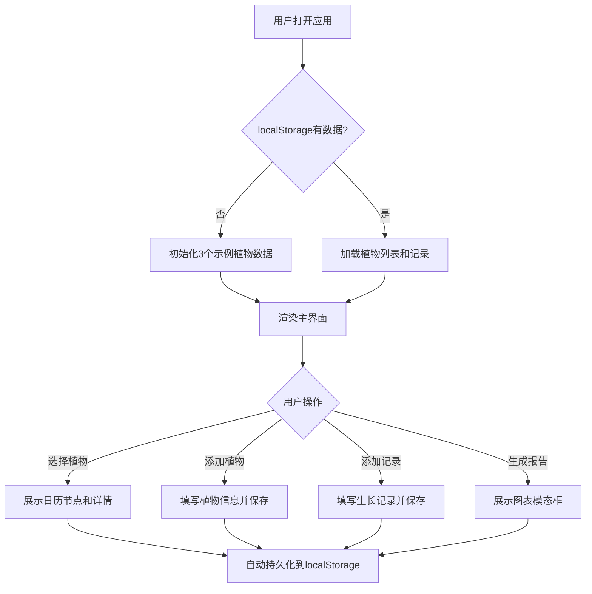

## 1. 产品概述

园艺种植助手是一款面向家庭园艺爱好者和社区园艺小组的浏览器应用，帮助用户快速创建个性化种植日历、记录植物生长进度并生成可视化生长报告。

- 解决的核心问题：纸质记录易丢失、Excel表格缺乏直观性、难以结合天气数据推算浇水/施肥提醒
- 目标用户：家庭园艺爱好者、社区园艺小组
- 产品价值：提供直观、持久化、数据驱动的园艺管理体验

## 2. 核心功能

### 2.1 用户角色
| 角色 | 注册方式 | 核心权限 |
|------|----------|----------|
| 普通用户 | 无需注册（本地数据） | 添加/编辑/删除植物、记录生长数据、查看日历、生成报告 |

### 2.2 功能模块
1. **主界面**：左侧植物列表、右侧日历视图、顶部天气预报
2. **植物详情页**：进度条、生长记录时间线、生成报告功能

### 2.3 页面详情
| 页面名称 | 模块名称 | 功能描述 |
|----------|----------|----------|
| 主界面 | 植物列表 | 展示植物卡片（名称、品种、种植日期、预计收获天数）、添加植物按钮、点击切换详情 |
| 主界面 | 日历视图 | 月度网格展示、5类节点圆点标记（播种/发芽/移栽/开花/收获）、点击编辑/删除节点、低温警告标记 |
| 主界面 | 天气预报 | 最近7天模拟天气数据展示（日期、图标、最高/最低温、降雨概率） |
| 详情页 | 进度条 | 从播种到收获的百分比进度条、数字跳动动画 |
| 详情页 | 生长记录时间线 | 日期、照片URL、高度cm、叶片数、备注文字、编辑/删除按钮 |
| 详情页 | 报告生成 | 高度折线图、叶片数柱状图、导出为PNG按钮 |

## 3. 核心流程

用户打开应用 → 系统从localStorage加载数据（首次加载自动初始化3个示例植物）→ 用户在左侧列表选择植物或添加新植物 → 右侧日历展示该植物的生长节点 → 用户点击植物卡片进入详情页 → 用户添加/编辑生长记录 → 用户点击生成报告查看可视化图表 → 所有操作自动保存到localStorage

## 4. 用户界面设计

### 4.1 设计风格
- 主背景色：#121212（深色主题）
- 卡片背景色：#1e1e2e
- 圆角：12px（卡片）、8px（按钮）
- 内边距：16px
- 节点颜色：播种=#4caf50、发芽=#8bc34a、移栽=#2196f3、开花=#ff9800、收获=#f44336
- 按钮：生成报告按钮背景#1e88e5，白色文字
- 字体：Inter（Google Fonts）
- 布局：左侧固定280px导航栏 + 右侧自适应主区域
- 图标：使用Lucide React图标库

### 4.2 页面设计概述
| 页面名称 | 模块名称 | UI元素 |
|----------|----------|--------|
| 主界面 | 植物列表卡片 | 深色卡片、悬停上移4px+box-shadow过渡、圆角12px、内边距16px |
| 主界面 | 日历节点圆点 | 彩色圆点、点击放大1.2倍、tooltip气泡 |
| 主界面 | 低温警告 | 红色三角形图标叠加在节点上 |
| 详情页 | 进度条 | 渐变色进度条、百分比数字跳动动画 |
| 详情页 | 时间线记录 | 左侧垂直线、时间点标记、卡片式记录项 |
| 详情页 | 报告模态框 | 半透明遮罩、居中卡片、折线图+柱状图 |

### 4.3 响应式设计
- 桌面优先设计
- 宽度小于768px时：左侧导航栏折叠为顶部汉堡菜单
- 日历网格自适应宽度
- 移动端单列布局

### 4.4 动效设计
- 卡片新增：向下滑动出现（slide-down）
- 卡片删除：向左滑动消失（slide-left）
- 卡片悬停：上移4px + box-shadow过渡（0.2s ease）
- 节点圆点点击：放大1.2倍
- 进度条更新：数字跳动效果
- tooltip气泡：淡入弹出
