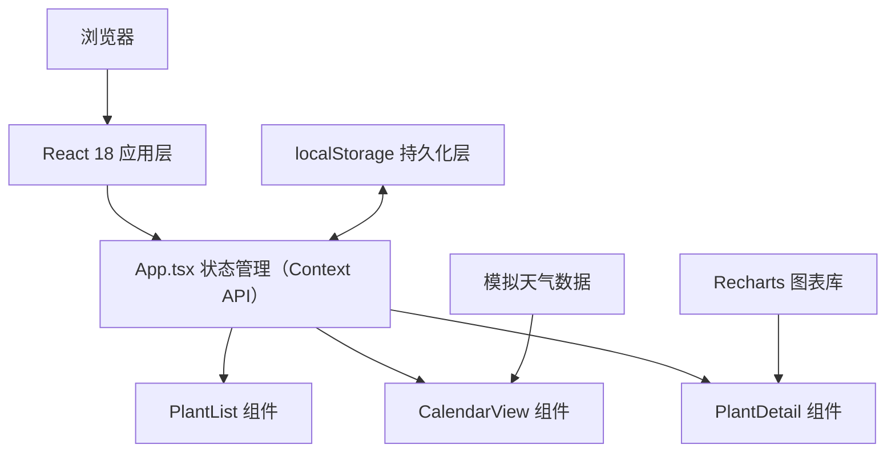
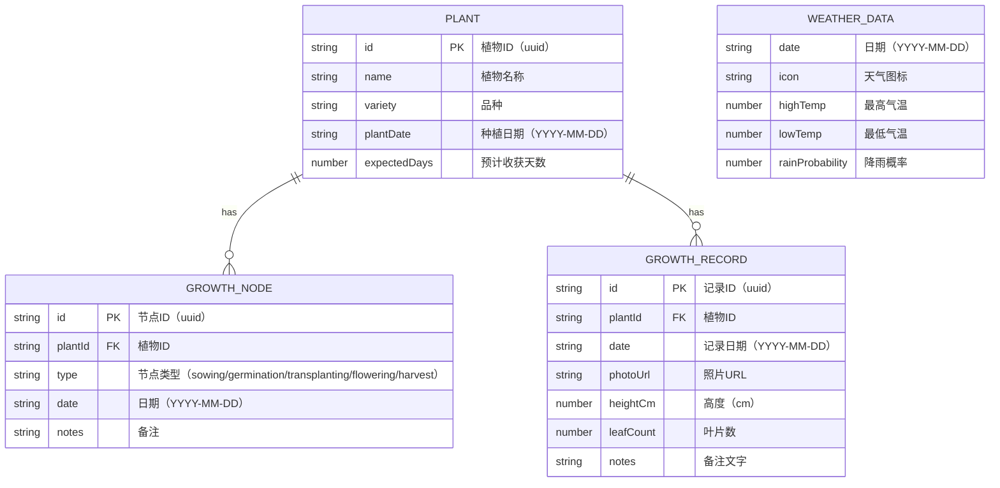

## 1. 架构设计



## 2. 技术说明

- 前端框架：React@18 + TypeScript
- 构建工具：Vite@5
- 图表库：Recharts@2
- 工具库：uuid、lodash
- 图标库：lucide-react
- 状态管理：React Context API
- 数据持久化：localStorage
- 样式方案：CSS-in-JS（内联样式 + CSS变量）

## 3. 路由定义
| 路由 | 用途 |
|------|------|
| / | 主界面（植物列表+日历视图），无实际路由，使用状态切换详情页 |

本应用为单页应用，不引入react-router，通过状态管理切换主界面与详情页视图。

## 4. 数据模型

### 4.1 数据模型定义



### 4.2 数据结构（TypeScript类型）

```typescript
type NodeType = 'sowing' | 'germination' | 'transplanting' | 'flowering' | 'harvest';

interface Plant {
  id: string;
  name: string;
  variety: string;
  plantDate: string;
  expectedDays: number;
}

interface GrowthNode {
  id: string;
  plantId: string;
  type: NodeType;
  date: string;
  notes?: string;
}

interface GrowthRecord {
  id: string;
  plantId: string;
  date: string;
  photoUrl: string;
  heightCm: number;
  leafCount: number;
  notes: string;
}

interface WeatherData {
  date: string;
  icon: string;
  highTemp: number;
  lowTemp: number;
  rainProbability: number;
}

interface PlantContextType {
  plants: Plant[];
  growthNodes: GrowthNode[];
  growthRecords: GrowthRecord[];
  weatherData: WeatherData[];
  selectedPlantId: string | null;
  addPlant: (plant: Omit<Plant, 'id'>) => void;
  updatePlant: (id: string, plant: Partial<Plant>) => void;
  deletePlant: (id: string) => void;
  addGrowthNode: (node: Omit<GrowthNode, 'id'>) => void;
  updateGrowthNode: (id: string, node: Partial<GrowthNode>) => void;
  deleteGrowthNode: (id: string) => void;
  addGrowthRecord: (record: Omit<GrowthRecord, 'id'>) => void;
  updateGrowthRecord: (id: string, record: Partial<GrowthRecord>) => void;
  deleteGrowthRecord: (id: string) => void;
  selectPlant: (id: string | null) => void;
}
```

## 5. 文件结构

```
.
├── package.json
├── vite.config.js
├── tsconfig.json
├── index.html
└── src/
    ├── App.tsx              # 主应用组件，Context API状态管理
    ├── main.tsx             # 入口文件
    ├── index.css            # 全局样式
    └── components/
        ├── PlantList.tsx    # 左侧植物列表组件
        ├── CalendarView.tsx # 日历视图组件
        └── PlantDetail.tsx  # 植物详情页组件
```

## 6. 性能要求

- 日历视图节点渲染和工具提示响应延迟：≤ 50ms
- 图表生成时间：≤ 100ms
- 卡片动画过渡：0.2s ease
- 所有交互反馈使用CSS动画，避免阻塞主线程
