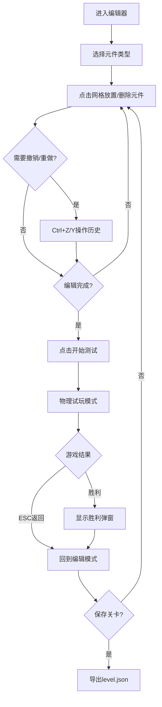

## 1. 产品概述

基于浏览器的2D平台游戏关卡编辑器与测试运行器，用户可通过拖拽方式快速构建关卡并实时测试可玩性。
- 面向游戏开发者和关卡设计师，提供所见即所得的关卡编辑体验
- 降低2D平台游戏关卡设计门槛，实现编辑-测试-迭代的高效闭环

## 2. 核心功能

### 2.1 功能模块
1. **关卡编辑器**：20x15网格编辑区、元件面板、点击放置/删除
2. **物理试玩**：实时物理引擎、角色控制、碰撞检测、生命系统
3. **历史记录**：撤销(Ctrl+Z)/重做(Ctrl+Y)，最多30步
4. **关卡管理**：JSON格式保存/加载关卡数据
5. **质量检测**：自动检测不可通过的水平间隙并警告

### 2.2 页面详情
| 页面名称 | 模块名称 | 功能描述 |
|-----------|-------------|---------------------|
| 主编辑器 | 工具栏 | 保存/加载按钮、模式切换 |
| 主编辑器 | 元件面板 | 平台、敌人、尖刺、终点旗选择 |
| 主编辑器 | 网格画布 | 20x15网格、元件放置渲染 |
| 主编辑器 | 状态栏 | 间隙警告提示、状态信息 |
| 试玩模式 | 游戏画布 | 物理模拟、角色渲染、暗角效果 |
| 试玩模式 | HUD | 生命值显示、胜利弹窗 |

## 3. 核心流程

用户选择元件 → 在网格上点击放置 → 编辑完成后点击"开始测试" → 控制角色试玩 → 碰到终点旗胜利或ESC返回 → 可保存/加载关卡JSON

## 4. 用户界面设计

### 4.1 设计风格
- **主色调**：深色科幻风 #1a1a2e（主背景）、#16213e（面板）、#0f3460（工具栏渐变）
- **元件色**：平台#8B4513、敌人#ff4444、尖刺#666666、终点旗#ffd700、玩家#4caf50
- **按钮**：圆角设计，悬停放大scale(1.05)，按下内阴影效果
- **字体**：现代无衬线字体，标题加粗，状态文字适中
- **特效**：元件选中白色外发光(shadow blur 8px)、试玩模式暗角渐变

### 4.2 页面设计概述
| 页面名称 | 模块名称 | UI元素 |
|-----------|-------------|-------------|
| 主编辑器 | 工具栏 | 顶部渐变背景，保存/加载按钮（圆角6px） |
| 主编辑器 | 元件面板 | 左侧180px宽，圆角8px，元件图标+文字 |
| 主编辑器 | 网格画布 | 中心区域，#334466半透明网格线 |
| 主编辑器 | 状态栏 | 底部黄色警告文字 |
| 试玩模式 | 游戏画面 | 全屏Canvas，径向渐变暗角 |
| 试玩模式 | HUD | 左上角生命值（红心），中央胜利弹窗 |

### 4.3 响应式
- 桌面端优先设计，最小宽度800px
- 低于800px显示"请使用更大屏幕"提示
- Canvas按比例缩放适配窗口
