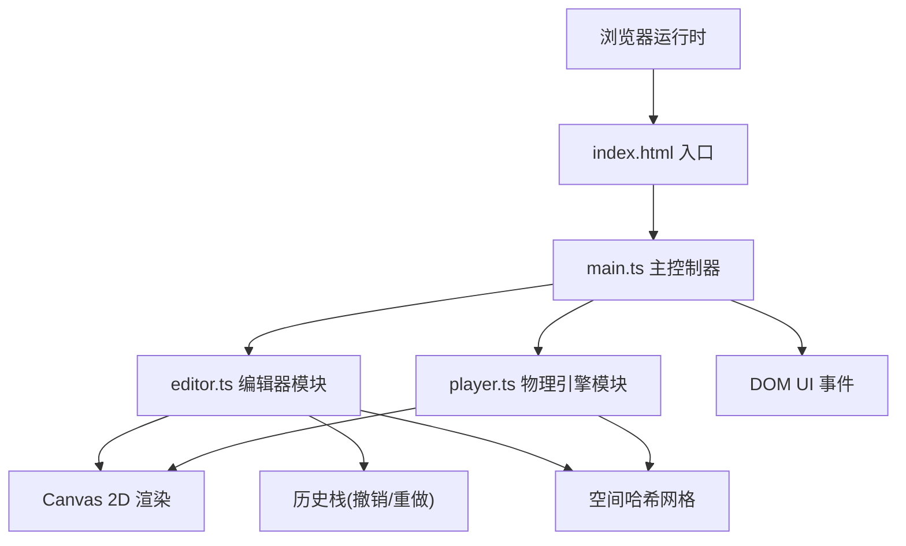

## 1. 架构设计



## 2. 技术描述
- **前端框架**：纯TypeScript + Canvas 2D API（无框架）
- **构建工具**：Vite@5
- **辅助库**：lodash（深拷贝等工具函数）
- **开发语言**：TypeScript（strict模式，target ES2020，module ESNext）

## 3. 核心模块设计

### 3.1 editor.ts - 关卡编辑器
| 类/接口 | 职责 |
|---------|------|
| `LevelEditor` | 编辑器主类，管理网格、元件、渲染 |
| `GridManager` | 20x15网格渲染与坐标转换 |
| `EntityLibrary` | 元件类型定义与图标渲染 |
| `HistoryStack` | 撤销重做栈（限30步） |
| `GapDetector` | 水平间隙检测算法 |

### 3.2 player.ts - 物理引擎
| 类/接口 | 职责 |
|---------|------|
| `Player` | 玩家角色状态与物理 |
| `PhysicsEngine` | 重力、速度、位移计算 |
| `CollisionSystem` | 基于空间哈希的碰撞检测 |
| `EnemyAI` | 敌人来回移动逻辑 |

### 3.3 main.ts - 主入口
| 函数 | 职责 |
|---------|------|
| `initApp()` | 初始化Canvas、UI、事件绑定 |
| `gameLoop()` | request循环（逻辑与渲染分离） |
| `switchMode()` | 编辑/试玩模式切换 |

## 4. 数据结构

### 4.1 关卡元件类型
```typescript
type EntityType = 'platform' | 'enemy' | 'spike' | 'goal';

interface LevelEntity {
  id: string;
  type: EntityType;
  gridX: number;  // 网格坐标X (0-19)
  gridY: number;  // 网格坐标Y (0-14)
}

interface LevelData {
  entities: LevelEntity[];
}
```

### 4.2 玩家状态
```typescript
interface PlayerState {
  x: number;          // 像素坐标
  y: number;
  vx: number;         // 速度
  vy: number;
  onGround: boolean;
  lives: number;
  isHit: boolean;
  hitTimer: number;
  spawnX: number;
  spawnY: number;
}
```

### 4.3 历史栈
```typescript
interface HistoryState {
  stack: LevelData[];
  currentIndex: number;
  MAX_SIZE: 30;
}
```

## 5. 性能优化策略
- **逻辑渲染分离**：逻辑tick固定时间步，渲染使用requestAnimationFrame
- **空间哈希网格**：碰撞检测前先将元件按网格分桶，减少O(n²)检测
- **Canvas批处理**：同类元件批量绘制，减少状态切换
- **脏标记渲染**：编辑模式仅在元件变化时重绘（可选，视性能需求）

## 6. 文件结构
```
auto173/
├── package.json
├── tsconfig.json
├── vite.config.js
├── index.html
└── src/
    ├── main.ts        # 主入口
    ├── editor.ts      # 编辑器核心
    ├── player.ts      # 玩家物理引擎
    └── types.ts       # 共享类型定义
```
