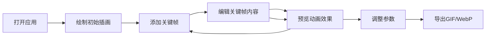

## 1. 产品概述

表情工坊（Emoji Workshop）是一款面向独立插画师和表情包爱好者的浏览器端动画制作工具，帮助用户将静态插画快速转换为循环播放的动态表情包。通过锚点定位和参数曲线控制，用户只需设置关键帧即可自动生成平滑的补间动画，大幅降低GIF制作的时间成本。

- 目标用户：独立插画师、表情包创作者、设计爱好者
- 核心价值：解决手动逐帧绘制耗时、帧间过渡不自然的痛点，提供一键导出能力

## 2. 核心功能

### 2.1 用户角色

| 角色 | 注册方式 | 核心权限 |
|------|---------|----------|
| 普通用户 | 无需注册，直接使用 | 创建、编辑、预览和导出动画表情包 |

### 2.2 功能模块

1. **绘图编辑模块**：600x600 画布，支持画笔/橡皮擦工具切换，十字辅助线
2. **时间轴模块**：帧级时间轴管理，关键帧添加/删除/拖拽，菱形图标标记
3. **动画引擎模块**：关键帧补间计算（线性插值/缓动曲线），自动生成中间帧
4. **参数控制模块**：帧速率、循环次数、输出尺寸调节
5. **导出模块**：一键导出 GIF / WebP 格式

### 2.3 页面详情

| 页面名称 | 模块名称 | 功能描述 |
|---------|---------|----------|
| 主工作区 | 绘图编辑区 | 600x600画布，背景色#f5f0eb，浅色十字辅助线，鼠标绘制/擦除，画笔大小可调 |
| 主工作区 | 时间轴面板 | 宽度280px，帧级时间轴，点击添加关键帧（菱形#ff6b6b），拖拽调整位置 |
| 主工作区 | 参数面板 | 背景#1e1e2e，三个滑块：帧速率(5-30fps)、循环次数(1-5)、输出尺寸(100-500px) |
| 主工作区 | 预览/导出 | 预览按钮（#4ecdc4）触发补间动画预览，导出GIF（#ff6b6b）和WebP（#845ec2）按钮 |

## 3. 核心流程

用户打开应用 → 在画布上绘制初始插画 → 在时间轴上添加关键帧 → 切换到关键帧并修改画布内容 → 点击预览查看补间动画 → 调整参数（帧率、循环、尺寸） → 导出为GIF或WebP格式下载

## 4. 用户界面设计

### 4.1 设计风格

- **主背景色**：#1a1a2e（深紫黑）
- **次背景色**：#2d2d3d（深蓝灰）
- **点缀色**：#ff6b6b（珊瑚红）、#4ecdc4（青绿）、#845ec2（紫罗兰）
- **按钮样式**：圆角8px，悬停颜色变亮，工具切换0.3s渐变过渡
- **交互反馈**：关键帧弹簧动画（透明度0→1弹性回弹）、预览时画布外发光（box-shadow: 0 0 20px rgba(78, 205, 196, 0.4)）、导出按钮100ms点击缩放动画
- **字体**：现代无衬线字体，清晰易读

### 4.2 页面设计概览

| 页面名称 | 模块名称 | UI 元素 |
|---------|---------|--------|
| 主工作区 | 整体布局 | 桌面端左右分栏（编辑区+时间轴），移动端上下布局，暗色主题分层设计 |
| 主工作区 | 绘图编辑区 | 600x600画布，#f5f0eb背景，十字辅助线，工具栏（画笔/橡皮擦切换，大小调节） |
| 主工作区 | 时间轴面板 | 280px宽，#2d2d3d背景，水平帧条，菱形关键帧标记#ff6b6b，当前帧标签 |
| 主工作区 | 参数面板 | #1e1e2e背景，16px内边距，12px圆角，三个滑块带数值显示 |
| 主工作区 | 导出按钮 | GIF按钮#ff6b6b，WebP按钮#845ec2，圆角8px白色文字 |

### 4.3 响应式设计

- 桌面端（≥768px）：左侧绘图编辑区，右侧时间轴面板
- 移动端（<768px）：上下布局（编辑区在上，参数和时间轴在下），滑块横向排列
- 触摸优化：关键帧拖拽区域放大，按钮尺寸适配触屏

### 4.4 性能要求

- 预览动画帧率稳定在30fps以上
- 导出GIF时帧间延迟不超过50ms
- 画布操作无明显卡顿
