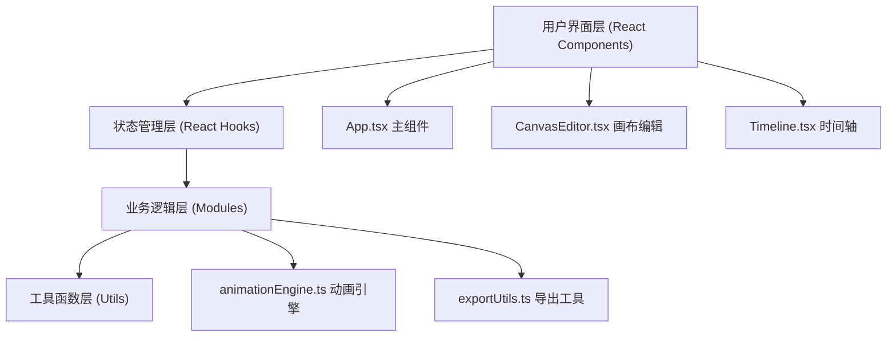

## 1. 架构设计



## 2. 技术说明

- **前端框架**：React 18 + TypeScript
- **构建工具**：Vite 5
- **状态管理**：React useState/useCallback（无需额外状态库，应用规模较小）
- **动画补间**：自定义像素级插值算法（线性/ease-out缓动）
- **导出能力**：gif.js（GIF编码）、Canvas API（WebP编码）、file-saver（文件下载）
- **工具库**：lodash（辅助函数）

## 3. 项目文件结构

| 文件路径 | 说明 |
|---------|------|
| package.json | 项目依赖与脚本配置 |
| vite.config.js | Vite 构建配置，devServer 端口 3000 |
| tsconfig.json | TypeScript 严格模式配置 |
| index.html | 入口页面，标题"表情工坊 - Emoji Workshop" |
| src/App.tsx | 主组件，画布状态、关键帧列表、参数管理 |
| src/CanvasEditor.tsx | 绘图编辑组件，Canvas 2D绘制、鼠标事件、工具切换 |
| src/Timeline.tsx | 时间轴组件，关键帧增删改、拖拽定位 |
| src/animationEngine.ts | 动画引擎，ImageData插值、补间帧生成 |
| src/exportUtils.ts | 导出工具，GIF/WebP拼接与下载 |

## 4. 核心数据模型

### 4.1 关键帧数据结构
```typescript
interface Keyframe {
  id: string;
  frameIndex: number;
  imageData: ImageData;
}
```

### 4.2 动画参数
```typescript
interface AnimationParams {
  fps: number;           // 5-30, 默认12
  loops: number;         // 1-5, 默认3
  outputSize: number;    // 100-500px, 默认200
  easing: 'linear' | 'ease-out';  // 缓动函数
}
```

### 4.3 绘图工具状态
```typescript
interface ToolState {
  tool: 'brush' | 'eraser';
  size: number;     // 默认3px
  color: string;    // 默认#333333
}
```

## 5. 动画引擎算法说明

### 5.1 补间计算原理
- 输入：两个关键帧的 ImageData（像素数组）
- 输出：中间帧的 ImageData 数组
- 算法：对每个像素的 RGBA 通道分别进行插值
  - 线性插值：`pixel(t) = A + (B - A) * t`
  - 缓出(ease-out)：`t' = 1 - (1 - t)^3`，再代入线性公式

### 5.2 帧生成流程
1. 按帧率和总帧数计算需要生成的中间帧数量
2. 对每对相邻关键帧之间的帧进行像素级插值
3. 处理循环动画的首尾帧过渡（最后一帧插值回第一帧）

## 6. 导出流程

### 6.1 GIF导出
1. 使用 gif.js 创建 GIF 实例，设置帧率和循环次数
2. 将每一帧的 Canvas 缩放至输出尺寸
3. 添加到 GIF 编码器，设置帧间延迟 ≤ 50ms
4. 编码完成后通过 file-saver 触发下载

### 6.2 WebP导出
1. 对每一帧 Canvas 调用 toDataURL('image/webp')
2. 由于浏览器原生 WebP 不支持动画，导出为单帧序列或使用替代方案
3. 通过 Blob + file-saver 触发下载
