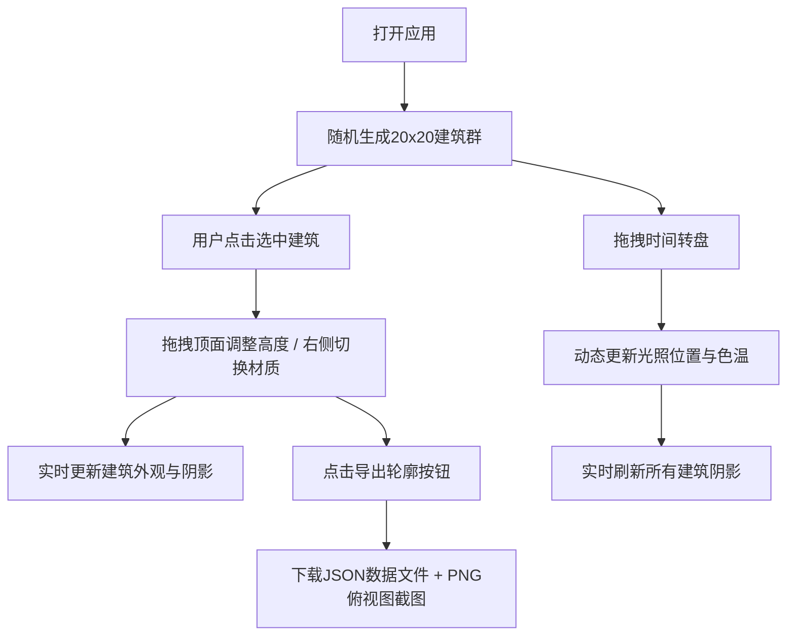

## 1. 产品概述

天际线工坊是一款面向城市规划师和环境设计师的浏览器端3D可视化工具，解决传统CAD软件无法即时调整建筑参数并观察日照阴影效果的痛点。用户可动态生成和编辑城市天际线，实时模拟不同时间段太阳光影对建筑群的遮挡与反射效果。

- 目标用户：城市规划师、环境设计师、建筑系学生
- 核心价值：即时可视化建筑高度/密度/材质调整对天际线形态及日照环境的影响

## 2. 核心功能

### 2.1 用户角色
| 角色 | 注册方式 | 核心权限 |
|------|----------|----------|
| 设计师用户 | 无需注册，直接使用 | 所有编辑、模拟、导出功能 |

### 2.2 功能模块
1. **3D场景主界面**：建筑群渲染、地面网格、渐变天空背景
2. **建筑编辑模块**：点击选中、拖拽顶面调整高度、高度实时标签、选中发光边框
3. **时间日照模拟模块**：圆形时间转盘、光照位置/色温动态变化、柔和阴影投射
4. **材质属性面板**：玻璃/混凝土/金属三种材质切换、实时外观更新
5. **导出模块**：JSON数据导出、俯视图PNG截图导出

### 2.3 页面详情
| 页面名称 | 模块名称 | 功能描述 |
|----------|----------|----------|
| 主工作区 | 3D场景 | 渲染20x20网格建筑群，支持鼠标交互，渐变天空背景 |
| 主工作区 | 时间转盘 | 右上角圆形控件，06:00-20:00范围，15分钟步长 |
| 主工作区 | 属性面板 | 右侧300px面板，材质切换选项 |
| 主工作区 | 底部工具栏 | "导出轮廓"按钮，导出JSON+PNG |

## 3. 核心流程

## 4. 用户界面设计

### 4.1 设计风格
- **主色调**：深蓝天空渐变(#1a237e → #64b5f6)，深灰面板(#263238)，橙色强调(#ff7043、#ffca28)
- **按钮样式**：圆角8px，悬停有亮度提升过渡(0.2s缓动)
- **字体**：系统字体栈(-apple-system, BlinkMacSystemFont, "Segoe UI", Roboto, sans-serif)
- **布局风格**：左右分栏(70%/300px)，桌面优先，移动端折叠为底部抽屉
- **交互反馈**：所有状态变化0.2s缓动过渡，选中建筑1s脉冲发光动画

### 4.2 页面设计概览
| 页面名称 | 模块名称 | UI元素 |
|----------|----------|--------|
| 主工作区 | 3D场景 | 全屏Canvas、渐变天空背景、浅绿色地面网格(透明度0.3) |
| 主工作区 | 时间转盘 | 圆形(直径120px)、半透明白色背景、小时刻度、可拖拽滑块 |
| 主工作区 | 属性面板 | 深灰背景(#263238)、圆角16px、内边距20px、浅灰文字(#e0e0e0) |
| 主工作区 | 底部工具栏 | 居中对齐、橙色导出按钮(#ff7043, 圆角8px) |
| 主工作区 | 建筑选中效果 | 外发光边框(#ffca28, 脉冲1s周期)、拖拽时高度标签 |

### 4.3 响应式
- 桌面端(≥768px)：左右分栏布局，左侧3D场景70%，右侧属性面板300px固定宽度
- 移动端(<768px)：右侧面板折叠为底部抽屉，顶部汉堡按钮展开/收起
- 触摸优化：建筑选中需更大热区，高度拖拽支持触摸手势

### 4.4 3D场景指引
- **环境**：顶点渐变天空(顶部#1a237e → 底部#64b5f6)，浅绿色地面(#e8f5e9网格线#bdbdbd, 0.3透明度)
- **光照**：环境光(基础照明) + 方向光(模拟太阳光，带阴影投射)，方向光位置/色温随时间动态变化
- **相机**：PerspectiveCamera，45° FOV，初始俯视角约30°，可通过OrbitControls旋转缩放
- **构图**：20x20建筑网格居中，地面略大于建筑群，相机距离保证完整视野
- **交互**：点击建筑选中、拖拽顶面调整高度、OrbitControls场景浏览
- **后期**：建筑阴影使用PCFSoftShadowMap实现柔和边缘，选中建筑外发光效果
- **性能**：20x20=400栋建筑，时间滑块拖拽≥30fps，高度调整响应<100ms
