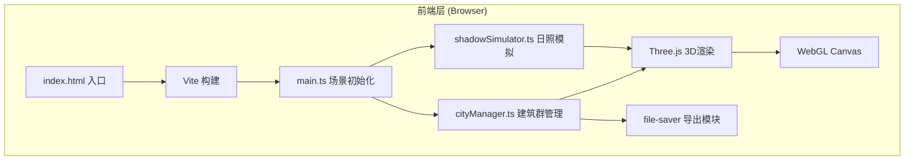

## 1. 架构设计



## 2. 技术描述
- **前端框架**：原生 TypeScript (无UI框架)
- **3D引擎**：Three.js v0.160
- **构建工具**：Vite v5
- **工具库**：lodash (工具函数), file-saver (文件下载)
- **无后端**：纯前端应用，所有计算在浏览器端完成

## 3. 文件结构
| 路径 | 用途 |
|------|------|
| /package.json | 依赖与脚本配置 |
| /index.html | 入口HTML，全屏布局，DOM UI控件 |
| /tsconfig.json | TypeScript严格模式配置 |
| /vite.config.js | Vite构建配置(dev端口3000) |
| /src/main.ts | 场景初始化、主循环animate、事件绑定 |
| /src/cityManager.ts | 建筑群生成/编辑/材质/导出核心逻辑 |
| /src/shadowSimulator.ts | 时间转盘UI、光照计算、阴影参数更新 |

## 4. 核心数据模型

```typescript
// 建筑材质类型
type MaterialType = 'glass' | 'concrete' | 'metal';

// 单栋建筑数据
interface BuildingData {
  id: string;
  x: number;        // 网格X坐标 (0-19)
  z: number;        // 网格Z坐标 (0-19)
  width: number;    // 建筑宽度(地块大小)
  depth: number;    // 建筑深度
  height: number;   // 当前高度 (2-50)
  material: MaterialType;
  roofColor: string; // 屋顶随机颜色 HSL生成
}

// 导出JSON格式
interface ExportData {
  timestamp: number;
  buildings: BuildingData[];
  gridSize: number;  // 20
  plotSize: number;  // 20
}

// 时间状态 (分钟数 06:00=360 ~ 20:00=1200)
interface TimeState {
  minutes: number;   // 360-1200
  sunPosition: { x: number; y: number; z: number };
  colorTemperature: string; // 十六进制颜色
}
```

## 5. 关键技术实现要点

### 5.1 Three.js场景配置
- **渲染器**：WebGLRenderer，antialias=true，shadowMap.enabled=true，shadowMap.type=PCFSoftShadowMap
- **相机**：PerspectiveCamera(fov=45, aspect, near=0.1, far=2000)，初始位置(0, 150, 200)
- **控制器**：OrbitControls，target设为网格中心，minDistance=50，maxDistance=500
- **地面**：PlaneGeometry(600, 600)，MeshStandardMaterial，接收阴影，网格辅助线(GridHelper)

### 5.2 建筑高度渐变着色
- 自定义ShaderMaterial或使用顶点颜色实现从底部#333344到顶部#aaaacc的垂直渐变
- 高度调整时动态更新几何体或材质uniforms

### 5.3 时间-光照映射算法
- 时间(minutes) → 太阳仰角：6:00/20:00约5°，12:00约80°（正弦曲线插值）
- 时间 → 太阳方位角：6:00东(-90°) → 12:00南(0°) → 20:00西(+90°)
- 时间 → 色温：6:00(#ffaa66) → 12:00(#ffffff) → 18:00(#ff6633) → 20:00(渐暗)，使用颜色线性插值

### 5.4 材质配置
| 材质 | 透明度 | 金属度 | 粗糙度 | 颜色 | 反射强度 |
|------|--------|--------|--------|------|----------|
| glass | 0.4 | 0.1 | 0.05 | #77bbff | 0.3 |
| concrete | 1.0 | 0.0 | 0.9 | #999999 | 0.05 |
| metal | 1.0 | 0.9 | 0.2 | #dddddd | 0.7 + 环境贴图 |

### 5.5 导出功能
- **JSON**：遍历所有建筑数据 → JSON.stringify → file-saver.saveAs
- **PNG截图**：临时设置相机为正投影俯视图(OrthographicCamera，从+Y向下看) → renderer.render → canvas.toDataURL('image/png') → 下载，然后恢复原相机

## 6. 性能优化策略
- 建筑几何体复用(BoxGeometry单例共享)
- 材质对象按类型缓存，避免重复创建
- 拖拽高度时仅更新scale.y和顶点颜色，不重建几何体
- 使用requestAnimationFrame驱动的高效主循环
- 阴影贴图尺寸限制在1024x1024，避免过大
