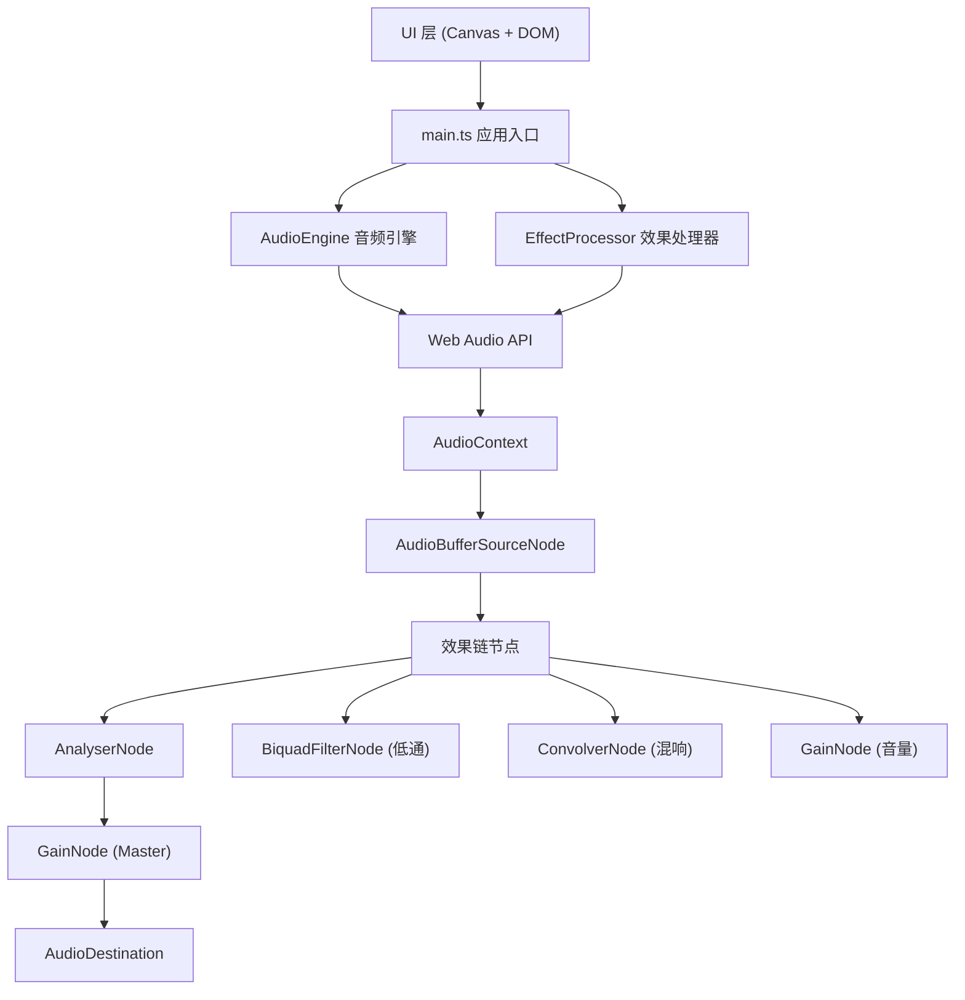

## 1. 架构设计



## 2. 技术选型说明

- **前端框架**: Vanilla TypeScript（无React/Vue，轻量级Canvas应用）
- **构建工具**: Vite 5.x，TypeScript 严格模式
- **音频处理**: Web Audio API 原生接口
  - `AudioContext`：音频上下文容器
  - `AudioBufferSourceNode`：音频源
  - `AnalyserNode`：频谱/波形数据分析
  - `BiquadFilterNode`：低通滤波器
  - `ConvolverNode`：卷积混响（生成脉冲响应模拟混响）
  - `GainNode`：音量控制
- **可视化**: Canvas 2D API
- **工具库**: uuid（用于唯一标识）
- **样式**: 内联CSS（使用CSS变量统一主题色）

## 3. 文件结构

```
/
├── index.html                 # 入口HTML，含加载动画和DOM结构
├── package.json               # 依赖与脚本
├── vite.config.js             # Vite构建配置（端口3000）
├── tsconfig.json              # TypeScript配置（strict, ES2020, ESNext）
└── src/
    ├── main.ts                # 应用入口：Canvas初始化、事件绑定、UI渲染循环
    ├── audioEngine.ts         # 音频引擎：加载、播放、Seek、频谱/波形数据提取
    └── effectProcessor.ts     # 效果处理：混响/低通/音量，效果链管理与动态重连
```

## 4. 模块设计

### 4.1 AudioEngine（audioEngine.ts）
**职责**：加载音频文件、管理播放状态、提供分析数据

| 成员 | 类型 | 说明 |
|------|------|------|
| `loadFile(file: File)` | `Promise<AudioBuffer>` | 解码音频文件 |
| `start(offset?: number)` | `void` | 开始播放 |
| `stop()` | `void` | 停止播放 |
| `seek(progress: number)` | `void` | 跳转到指定进度（0-1） |
| `getFrequencyData()` | `Uint8Array` | 获取当前频谱数据（长度256，截取128条） |
| `getTimeDomainData()` | `Uint8Array` | 获取当前时域波形数据 |
| `getWaveformData(resolution: number)` | `Float32Array` | 获取完整波形预览数据（降采样） |
| `isPlaying` | `boolean` | 播放状态 |
| `currentTime` | `number` | 当前播放时间（秒） |
| `duration` | `number` | 总时长（秒） |
| `onPlaybackEnd` | `() => void` | 播放结束回调 |

**节点链路**：`AudioBufferSourceNode → EffectProcessor 输入 → AnalyserNode → GainNode → Destination`

### 4.2 EffectProcessor（effectProcessor.ts）
**职责**：创建并串联效果节点，暴露参数控制接口

| 成员 | 类型 | 说明 |
|------|------|------|
| `input` | `AudioNode` | 效果链输入节点 |
| `output` | `AudioNode` | 效果链输出节点 |
| `setReverb(percent: number)` | `void` | 设置混响强度（0-100） |
| `setLowPass(frequency: number, q: number)` | `void` | 设置低通滤波器（频率Hz, Q值dB） |
| `setVolume(percent: number)` | `void` | 设置音量（0-200） |
| `getReverb()` | `number` | 获取当前混响值 |
| `getLowPass()` | `{ frequency: number, q: number }` | 获取当前低通参数 |
| `getVolume()` | `number` | 获取当前音量值 |
| `generateImpulseResponse(duration: number, decay: number)` | `AudioBuffer` | 合成混响脉冲响应 |

**效果链**：`Input → BiquadFilterNode(低通) → ConvolverNode(混响湿信号) + Direct(干信号) → GainNode(音量) → Output`

### 4.3 main.ts（应用入口）
**职责**：
- 初始化Canvas元素与尺寸适配
- 绑定文件上传、播放控制、滑块等DOM事件
- 启动60fps渲染循环（requestAnimationFrame）
- 每帧：获取频谱数据 → 绘制128条频谱条 → 绘制波形与播放指示线 → 更新进度条
- 响应式布局处理（监听resize事件）

## 5. 关键实现策略

### 5.1 混响模拟
不依赖外部IR文件，使用 `generateImpulseResponse` 动态生成衰减白噪声脉冲响应：
- 双通道（立体声）
- 指数衰减包络
- duration 2s，decay 2.5

### 5.2 频谱可视化
- AnalyserNode.fftSize = 256 → frequencyBinCount = 128，恰好对应128条频谱
- 使用 Canvas 线性渐变：底部 #6366f1 → 顶部 #a78bfa
- 低通截止频率以上：alpha 从1线性衰减到0.2
- 混响增强低频段（0-200Hz ≈ 前几条bar）高度增益

### 5.3 波形预览
- 加载音频后一次性对整个 AudioBuffer 做降采样，生成约1000个采样点用于波形绘制
- 播放指示线位置 = `(currentTime / duration) * canvasWidth`
- 音量滑块同步缩放波形显示高度

### 5.4 自定义滑块
使用原生 `<input type="range">` + CSS 变量控制外观：
- 轨道背景 #334155
- 滑块圆形，颜色 #f59e0b
- 数值标签绝对定位跟随

## 6. 性能保障
- 使用 `requestAnimationFrame` 保证60fps
- 频谱数据复用同一 `Uint8Array` 缓冲区，避免频繁GC
- 波形数据一次性预处理，不随帧重算
- 所有效果参数直接设置 AudioNode 属性，无需重连整个节点链（除ConvolverNode buffer替换外）
