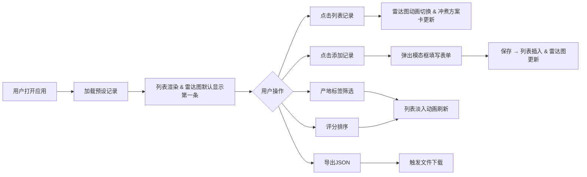

## 1. 产品概述

风味雷达（Flavor Radar）是一款面向咖啡测评爱好者和小型烘焙工坊的浏览器端应用，帮助用户快速记录、对比和分享不同产地咖啡豆的风味雷达图与冲煮参数。

- **核心问题**：传统笔记/Excel记录杯测分数时，难以直观比较酸度、苦度、甜度、醇厚度、余韵五个维度的差异，也无法快速推算最佳赏味窗口期。
- **目标用户**：咖啡测评爱好者、小型咖啡烘焙工坊、专业杯测师
- **产品价值**：在浏览器内一站式完成风味记录、可视化对比、赏味期推算与数据导出

## 2. 核心功能

### 2.1 功能模块

1. **记录列表区**：左侧展示所有咖啡豆记录，支持产地筛选与评分排序
2. **交互式雷达图**：中央展示五维风味数据的雷达图，支持平滑动画切换
3. **添加记录模态框**：右上角按钮触发，完整表单录入豆子信息与风味评分
4. **冲煮方案卡**：雷达图下方展示冲煮参数、最佳赏味期状态与冲煮小贴士
5. **数据导出**：页头按钮一键导出所有记录为 JSON 文件

### 2.2 页面详情

| 页面名称 | 模块名称 | 功能描述 |
|---------|---------|---------|
| 主页面 | 页头导航 | 应用图标、标题、导出JSON按钮 |
| 主页面 | 记录列表区 | 豆子列表、产地标签筛选、排序下拉、评分颜色标识 |
| 主页面 | 雷达图区域 | 五轴雷达图、刻度线、数据填充、缓动动画切换 |
| 主页面 | 冲煮方案卡 | 水温、粉水比、赏味期徽章、冲煮小贴士 |
| 添加记录 | 模态框表单 | 完整录入表单，含滑块、下拉、日期选择器等控件 |

## 3. 核心流程

## 4. 用户界面设计

### 4.1 设计风格

- **主色调**：深蓝 `#1d3557`（页头）、暗蓝 `#2b2d42`（侧栏背景）、奶咖 `#fdf6f0`（雷达图背景）、白色 `#ffffff`（卡片背景）
- **强调色**：珊瑚红 `#e76f51`（雷达填充）、深绯红 `#c1121f`（雷达描边）、湖蓝 `#457b9d`（按钮）、翠绿 `#2a9d8f`（高分）、橙黄 `#f4a261`（中分）、红 `#e63946`（低分）
- **产地色**：埃塞俄比亚 `#d4a373`、哥伦比亚 `#90a955`、巴西 `#7b2cbf`、哥斯达黎加 `#e29578`、肯尼亚 `#006d77`
- **字体**：现代无衬线字体，标题加粗，正文常规
- **按钮风格**：圆角 6-16px，悬停微暗
- **布局风格**：左右分栏，卡片式，充足留白

### 4.2 页面设计概览

| 页面名称 | 模块名称 | UI 元素 |
|---------|---------|---------|
| 主页面 | 页头 | 高度60px，背景#1d3557，咖啡豆SVG图标#e9c46a，标题白色，导出按钮#e63946圆角6px |
| 主页面 | 记录列表 | 宽度260px，背景#2b2d42，顶部彩色标签按钮+排序下拉，记录项显示名称/烘焙日期/评分（按分着色） |
| 主页面 | 雷达图 | 直径420px，背景#fdf6f0，五轴刻度，填充半透明#e76f51，描边#c1121f线宽2px，0.3s缓动 |
| 主页面 | 冲煮方案卡 | 背景#ffffff圆角12px内边距16px，水温/粉水比/赏味期徽章/小贴士 |
| 添加记录 | 模态框 | 宽520px圆角16px背景#fff，滑块轨道#e8e8e8按钮#457b9d |

### 4.3 响应性

- 桌面端优先设计
- 左右分栏布局，间距24px
- 侧栏固定宽度260px，右侧自适应

### 4.4 动画效果

- 雷达图数据切换：0.3秒缓动动画
- 列表筛选刷新：0.2秒淡入动画
- 模态框弹出：平滑过渡
