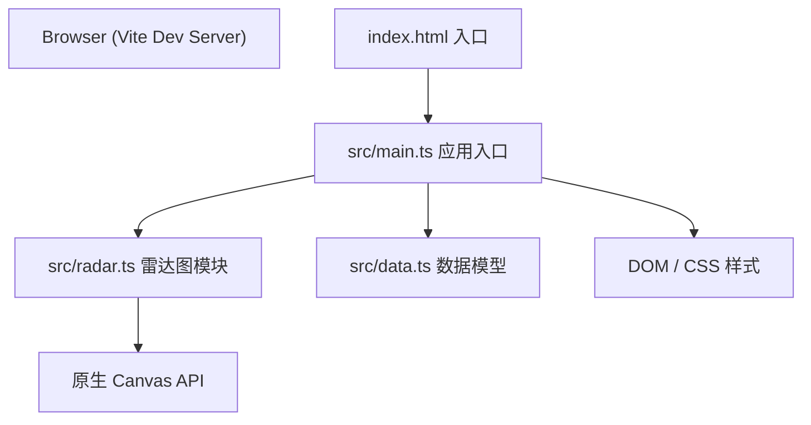

## 1. 架构设计



纯前端单页应用，无后端服务。数据完全保存在浏览器内存中，支持 JSON 导出。

## 2. 技术说明

- **前端框架**：无框架，原生 TypeScript + DOM 操作
- **构建工具**：Vite 5，dev server 端口 3000
- **类型系统**：TypeScript，严格模式，target ES2020，module ESNext
- **图表库**：原生 Canvas API 手动绘制雷达图
- **工具库**：lodash（辅助函数）
- **模块规范**：ES Modules (ESM)

## 3. 项目文件结构

| 文件路径 | 用途 |
|---------|-----|
| `package.json` | 依赖声明（typescript、vite@5、lodash）、启动脚本 `npm run dev` |
| `index.html` | 入口 HTML，页面标题「风味雷达 - Flavor Radar」，引入 `src/main.ts` |
| `tsconfig.json` | TypeScript 配置：严格模式、target ES2020、module ESNext |
| `vite.config.js` | Vite 构建配置：devServer 端口 3000、TypeScript 支持 |
| `src/main.ts` | 应用入口：初始化页面结构、事件绑定、状态管理、列表与雷达图渲染调度 |
| `src/radar.ts` | 雷达图绘制模块：Canvas 绘图、轴/刻度/数据折线、缓动动画 |
| `src/data.ts` | 数据模型：CoffeeRecord 接口定义、6 条预设模拟数据 |

## 4. 数据模型

### 4.1 CoffeeRecord 接口

```typescript
interface CoffeeRecord {
  id: string;
  name: string;
  origin: '埃塞俄比亚' | '哥伦比亚' | '巴西' | '哥斯达黎加' | '肯尼亚';
  roastDate: string; // ISO date string YYYY-MM-DD
  brewTemp: number;  // 85-96
  ratio: string;     // e.g. "1:15"
  flavors: {
    acidity: number;    // 0-10 步长0.5
    bitterness: number;
    sweetness: number;
    body: number;
    aftertaste: number;
  };
  overallScore: number; // 0-10
  notes: string;
}
```

### 4.2 赏味期计算规则

```typescript
function getTastingStatus(daysSinceRoast: number): {
  label: '巅峰期' | '良好期' | '已过最佳期';
  bgColor: string;
} {
  if (daysSinceRoast <= 7)  return { label: '巅峰期',     bgColor: '#2a9d8f' };
  if (daysSinceRoast <= 21) return { label: '良好期',     bgColor: '#e9c46a' };
  return                            { label: '已过最佳期', bgColor: '#e76f51' };
}
```

### 4.3 冲煮小贴士规则（常量映射）

- 酸度高（>7）：配较低水温（建议 88-90°C）
- 苦度高（>7）：配较高粉水比（建议 1:16-1:18）
- 甜度高（>7）：建议手冲法，分段注水
- 醇厚度高（>7）：建议法压壶或意式浓缩
- 余韵长（>7）：建议慢冲，延长萃取时间
